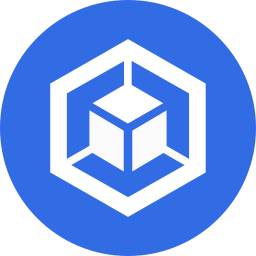
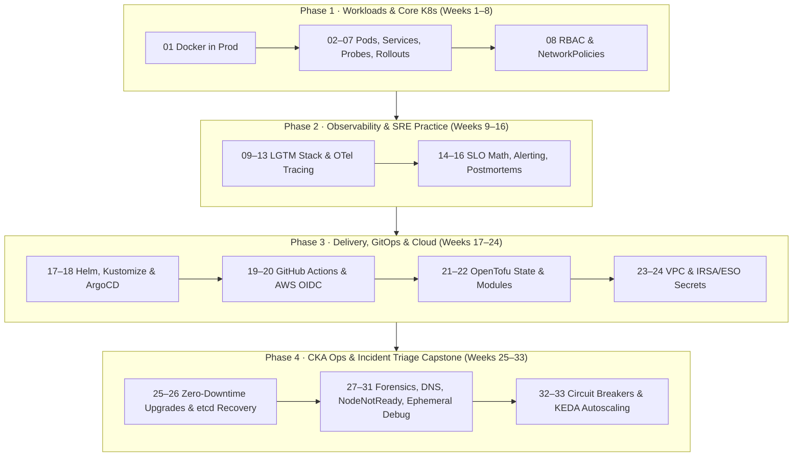
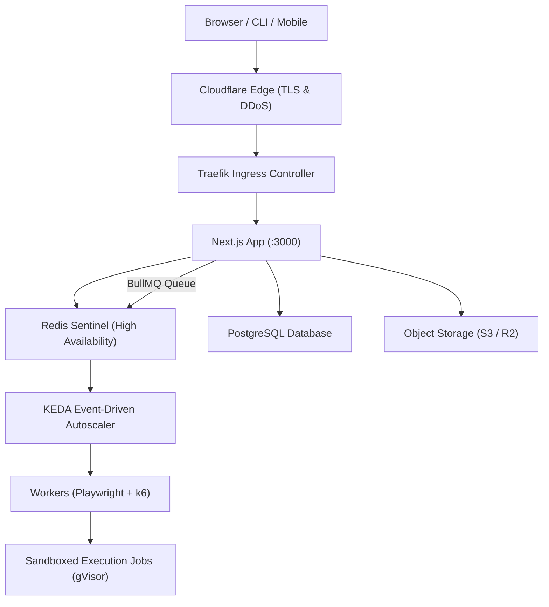
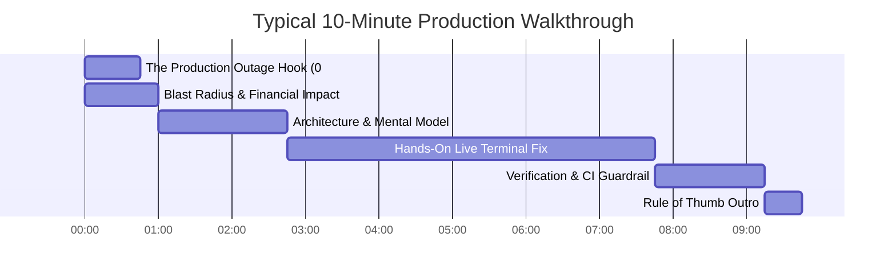

  <picture>
    <source media="(prefers-color-scheme: dark)" srcset="assets/prodline-logo.svg">
    
  </picture>

<h1 align="center">Prodline · Kubernetes & SRE Curriculum</h1>

  
  
  
  

> *Learn Kubernetes, DevOps, and SRE by deploying, debugging, and operating real applications.*

Prodline is a technical education brand for **mid-to-senior engineers, platform teams, and architects**. No "Hello World" — only production realities, reliability engineering, and real cluster debugging in **short, single-problem walkthroughs**.

This repository contains the complete **33-episode Kubernetes & SRE Master Curriculum** published on **[@prodlinehq](https://www.youtube.com/@prodlinehq)**.

---

## The 4-Phase SRE Progression Roadmap

A structured 33-week progression designed to build senior credibility: **Workloads & K8s Core** $\rightarrow$ **Observability & SRE Practice** $\rightarrow$ **Delivery, GitOps & Cloud** $\rightarrow$ **Cluster Ops & Incident Triage Capstone**.

---

## Production Lab Architecture

All episodes are filmed against real production microservice architectures — not toy local deployments. The primary open-source lab stack demonstrates end-to-end distributed system operations:

---

## Master Curriculum Index

### Phase 1 · Weeks 1–8 · Workloads & Core Kubernetes

| Ep | Episode Guide | Focus & Scenario | Key Architectural Artifact |
| :---: | :--- | :--- | :--- |
| **01** | [01-docker.md](episodes/01-docker.md) | **Docker in Production** | Multi-stage caching, non-root `USER 1001`, digest pins, Trivy CVE gates |
| **02** | [02-deployment.md](episodes/02-deployment.md) | **Kubernetes Deployments in Production** | Declarative controllers, replica reconciliation, crash isolation |
| **03** | [03-services-ingress.md](episodes/03-services-ingress.md) | **Kubernetes Services and Ingress** | ClusterIP, kube-proxy iptables packet flow, Traefik/NGINX routing |
| **04** | [04-config-secrets.md](episodes/04-config-secrets.md) | **ConfigMaps & Secrets in Production** | Decoupled configurations, atomic volume injection, secret rotation |
| **05** | [05-resources.md](episodes/05-resources.md) | **Requests, Limits, and OOMKilled** | CFS CPU quotas, memory cgroups, QoS classes (`Guaranteed` vs `Burstable`) |
| **06** | [06-probes.md](episodes/06-probes.md) | **Liveness, Readiness, and Startup Probes** | Cold start protection, deadlock recovery, zero-downtime endpoint isolation |
| **07** | [07-rollouts.md](episodes/07-rollouts.md) | **Zero-Downtime Rolling Updates** | `maxSurge`/`maxUnavailable` tuning, preStop termination lifecycles |
| **08** | [08-rbac-networkpolicy.md](episodes/08-rbac-networkpolicy.md) | **Kubernetes RBAC & NetworkPolicy** | Least-privilege ServiceAccounts, default-deny egress, pod firewalls |

---

### Phase 2 · Weeks 9–16 · Observability & SRE Practice

| Ep | Episode Guide | Focus & Scenario | Key Architectural Artifact |
| :---: | :--- | :--- | :--- |
| **09** | [09-golden-signals.md](episodes/09-golden-signals.md) | **Golden Signals: RED, USE, and SLIs** | Outside-in synthetic SLIs vs internal telemetry, PromQL error calculations |
| **10** | [10-prometheus.md](episodes/10-prometheus.md) | **Prometheus in Kubernetes** | Prometheus Operator, ServiceMonitors, high-cardinality label explosions |
| **11** | [11-grafana.md](episodes/11-grafana.md) | **Grafana Dashboards for On-Call** | Incident-focused triage dashboards: Overview $\rightarrow$ Pod Health $\rightarrow$ Dependent I/O |
| **12** | [12-loki.md](episodes/12-loki.md) | **Loki: Logs That Correlate** | Structured JSON logging, Promtail/Alloy daemon, correlating logs via `trace_id` |
| **13** | [13-tracing.md](episodes/13-tracing.md) | **Distributed Tracing with OpenTelemetry** | W3C tracecontext propagation, OTel Collector daemon, Tempo span triage |
| **14** | [14-slo-error-budgets.md](episodes/14-slo-error-budgets.md) | **SLOs and Error Budgets** | 99.9% uptime math, multi-window multi-burn-rate alerting policies |
| **15** | [15-alerting.md](episodes/15-alerting.md) | **Alertmanager: Symptom-Based Alerting** | Eliminating alert fatigue, silencing/inhibition trees, actionable on-call routing |
| **16** | [16-postmortems.md](episodes/16-postmortems.md) | **Incident Command & Blameless Postmortems** | Incident Commander roles, timelines, 5 Whys, blameless corrective action items |

---

### Phase 3 · Weeks 17–24 · Delivery, GitOps & Cloud

| Ep | Episode Guide | Focus & Scenario | Key Architectural Artifact |
| :---: | :--- | :--- | :--- |
| **17** | [17-kustomize.md](episodes/17-kustomize.md) | **Kustomize and Helm in Production** | Parameterized packaging, DRY multi-environment overlays (`staging` vs `prod`) |
| **18** | [18-argocd.md](episodes/18-argocd.md) | **GitOps with Argo CD** | Declarative reconciliation, self-healing, automated drift detection |
| **19** | [19-github-actions.md](episodes/19-github-actions.md) | **GitHub Actions: Tests, Trivy & Image CI** | Matrix test runners, buildx caching, non-root vulnerability scanning |
| **20** | [20-oidc.md](episodes/20-oidc.md) | **OIDC: Passwordless Cloud Authentication** | Eliminating static cloud keys, AWS STS assume-role with GitHub JWT tokens |
| **21** | [21-tofu-state.md](episodes/21-tofu-state.md) | **Terraform Remote State and Locking** | Remote S3 backend, DynamoDB distributed mutex locks, state encryption |
| **22** | [22-tofu-modules.md](episodes/22-tofu-modules.md) | **Terraform Modules, PR Plans, and Drift** | Reusable infra modules, automated PR plan reviews, drift detection |
| **23** | [23-network.md](episodes/23-network.md) | **Production Kubernetes Networking** | 3-tier VPC architecture, private subnets, NAT Gateways, VPC CNI IP management |
| **24** | [24-irsa-eso.md](episodes/24-irsa-eso.md) | **Workload Identity & Secrets Operators** | IRSA least privilege, External Secrets Operator (ESO) syncing from Secrets Manager |

---

### Phase 4 · Weeks 25–33 · Cluster Ops & Deep Troubleshooting Capstone

| Ep | Episode Guide | Focus & Scenario | Key Architectural Artifact |
| :---: | :--- | :--- | :--- |
| **25** | [25-cluster-upgrade.md](episodes/25-cluster-upgrade.md) | **Zero-Downtime Cluster Upgrades** | Version skew policy, PodDisruptionBudgets, node cordon and drain sequences |
| **26** | [26-etcd.md](episodes/26-etcd.md) | **etcd Backup & Disaster Recovery** | Raft consensus integrity, scheduled snapshot crons, cold restoration drills |
| **27** | [27-triage.md](episodes/27-triage.md) | **The 5-Layer Incident Triage Loop** | Top-down systematic isolation: Edge $\rightarrow$ Ingress $\rightarrow$ Service $\rightarrow$ Pod $\rightarrow$ Node |
| **28** | [28-crashloop.md](episodes/28-crashloop.md) | **CrashLoopBackOff & Exit Code Forensics** | Exit 137 (OOMKiller), Exit 143 (SIGTERM), Exit 1/2, `kubectl logs --previous` |
| **29** | [29-dns.md](episodes/29-dns.md) | **CoreDNS & The `ndots:5` Latency Bug** | `/etc/resolv.conf` packet inspection, search paths, cutting DNS volume by 80% |
| **30** | [30-nodenotready.md](episodes/30-nodenotready.md) | **NodeNotReady & Eviction Triage** | Kubelet systemd debugging, DiskPressure, PID exhaustion, cgroup v2 throttling |
| **31** | [31-ephemeral-debug.md](episodes/31-ephemeral-debug.md) | **`kubectl debug` & Distroless Containers** | Shared PID/network namespaces, debugging live production pods without shells |
| **32** | [32-circuit-breakers.md](episodes/32-circuit-breakers.md) | **Cascading Failures & Circuit Breakers** | Thundering herds, exponential backoff with full jitter, fail-fast protections |
| **33** | [33-keda.md](episodes/33-keda.md) | **Autoscaling Beyond CPU with KEDA** | Queue-driven scaling (Redis / BullMQ / Kafka), Scale-to-Zero architecture |

---

## 10-Minute Video Breakdown Anatomy

Every episode in this curriculum is engineered for high-density, production-first learning:

1. **The Hook (0:00–0:45)**: Starts directly *in medias res* with a broken cluster state (e.g. `CrashLoopBackOff`, HTTP 502, empty endpoints, or high-severity CVEs).
2. **The Stakes & Blast Radius (0:45–1:45)**: Why this failure knocks over downstream services and costs money in production.
3. **Architecture & Mental Model (1:45–3:30)**: A clear diagram and intuitive mental model separating symptoms from root causes.
4. **Hands-On Production Fix (3:30–8:30)**: Step-by-step CLI commands and production manifests. No hand-waving.
5. **Verification & Guardrails (8:30–10:00)**: Proving the fix with live monitors and encoding the prevention rule into CI/CD.
6. **Outro & Rule of Thumb (10:00–10:30)**: The single memorable engineering rule to take into your next on-call shift or interview.

---

## European Staff SRE & CKA Alignment

This curriculum is ordered to directly match senior European hiring signals and practical competencies:

- **CKAD & Pod Lifecycle (Weeks 1–8)**: Demonstrates container mastery, QoS, health probes, and network security.
- **LGTM & Distributed Observability (Weeks 9–16)**: Demonstrates open-source metrics, logging, tracing, and Google SRE error budget practices.
- **Enterprise GitOps & Cloud Automation (Weeks 17–24)**: Demonstrates production infrastructure-as-code, passwordless OIDC, and secrets federation.
- **CKA & Advanced Incident Triage (Weeks 25–33)**: Demonstrates cluster operations, disaster recovery, Linux kernel cgroup debugging, and event-driven resilience.

---

## Community & Contributing

Found a typo, updated a best practice for a new Kubernetes minor release, or want to suggest an incident scenario? PRs and Issues are warmly welcomed!

## License

Curriculum text and architectural diagrams are licensed under [CC BY 4.0](https://creativecommons.org/licenses/by/4.0/).  
Brand logos and icons are proprietary to **Prodline**.
