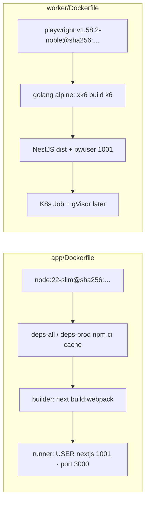
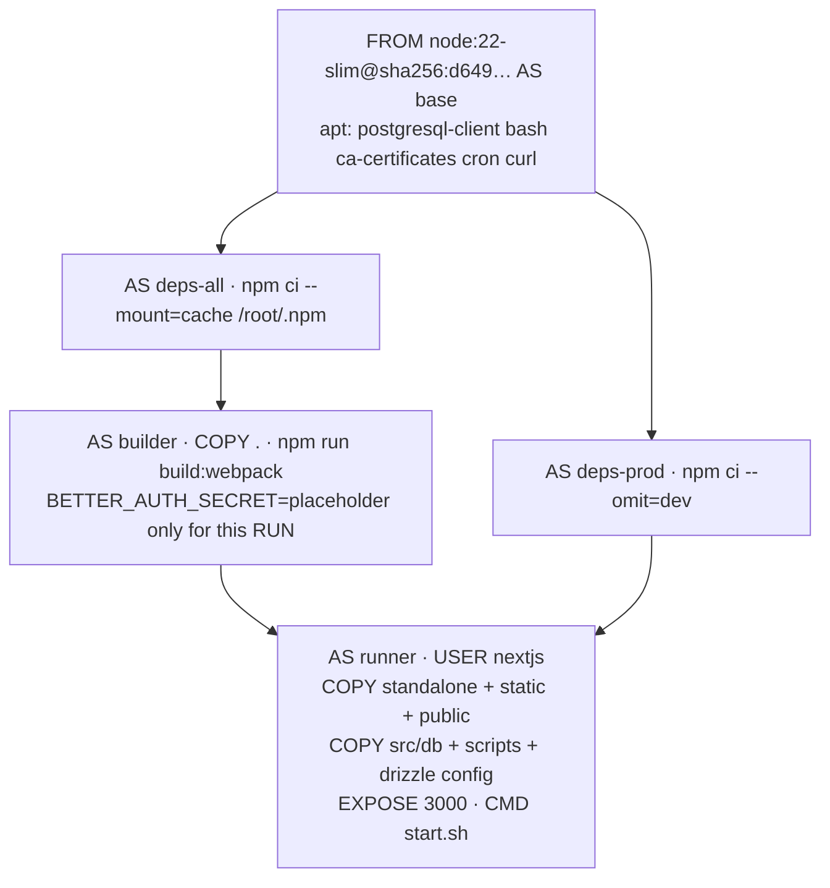
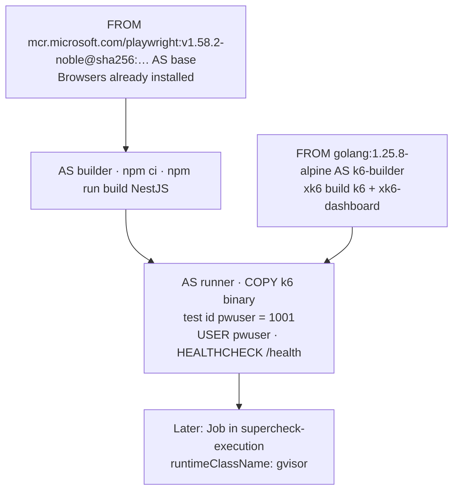

# Episode 01 — Docker in Production

| | |
| :--- | :--- |
| **YouTube title** | Docker in Production |
| **Film order** | 01 of 33 · Phase 1 · Week 1 |
| **Duration** | 10 minutes |
| **Lab repo** | [`supercheck-io/supercheck`](https://github.com/supercheck-io/supercheck) |
| **Files on camera** | `app/Dockerfile`, `worker/Dockerfile` |
| **Images** | `ghcr.io/supercheck-io/supercheck/app` · `ghcr.io/supercheck-io/supercheck/worker` |
| **Cluster** | None (build + Trivy only) |
| **Next** | [02-deployment.md](02-deployment.md) |

---

## Overview (say this before you hit record)

Supercheck is not one container. Production runs **two images with opposite constraints**:

1. **`app`** — Next.js dashboard + API (`node:22-slim`, UID `1001` `nextjs`, port **3000**, `CMD ./scripts/start.sh`). This is the image you can still shrink, pin, and scan hard.
2. **`worker`** — NestJS control plane **and** the image used for gVisor Playwright/k6 Jobs. It **must** start from `mcr.microsoft.com/playwright` so Chromium/Firefox/WebKit already exist. Distroless would delete the browsers. Isolation happens at **runtime** (`runtimeClassName: gvisor` in `supercheck-execution`), not by deleting `/bin/sh`.

This episode is **not** “hello Docker.” It is: why Supercheck’s GitHub Actions builds two Dockerfiles, why digest-pins matter for NIS2/supply-chain interviews, and why a 2 GB worker image is a *deliberate* trade-off.

**Do not invent a Go API.** Open the real files. If you skip the worker, you have not explained Supercheck.



---

## The production problem (hook)

*"Our ‘simple Node image’ is 1.4 GB, runs as root, and Trivy reports HIGH CVEs from leftover apt tools. The worker image is even larger. A junior engineer wants to `FROM ubuntu` both of them. If we ship that, Supercheck’s HPA cold-start is slow, the attack surface includes `curl`/`apt`, and we fail the security gate before `supercheck-app` ever starts."*

---

## Supercheck facts you must not get wrong

| Fact | App | Worker |
| :--- | :--- | :--- |
| Path | `app/Dockerfile` | `worker/Dockerfile` |
| Base | `node:22-slim` **digest-pinned** | Official Playwright noble **digest-pinned** |
| Extra stage | — | `golang:1.25.8-alpine` builds **xk6** (k6 + dashboard) |
| User | `nextjs` UID/GID **1001** | Playwright `pwuser` **must stay 1001** (K8s `runAsUser` cannot use names) |
| Listen | `PORT=3000` `HOSTNAME=0.0.0.0` | Worker HTTP `/health` (default 8000 in HEALTHCHECK) |
| Entrypoint | `./scripts/start.sh` in image; **K8s overrides** to `node server.js` + initContainer `db-migrate.js` | `node dist/src/main.js` |
| Why not distroless | Next standalone still needs Node + migrate scripts + `postgresql-client` in base (app base installs `curl`, `bash`, `cron` — call this out as a **remaining hardening discussion**, not pretend it is distroless) | Browsers |
| GHCR | `ghcr.io/supercheck-io/supercheck/app` | `ghcr.io/supercheck-io/supercheck/worker` |

**Honest teaching:** the app base still `apt-get install`s `curl`, `bash`, `cron`, `postgresql-client`. That is the real Supercheck file. Contrast it with distroless *theory*, then say what Supercheck *actually* does and why (`db-migrate`, start script). Do not rewrite history.

---

## Architecture: app image layers



**Talking points (90 seconds on this diagram):**

1. **Digest pin** — `node:22-slim@sha256:…` not `node:latest`. Supply chain + reproducible CI (same as Supercheck).
2. **Split npm ci** — `deps-all` for compile, `deps-prod` merged into runner because Next standalone does not include every migrate dependency.
3. **Build-time secret** — `BETTER_AUTH_SECRET=build-time-placeholder-…` is scoped to the `RUN` so scanners do not treat a layer as a real credential.
4. **`--webpack`** — Next 16 defaults to Turbopack; Supercheck documents ARM64 WASM fallback. One sentence on camera if you build on M2.
5. **UID 1001** — matches `deploy/k8s/base/app-deployment.yaml` `runAsUser: 1001`. If the image user ≠ YAML, the pod crashes.

---

## Architecture: worker image layers



**Talking points:**

- Playwright base avoids `npx playwright install` OOM on CI (comment in the real Dockerfile).
- k6 is compiled in a **throwaway Go stage**, only the binary is copied — that *is* multi-stage done right, even though the final image is still huge.
- `Docker CLI removed` — execution is Kubernetes Jobs, not `docker run` from the worker. Say this; it is Supercheck architecture.
- `test "$(id -u pwuser)" = "1001"` — build fails if Playwright changes the UID. K8s securityContext is numeric.

---

## Comparison table (full-frame 4 seconds)

| Decision | Tutorial anti-pattern | Supercheck |
| :--- | :--- | :--- |
| Tag | `node:latest` | Digest-pinned slim / Playwright |
| User | root | 1001 (`nextjs` / `pwuser`) |
| One image for all | “Just Node” | **App ≠ worker** |
| Shrink worker | Distroless | **gVisor Jobs**, not a smaller FROM |
| Secrets in image | `ENV AUTH_SECRET=real` | Placeholder only at build; Infisical/K8s Secret at runtime |
| Health | none | Worker `HEALTHCHECK`; app probes in K8s (`/api/health`) |
| Scan | skip | Trivy HIGH/CRITICAL fails CI (Episode 19) |

---

## Annotated Supercheck `app/Dockerfile` (film these stages)

Do not retype from memory. Scroll the repo. This is the teaching copy of what is in `app/Dockerfile` today:

```dockerfile
# supercheck/app/Dockerfile (abridged for the video)
ARG SUPERCHECK_BUILD_SHA=unknown

FROM node:22-slim@sha256:d649c27dae7ba0137b3cef5dd75baa422c08dc3d9e3fc0c23dfb172dc3cc6436 AS base
RUN apt-get update && apt-get install -y \
    postgresql-client bash ca-certificates cron curl \
    && rm -rf /var/lib/apt/lists/*

FROM base AS deps-all
WORKDIR /app
COPY package.json package-lock.json* ./
RUN --mount=type=cache,target=/root/.npm,sharing=locked \
    npm ci --legacy-peer-deps --no-audit --no-fund

FROM base AS deps-prod
WORKDIR /app
COPY package.json package-lock.json* ./
RUN --mount=type=cache,target=/root/.npm,sharing=locked \
    npm ci --omit=dev --legacy-peer-deps --no-audit --no-fund

FROM base AS builder
WORKDIR /app
COPY --from=deps-all /app/node_modules ./node_modules
COPY . .
ENV NODE_ENV=production
# Secret exists only for this RUN — not a runtime credential
RUN BETTER_AUTH_SECRET=build-time-placeholder-will-be-overridden-at-runtime \
    npm run build:webpack

FROM base AS runner
WORKDIR /app
RUN groupadd --system --gid 1001 nodejs && \
    useradd --system --uid 1001 --gid nodejs nextjs
COPY --from=builder --chown=nextjs:nodejs /app/.next/standalone ./
COPY --from=builder --chown=nextjs:nodejs /app/.next/static ./.next/static
COPY --from=builder --chown=nextjs:nodejs /app/public ./public
COPY --from=deps-prod --chown=nextjs:nodejs /app/node_modules ./node_modules
COPY --from=builder --chown=nextjs:nodejs /app/scripts ./scripts
USER nextjs
EXPOSE 3000
ENV PORT=3000 HOSTNAME="0.0.0.0"
CMD ["./scripts/start.sh"]
```

**K8s twist (10 seconds):** `app-deployment.yaml` does **not** use `start.sh`. Init container runs `node scripts/db-migrate.js`; main container is `node server.js`. The image still contains `start.sh` for Compose/self-host.

---

## Annotated Supercheck `worker/Dockerfile` (film the FROM lines)

```dockerfile
# supercheck/worker/Dockerfile (abridged)
FROM mcr.microsoft.com/playwright:v1.58.2-noble@sha256:6446946a1d9fd62d9ae501312a2d76a43ee688542b21622056a372959b65d63d AS base

FROM golang:1.25.8-alpine@sha256:8e02eb337d9e0ea459e041f1ee5eece41cbb61f1d83e7d883a3e2fb4862063fa AS k6-builder
RUN apk add --no-cache git
RUN go install go.k6.io/xk6/cmd/xk6@v1.3.6
RUN xk6 build v1.6.1 --with github.com/grafana/xk6-dashboard@v0.8.1

FROM base AS builder
WORKDIR /worker
COPY package.json package-lock.json* ./
RUN --mount=type=cache,target=/root/.npm,sharing=locked \
    npm ci --legacy-peer-deps --no-audit --no-fund
COPY . .
RUN npm run build

FROM base AS runner
WORKDIR /worker
COPY --from=k6-builder /go/k6 /usr/local/bin/k6
RUN test "$(id -u pwuser)" = "1001" && test "$(id -g pwuser)" = "1001"
# … npm ci --omit=dev, COPY dist …
USER pwuser
CMD ["node", "--max-http-header-size=16384", "dist/src/main.js"]
```

---

## 10-minute script (shot list)

| Time | Visual | Say |
| :--- | :--- | :--- |
| 0:00–0:45 | `docker images` showing a fat unpinned `node` vs GHCR Supercheck tags | Hook: two images, one product. |
| 0:45–1:45 | Table: app vs worker | Blast radius: root + curl vs browsers in worker. |
| 1:45–3:30 | App layer mermaid | Digest, npm cache mount, UID 1001, placeholder secret. |
| 3:30–6:30 | Scroll real `app/Dockerfile` in VS Code; zoom USER / EXPOSE 3000 | Hands-on: `docker build -f app/Dockerfile` if time; otherwise Trivy on published digest. |
| 6:30–8:30 | Scroll `worker/Dockerfile` FROM playwright + xk6 stage | Why distroless is wrong here; gVisor is Episode 08/31. |
| 8:30–10:00 | Trivy snippet / GHCR labels `org.opencontainers.image.source` | Guardrail: pin digest, non-root, Trivy in Episode 19. |
| 10:00–10:30 | Interview one-liner | Next: `kubectl apply` Supercheck Deployment. |

**Titles (pick one):**
1. *Docker in Production: Pin Digests, Drop Root, Scan with Trivy*
2. *Stop Distroless-ing Your Browser Workers*
3. *Multi-Stage Dockerfiles That Survive Production*

**Thumbnail:** Split: small `app` box vs huge `playwright` box; text **TWO IMAGES**.

**Pinned comment:** “Would you still try to distroless a Playwright runner?”

---

## Commands (pre-flight)

```bash
cd /path/to/supercheck   # product repo — Dockerfiles live there, not in this Prodline repo
# App (slow; optional if you already have GHCR)
docker build -f app/Dockerfile -t supercheck-app:local ./app

# Worker is large — do not full-build on M2 Air unless you have time
# Instead: docker pull ghcr.io/supercheck-io/supercheck/app:latest

trivy image ghcr.io/supercheck-io/supercheck/app:latest --severity HIGH,CRITICAL

docker inspect ghcr.io/supercheck-io/supercheck/app:latest \
  --format '{{.Config.User}} {{.Config.ExposedPorts}}'
# Expect something consistent with 1001 / 3000

# Prove worker UID contract
# grep the Dockerfile for: test "$(id -u pwuser)" = "1001"
```

Scan `ghcr.io/supercheck-io/supercheck/app` with Trivy. Cluster apply is Episode 02 **on Supercheck K3s**, not a local cluster.

---

## EU / interview one-liner

*"We pin digests and run UID 1001 because Supercheck’s Deployment `securityContext.runAsUser` is 1001. The worker stays on Playwright because the browsers are the product; we sandbox Jobs with gVisor instead of lying that the image is distroless."*

---

## Beginner traps (do not say these)

- “Supercheck is a 30 MB Go distroless binary.” **False.**
- “ClusterIP responds to ping.” (that is Episode 03.)
- “We run the worker as root so Playwright works.” Supercheck explicitly `USER pwuser`.
- “start.sh is what Kubernetes runs.” Init + `node server.js`.
