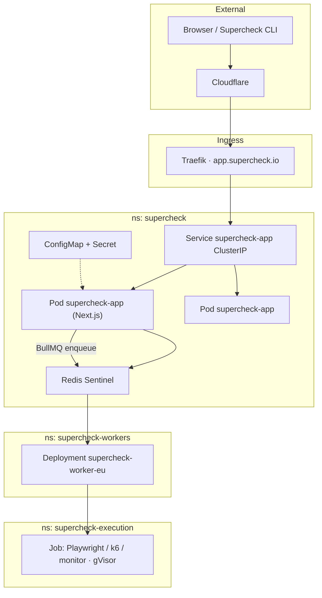
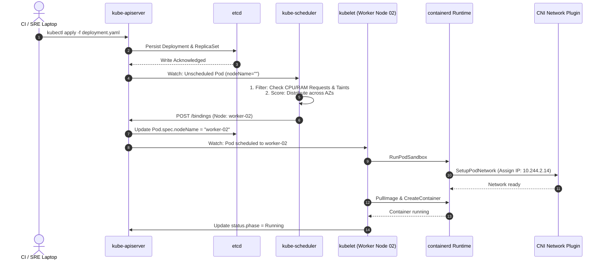

# Episode 02 — Kubernetes Deployments in Production

| | |
| :--- | :--- |
| **YouTube title** | Kubernetes Deployments in Production |
| **Film order** | 02 of 33 · Phase 1 · Week 2 |
| **Duration** | 10 minutes |
| **Lab repo** | `supercheck-io/supercheck` |
| **Supercheck files** | `deploy/k8s/base/app-deployment.yaml` |
| **Next** | [03-services-ingress.md](03-services-ingress.md) |

## Overview

You apply the real Supercheck Deployment (`supercheck-app`, UID 1001, port 3000, nodeSelector workload=app). `kubectl apply` returning 0 is not health. Trace apiserver → etcd → scheduler → kubelet → containerd until the Next.js container is Running.

Film only Supercheck names: `supercheck-app`, `supercheck-worker-eu`, `supercheck-execution`, Traefik, BullMQ, PlanetScale/Postgres, Redis Sentinel. No toy `demo-api`.


## Series Overview & The Supercheck Cluster Architecture

Across Phase 1 we operate **Supercheck on Hetzner K3s** — Next.js app, NestJS workers, Redis Sentinel, gVisor Jobs (`deploy/k8s`). Every video is a production failure on that cluster (staging overlay when the blast radius is high).



---


## European SRE interview cheat sheet


| Interview Question | Junior Answer | Senior / Staff SRE Answer |
| :--- | :--- | :--- |
| **"Why did your pod get OOMKilled if the worker node had 40GB free memory?"** | "Kubernetes has a bug." | "The container hit its cgroup memory limit, which is enforced independently of node-level free memory by the Linux kernel OOM killer." |
| **"Should a Liveness Probe check the database?"** | "Yes, so we know if the database is up." | **"Never.** If the database slows down, all API pods fail liveness and restart at once, creating a catastrophic thundering herd." |
| **"Why do we need a `preStop` sleep hook if Kubernetes already sends `SIGTERM`?"** | "It gives the container more time." | "There is an asynchronous propagation delay between EndpointSlice updates and kube-proxy iptables rule programming on nodes. The `preStop` sleep prevents the container from terminating while packets are still in transit." |
| **"Why use EndpointSlices instead of legacy Endpoints?"** | "They are newer." | "Endpoints store all backend IPs in a single API object. In large clusters, updating one pod transmits the entire list to every node. EndpointSlices shard endpoints into 100-pod chunks, slashing control-plane network bandwidth." |

---


## Episode 02: Kubernetes Deployments in Production

### 1. The Production Problem
*"I ran `kubectl apply -f deployment.yaml` in CI and the build step succeeded. 10 minutes later, production alerted because all 3 pods were permanently stuck in `Pending` or `ContainerCreating`, and nobody on call knew which control-plane subsystem failed."*

### 2. Deep Technical Breakdown
When you run `kubectl apply`, you are submitting a desired state to an asynchronous control loop:
1. **Authentication & Admission:** `kube-apiserver` authenticates the token, checks RBAC permissions, and executes Mutating & Validating Webhooks.
2. **Persistence:** The resource is serialized to JSON and written to `etcd` under `/registry/deployments/supercheck/supercheck-app`.
3. **Controller Loop:** The `deployment-controller` notices the new Deployment object, creates a `ReplicaSet`, which then creates individual unassigned `Pod` specifications with `spec.nodeName == ""`.
4. **Scheduling:** The `kube-scheduler` filters nodes (Predicate: checking CPU/RAM requests, taints, affinity) and scores remaining candidates. It then sends a `Binding` object to `kube-apiserver`.
5. **Kubelet Execution:** The `kubelet` on the assigned node watches the API server, notices the new Pod assignment, and calls the Container Runtime Interface (CRI / containerd) to pull the image and set up the sandbox.
6. **Networking (CNI) & Storage (CSI):** CRI calls the CNI plugin (Cilium / Calico / AWS VPC CNI) to allocate an IP address and configure the pod's `veth` interface, then mounts any required volumes via CSI.

### 3. Architecture & Control Plane Flow



### 4. Pod Phase & Condition Diagnostic Matrix

| Phase / Condition | Underlying Mechanism | Common Root Cause | Diagnostic Command |
| :--- | :--- | :--- | :--- |
| `Pending` (`PodScheduled: False`) | `kube-scheduler` filter phase failed | Insufficient CPU/Memory, Node taints, PVC unbounded | `kubectl describe pod <name> \| grep -A 5 Events` |
| `ContainerCreating` | Kubelet waiting for CRI/CNI/CSI | CNI IP exhaustion, image pull timeout, EBS attach failure | `journalctl -u kubelet -e --no-pager` |
| `ImagePullBackOff` | CRI cannot fetch image from registry | Missing `imagePullSecrets`, private ECR 403, typo in tag | `kubectl describe pod <name> \| grep Failed` |
| `CrashLoopBackOff` | Container launches and immediately exits | Missing environment variable, application crash, exit code 1/137 | `kubectl logs <name> --previous` |

### 5. Production Reference Manifest
```yaml
apiVersion: apps/v1
kind: Deployment
metadata:
  name: supercheck-app
  namespace: supercheck
  labels:
    app.kubernetes.io/name: supercheck
    app.kubernetes.io/component: app
spec:
  replicas: 2
  selector:
    matchLabels:
      app.kubernetes.io/name: supercheck
      app.kubernetes.io/component: app
  template:
    metadata:
      labels:
        app.kubernetes.io/name: supercheck
        app.kubernetes.io/component: app
    spec:
      serviceAccountName: supercheck
      securityContext:
        runAsUser: 1001
        runAsNonRoot: true
      terminationGracePeriodSeconds: 30
      containers:
      - name: app
        image: ghcr.io/supercheck-io/supercheck/app:1.3.6
        imagePullPolicy: IfNotPresent
        ports:
        - containerPort: 3000
          name: http
        resources:
          requests:
            cpu: 100m
            memory: 128Mi
          limits:
            cpu: 500m
            memory: 512Mi
```

### 6. 10-Minute Video Script Outline
* **1. The Hook (0:00–0:45):** Show a PR merge that reports green in CI, but `kubectl get pods` shows 3 pods stuck in `Pending` for 15 minutes. *"Your deployment script said success, but not a single customer packet is reaching your app. Where did Kubernetes drop the ball?"*
* **2. The Stakes & Blast Radius (0:45–1:45):** Explain that `kubectl apply` is purely declarative and returns immediately. If CI doesn't wait on `kubectl rollout status`, broken manifests ship to production silently.
* **3. Architecture & Mental Model (1:45–3:30):** Walk through the sequence diagram: API server $\rightarrow$ etcd $\rightarrow$ Scheduler $\rightarrow$ Kubelet $\rightarrow$ CRI $\rightarrow$ CNI. Break down the boundary between control plane and node data plane.
* **4. Hands-On Implementation (3:30–8:30):**
  - Step 1: Simulate node resource starvation (`Pending`). Run `kubectl describe pod` and decode the scheduler event message.
  - Step 2: Fix resource requests and demonstrate the binding event.
  - Step 3: Simulate CNI IP exhaustion / volume mount hang (`ContainerCreating`). Show how to check node kubelet logs.
* **5. Verification & Guardrails (8:30–10:00):** Show how to wire `kubectl rollout status deployment/supercheck-app --timeout=60s` into CI pipelines so builds fail immediately if pods don't reach `Running`.
* **6. Outro & Call to Action (10:00–10:30):** Summary rule: *"Never treat `kubectl apply` as a confirmation of health."* Next: Episode 03 — How traffic actually reaches these pods.

---

---

## Creator prep (from original kit)

### Episode 02 Preparation: Kubernetes Deployments in Production

#### 1. High-Yield Learning Links (Watch & Read Before Filming)
* **YouTube**: *TechWorld with Nana* — "Kubernetes Architecture Explained" & "What happens when you apply a Pod" ([YouTube Search: TechWorld with Nana Kubernetes Architecture](https://www.youtube.com/results?search_query=TechWorld+with+Nana+Kubernetes+Architecture))
* **YouTube**: *Hussein Nasser* — "Kubernetes Pod Lifecycle Under The Hood" ([YouTube Search: Hussein Nasser Kubernetes Pod Lifecycle](https://www.youtube.com/results?search_query=Hussein+Nasser+Kubernetes+Pod+Lifecycle))
* **Official Docs**: [Kubernetes Pod Lifecycle](https://kubernetes.io/docs/concepts/workloads/pods/pod-lifecycle/) & [Scheduler Overview](https://kubernetes.io/docs/concepts/scheduling-eviction/kube-scheduler/)

#### 2. Intuitive Mental Model
* **The Airport Flight Dispatcher Analogy**: `kubectl apply` is like submitting a flight plan to air traffic control (`kube-apiserver`). The central database (`etcd`) logs it. The dispatcher (`kube-scheduler`) checks runway weather and fuel capacity to pick an airport gate (node). The ground crew (`kubelet`) sees the assignment, fuels the plane (`containerd`), and connects the jet bridge (`CNI network`). If all gates are full, the plane stays in `Pending`.

#### 3. Pre-Flight (Supercheck K3s — staging or production kubeconfig)

```bash
# Context must be Supercheck K3s (nbg1), never a laptop cluster
kubectl config current-context
kubectl get nodes -o wide
kubectl get deploy,po -n supercheck -o wide

# Production Pending: supercheck-app cannot schedule (taint/capacity on workload=app nodes)
kubectl describe deploy supercheck-app -n supercheck | grep -A 20 Events
kubectl get events -n supercheck --sort-by='.lastTimestamp' | tail -n 30

# Prove apply ≠ healthy (CI must use rollout status)
kubectl rollout status deploy/supercheck-app -n supercheck --timeout=90s
```

#### 4. YouTube Retention & Growth Kit
* **Clickable Titles**:
  1. *What REALLY Happens When You Run `kubectl apply`?*
  2. *Why Your Pod Is Stuck in Pending (And How to Fix It)*
  3. *The Kubernetes Architecture Masterclass Every SRE Must Know*
* **Thumbnail Concept**: Top half shows terminal with `Pod: Pending 0/1 (0/3 nodes available)`. Bottom half shows an x-ray diagram of `apiserver -> scheduler -> kubelet` with a bold neon arrow pointing to the bottleneck. Big yellow text: **"WHY IS IT STUCK?"**
* **30-Second Hook**: *"You ran `kubectl apply` in CI, the build reported success, but 10 minutes later your website is down and your pods are permanently stuck in Pending. Where did Kubernetes drop the ball? In this video, we trace a pod through the 6 control-plane stages from code to running container."*
* **Pinned Comment**: *"What is the most confusing pod status you've ever had to debug in production? Pending, ContainerCreating, or CrashLoopBackOff?"*
* **Beginner Gotcha**: Don't say *"The API server creates the container."* The API server only validates and stores state in `etcd`. The `kubelet` on the node calls the container runtime via CRI to actually start containers.

---
