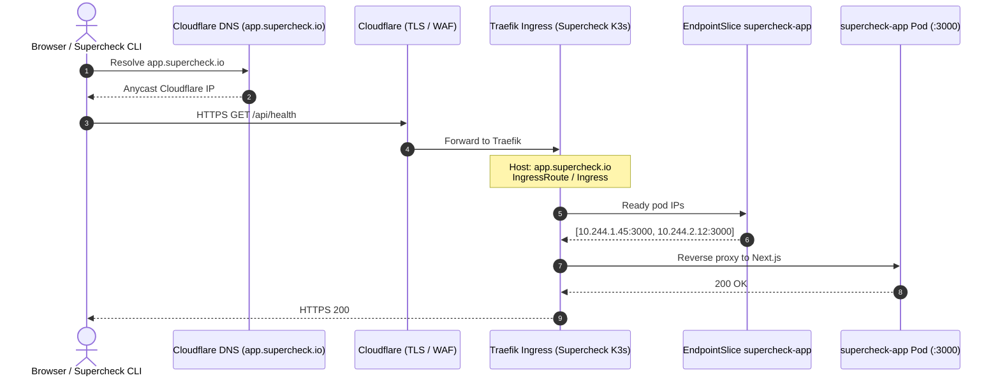

# Episode 03 — Kubernetes Services and Ingress

| | |
| :--- | :--- |
| **YouTube title** | Kubernetes Services and Ingress |
| **Film order** | 03 of 33 · Phase 1 · Week 3 |
| **Duration** | 10 minutes |
| **Lab repo** | `supercheck-io/supercheck` |
| **Supercheck files** | `deploy/k8s/base/app-service.yaml, base/ingress.yaml (Traefik)` |
| **Next** | [04-config-secrets.md](04-config-secrets.md) |

## Overview

Clients hit app.supercheck.io via Cloudflare → Traefik, not ClusterIP. Supercheck Service is ClusterIP; IngressClass is Traefik. Synthetics probe the Ingress path. Label mismatch = empty EndpointSlices = 502.

Film only Supercheck names: `supercheck-app`, `supercheck-worker-eu`, `supercheck-execution`, Traefik, BullMQ, PlanetScale/Postgres, Redis Sentinel. No toy `demo-api`.


## Episode 03: Kubernetes Services and Ingress

### 1. The Production Problem
*"Pods get destroyed and recreated with new ephemeral IP addresses every few hours. How do clients outside the cluster reliably reach backend pods without dropped packets, stale DNS records, or hardcoded IP addresses?"*

### 2. Deep Technical Breakdown
Kubernetes networking relies on virtual IPs and kernel packet rewrites:
1. **ClusterIP is Not a Real Interface:** A Service `ClusterIP` (e.g., `10.96.0.45`) does not belong to any physical or virtual network interface card (NIC). It exists purely as a set of kernel packet filtering rules (`iptables` or `IPVS` / eBPF) managed by `kube-proxy`.
2. **EndpointSlices:** The EndpointSlice controller tracks pod IPs and ports matching the Service selector. When a pod dies, the EndpointSlice updates within milliseconds.
3. **Ingress Controller (Layer 7 Routing):** Supercheck uses **Traefik** (K3s default) as the Ingress. It parses the HTTP Host header (`app.supercheck.io`), terminates TLS (often already at Cloudflare in prod), and proxies to `supercheck-app` EndpointSlices. The Ingress *API* is the same whether the controller is Traefik, NGINX, or Envoy — film Traefik so the lab matches production.

### 3. Architecture & Packet Flow



### 4. Service Types Comparison Matrix

| Service Type | Scope | Data Path | Cost Impact | Production Use Case |
| :--- | :--- | :--- | :--- | :--- |
| **ClusterIP** | In-cluster only | Kernel iptables/IPVS NAT | Free | Internal microservices, DBs, internal caches |
| **NodePort** | Cluster-wide on Node IP:30000–32767 | Node port $\rightarrow$ iptables NAT $\rightarrow$ Pod | Free | Bare-metal clusters, legacy load balancer targets |
| **LoadBalancer** | External cloud provider | Cloud LB (ALB/NLB) $\rightarrow$ NodePort $\rightarrow$ Pod | High ($20–$40/mo per service) | Public ingress entrypoints only |
| **Ingress (L7)** | External HTTP/HTTPS routing | Single Cloud LB $\rightarrow$ Ingress Pod $\rightarrow$ Pod IPs | Cheap (1 LB for 50 services) | Standard production API & Web routing default |
| **Gateway API** | Next-gen declarative L4/L7 | Role-oriented (Infra vs App developer) | Cheap / Vendor dependent | Modern multi-tenant clusters replacing Ingress |

### 5. Production Manifest: Service & Ingress
```yaml
apiVersion: v1
kind: Service
metadata:
  name: supercheck-app
  namespace: supercheck
  labels:
    app.kubernetes.io/name: supercheck-app
spec:
  type: ClusterIP
  selector:
    app.kubernetes.io/name: supercheck-app
  ports:
  - name: http
    port: 80
    targetPort: 3000
---
apiVersion: networking.k8s.io/v1
kind: Ingress
metadata:
  name: supercheck-app-ingress
  namespace: supercheck
spec:
  ingressClassName: traefik
  rules:
  - host: app.supercheck.io
    http:
      paths:
      - path: /
        pathType: Prefix
        backend:
          service:
            name: supercheck-app
            port:
              number: 80
```

### 6. 10-Minute Video Script Outline
* **1. The Hook (0:00–0:45):** Open terminal. Send `curl https://app.supercheck.io/health` and get `502 Bad Gateway`. Pods are running fine, but traffic isn't arriving.
* **2. The Stakes & Blast Radius (0:45–1:45):** Show what happens when labels don't match. An innocent typo in `spec.selector` cuts off 100% of customer traffic with zero warning.
* **3. Architecture & Mental Model (1:45–3:30):** Explain the difference between Service, Endpoints, EndpointSlices, and Ingress. Trace the packet flow using the sequence diagram.
* **4. Hands-On Implementation (3:30–8:30):**
  - Step 1: Deploy `ClusterIP` service for `supercheck-app`. Run `kubectl get endpointslices` and inspect the pod IP list.
  - Step 2: Intentionally break the label selector to show how EndpointSlices drain to empty.
  - Step 3: Apply Traefik Ingress (`ingressClassName: traefik`). Show Traefik picking up `app.supercheck.io`.
* **5. Verification:** `kubectl get ingress,svc,endpointslices -n supercheck`. Curl `https://app.supercheck.io/api/health` (or staging host). Debug DNS from an ephemeral container on `supercheck-app`, not a busybox `kubectl run`.
* **6. Outro & Call to Action (10:00–10:30):** Key takeaway: *"Services don't forward packets; the kernel does. Always check your EndpointSlices first."* Next: Episode 04 — Config & Secrets.

---

---

## Creator prep (from original kit)

### Episode 03 Preparation: Kubernetes Services and Ingress

#### 1. High-Yield Learning Links (Watch & Read Before Filming)
* **YouTube**: *TechWorld with Nana* — "Kubernetes Services Explained (ClusterIP, NodePort, LoadBalancer, Ingress)" ([YouTube Search: TechWorld with Nana Kubernetes Services](https://www.youtube.com/results?search_query=TechWorld+with+Nana+Kubernetes+Services))
* **YouTube**: *Hussein Nasser* — "How Kubernetes Networking Actually Works: Kube-Proxy & iptables" ([YouTube Search: Hussein Nasser Kubernetes networking iptables](https://www.youtube.com/results?search_query=Hussein+Nasser+Kubernetes+networking+iptables))
* **Official Docs**: [Kubernetes Services](https://kubernetes.io/docs/concepts/services-networking/service/) & [EndpointSlices](https://kubernetes.io/docs/concepts/services-networking/endpoint-slices/)

#### 2. Intuitive Mental Model
* **The Hotel Receptionist & Concierge Analogy**:
  * Pods are hotel guests who check in and out constantly (ephemeral dynamic IPs).
  * A `Service (ClusterIP)` is the hotel's front desk extension (static internal number).
  * The `EndpointSlice` is the receptionist's notepad listing which room numbers are currently occupied.
  * An `Ingress Controller` is the doorman/concierge standing at the main street entrance who checks your reservation ticket (HTTP host/path header) and escorts you directly to the correct room.

#### 3. Pre-Flight (staging Supercheck K3s)

Selector mismatch is a production 502 with empty EndpointSlices. Film **staging** only — never leave production `supercheck-app` without endpoints.

```bash
kubectl config current-context   # must be Supercheck K3s
kubectl get svc,endpointslices -n supercheck -l app.kubernetes.io/component=app
kubectl get endpointslices -n supercheck -l kubernetes.io/service-name=supercheck-app

# Break (staging): wrong selector → Traefik 502, Endpoints empty
kubectl patch svc supercheck-app -n supercheck --type merge \
  -p '{"spec":{"selector":{"app.kubernetes.io/name":"supercheck","app.kubernetes.io/component":"broken"}}}'
kubectl get endpointslices -n supercheck -l kubernetes.io/service-name=supercheck-app
# Restore immediately
kubectl patch svc supercheck-app -n supercheck --type merge \
  -p '{"spec":{"selector":{"app.kubernetes.io/name":"supercheck","app.kubernetes.io/component":"app"}}}'
```

#### 4. YouTube Retention & Growth Kit
* **Clickable Titles**:
  1. *How Traffic Actually Reaches Your Kubernetes Pods (Visualized)*
  2. *Why Kubernetes Services Are NOT Real Network Interfaces*
  3. *ClusterIP, Ingress, and Gateway API Explained in 10 Minutes*
* **Thumbnail Concept**: A client packet enters a Kubernetes cluster and splits into 3 colored paths. A glowing red barrier labeled `iptables / kube-proxy` with the headline: **"NO REAL IP!"**
* **30-Second Hook**: *"Pods die and change IP addresses every hour. So how do clients talk to them without dropping a single packet? Hint: ClusterIP is not a real network card—it doesn't exist anywhere in your cluster. Here is the exact packet journey through kube-proxy, EndpointSlices, and Ingress."*
* **Beginner Gotcha**: Don't say *"A ClusterIP responds to ping."* ClusterIP is a virtual IP implemented via iptables/IPVS; it will typically NOT respond to ICMP `ping` packets!

---
