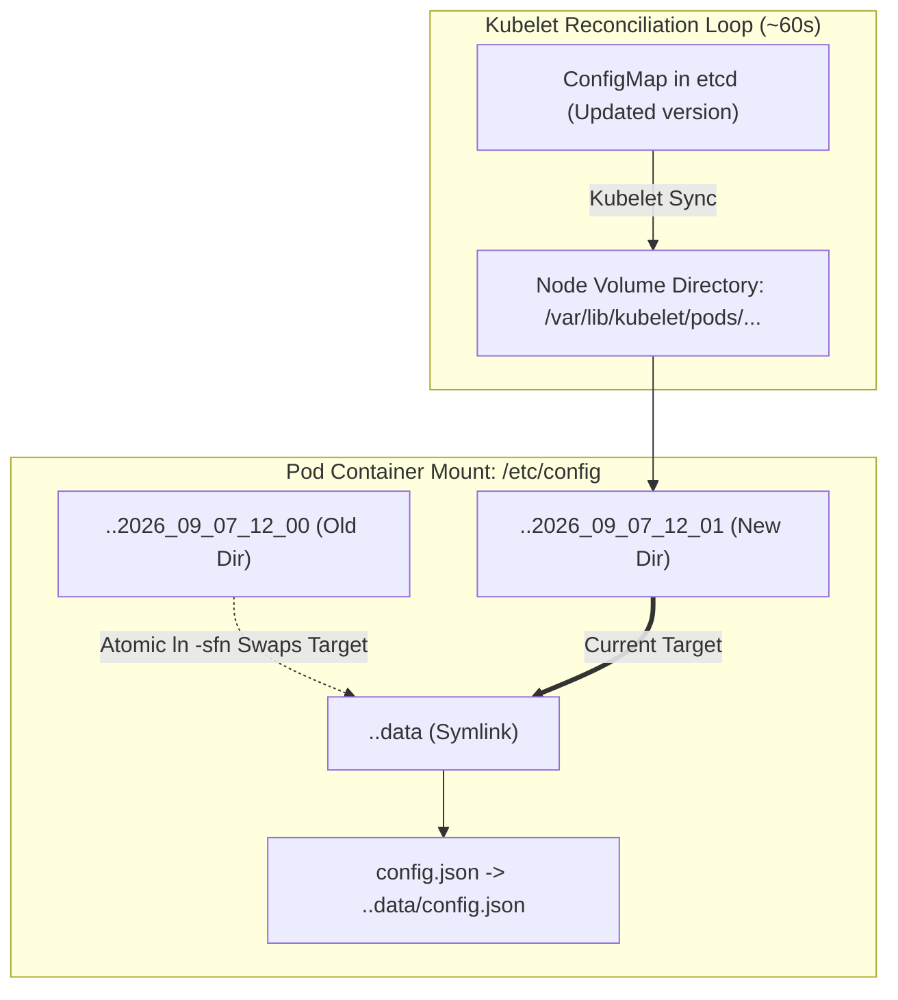

# Episode 04 — ConfigMaps and Secrets in Production

| | |
| :--- | :--- |
| **YouTube title** | ConfigMaps and Secrets in Production |
| **Film order** | 04 of 33 · Phase 1 · Week 4 |
| **Duration** | 10 minutes |
| **Lab repo** | `supercheck-io/supercheck` |
| **Supercheck files** | `Infisical → supercheck-secret; envFrom in app-deployment.yaml` |
| **Next** | [05-resources.md](05-resources.md) |

## Overview

Supercheck does not bake PlanetScale URLs into the image. K8s Secret `supercheck-secret` + envFrom. Volume mounts vs env. Rotation without rebuild. GDPR: no real credentials on camera.

Film only Supercheck names: `supercheck-app`, `supercheck-worker-eu`, `supercheck-execution`, Traefik, BullMQ, PlanetScale/Postgres, Redis Sentinel. No toy `demo-api`.


## Episode 04: ConfigMaps and Secrets in Production

### 1. The Production Problem
*"A junior engineer committed production database credentials into `config.json` inside the container image. When the database password rotated, every environment broke, and changing an environment variable required rebuilding the Docker image."*

### 2. Deep Technical Breakdown
Kubernetes provides two mechanisms for configuration: **Environment Variables** and **Volume Mounts**.
1. **Env Vars (`envFrom`):** Injected into process PID 1 during container initialization. **They are static.** If you update the ConfigMap, the running process never sees the new values until the pod is restarted or killed.
2. **Volume Mounts:** Kubelet projects the ConfigMap or Secret as files into a directory using atomic symlinks. When the ConfigMap updates, Kubelet updates the symlink target atomically within ~60 seconds without restarting the container.

### 3. Architecture: Atomic Symlink Directory Swapping



### 4. Configuration Injection Comparison Matrix

| Injection Method | Live Update Without Restart? | Masked in `ps aux` / Logs? | Max Payload Size | Best For |
| :--- | :---: | :---: | :---: | :--- |
| **`env` / `envFrom`** | **No** (Requires Pod Restart) | No (Visible in `/proc/$PID/environ`) | 1 MB (etcd limit) | Simple feature flags, static ports, log levels |
| **`volumeMounts`** | **Yes** (Atomic symlink update) | Yes (File permission guarded `0400`) | 1 MB per ConfigMap | Dynamic configs, NGINX configs, TLS certificates |
| **External Secrets (ESO)** | **Yes** (Automated sync from AWS/Vault) | Yes (Syncs to native K8s Secret) | Cloud Provider Limit | Production database credentials, API keys, certificates |

### 5. Production Manifests: ConfigMap, Secret & Volume Mounts
```yaml
apiVersion: v1
kind: ConfigMap
metadata:
  name: supercheck-app-config
  namespace: supercheck
data:
  app-config.yaml: |
    server:
      port: 3000
      log_level: "info"
    metrics:
      enabled: false
      # Next.js app does not export Prometheus /metrics (see Episode 10)
---
apiVersion: v1
kind: Secret
metadata:
  name: supercheck-app-secrets
  namespace: supercheck
type: Opaque
stringData:
  DB_PASSWORD: "ProdSecurePassword2026!"
```

Mounted inside the Deployment spec:
```yaml
        volumeMounts:
        - name: config-volume
          mountPath: /etc/config
          readOnly: true
        - name: secret-volume
          mountPath: /etc/secrets
          readOnly: true
      volumes:
      - name: config-volume
        configMap:
          name: supercheck-app-config
      - name: secret-volume
        secret:
          secretName: supercheck-app-secrets
          defaultMode: 0400
```

### 6. 10-Minute Video Script Outline
* **1. The Hook (0:00–0:45):** Show a developer updating a ConfigMap with `kubectl edit cm` and wondering why the application logs still output the old log level 10 minutes later.
* **2. The Stakes & Blast Radius (0:45–1:45):** Explain credential leakage via `envFrom`. Show how running `env` or dumping `/proc/1/environ` inside a container exposes plain text passwords to any process or compromised dependency.
* **3. Architecture & Mental Model (1:45–3:30):** Explain the atomic symlink architecture (`..data` directory swapping). Why volume mounts are superior for zero-downtime configuration reloads.
* **4. Hands-On Implementation (3:30–8:30):**
  - Step 1: Deploy ConfigMap and Secret as read-only volume mounts with `defaultMode: 0400`.
  - Step 2: Exec into container and inspect the directory structure: show `..data`, `..2026_xx_xx`, and the symlink.
  - Step 3: Update ConfigMap via `kubectl patch cm` and watch the symlink change live in real-time.
* **5. Verification & Guardrails (8:30–10:00):** Write a file watcher in Go (`fsnotify`) that listens for write events on `/etc/config` and reloads config without pod restart.
* **6. Outro & Call to Action (10:00–10:30):** Rule of thumb: *"Use volume mounts for reloadable configs, and never inject secrets via raw environment variables."* Next: Episode 05 — Requests, Limits & Throttling.

---

---

## Creator prep (from original kit)

### Episode 04 Preparation: ConfigMaps and Secrets in Production

#### 1. High-Yield Learning Links (Watch & Read Before Filming)
* **YouTube**: *That DevOps Guy* — "Kubernetes ConfigMaps & Secrets Best Practices" ([YouTube Search: That DevOps Guy Kubernetes ConfigMaps Secrets](https://www.youtube.com/results?search_query=That+DevOps+Guy+Kubernetes+ConfigMaps+Secrets))
* **YouTube**: *Viktor Farcic (DevOps Toolkit)* — "Stop putting Secrets into Environment Variables!" ([YouTube Search: DevOps Toolkit Secrets Environment Variables](https://www.youtube.com/results?search_query=DevOps+Toolkit+Secrets+Environment+Variables))
* **Official Docs**: [Kubernetes ConfigMaps](https://kubernetes.io/docs/concepts/configuration/configmap/) & [Secrets](https://kubernetes.io/docs/concepts/configuration/secret/)

#### 2. Intuitive Mental Model
* **The Envelope vs Post-It Note Analogy**:
  * Injecting credentials via Environment Variables (`env: valueFrom`) is like writing your credit card PIN on a bright yellow Post-It note and sticking it to the container forehead: anyone running `ps aux` or `docker inspect` can read it, and if you update the note, you must restart the entire container.
  * Mounting as a **Volume Mount** is like sliding a sealed letter into a mailbox: Kubernetes updates the letter contents atomically inside the container without rebooting the pod, and process crash logs don't leak it.

#### 3. Pre-Flight (Infisical + `supercheck-secret` on K3s)

Do not `kubectl create secret` with passwords in a demo Pod. Supercheck uses Infisical → `supercheck-secret` and `envFrom` in `app-deployment.yaml`.

```bash
kubectl get secret supercheck-secret -n supercheck -o jsonpath='{.data}' | jq 'keys'
# Never print values on camera

kubectl get deploy supercheck-app -n supercheck -o jsonpath='{.spec.template.spec.containers[0].envFrom}'
# Film: annotations secrets.infisical.com/auto-reload: "true"
```

#### 4. YouTube Retention & Growth Kit
* **Clickable Titles**:
  1. *Kubernetes Secrets Are NOT Encrypted! (Stop Doing This)*
  2. *ConfigMaps & Secrets: The Production Way (Volume Mounts vs Env)*
  3. *How to Update Kubernetes Config WITHOUT Restarting Pods*
* **Thumbnail Concept**: A Kubernetes secret YAML with `DB_PASS: c3VwZXJzZWNyZXQ=` with a magnifying glass decoding it to `SuperSecret123` in huge red letters. Text: **"NOT ENCRYPTED!"**
* **30-Second Hook**: *"Did you know that standard Kubernetes secrets are literally just base64 encoded strings? Anyone with read access can decode your production database passwords in 2 seconds. In this video, we'll cover how enterprise platforms manage secrets safely, avoid log leaks, and hot-reload configs without downtime."*
* **Beginner Gotcha**: Base64 is NOT encryption—it is encoding. Always remind viewers that encryption requires KMS encryption-at-rest in etcd or operators like External Secrets Operator.

---
