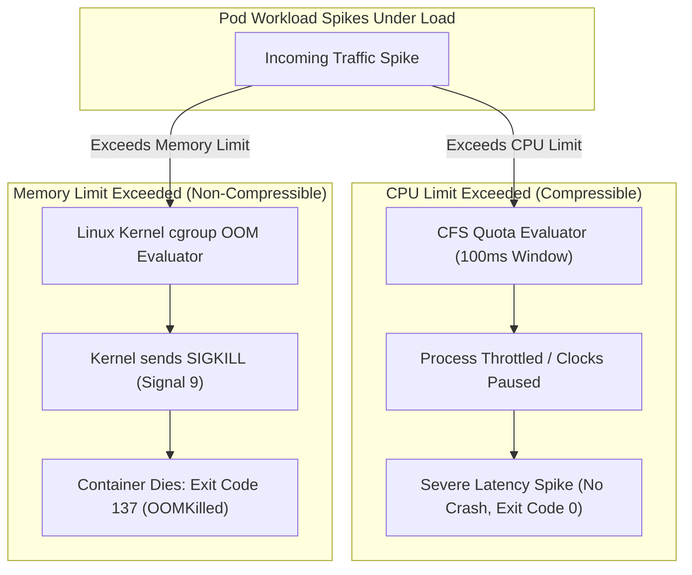

# Episode 05 — Kubernetes Requests, Limits, and OOMKilled

| | |
| :--- | :--- |
| **YouTube title** | Kubernetes Requests, Limits, and OOMKilled |
| **Film order** | 05 of 33 · Phase 1 · Week 5 |
| **Duration** | 10 minutes |
| **Lab repo** | `supercheck-io/supercheck` |
| **Supercheck files** | `resources in app-deployment.yaml (and worker shared spec)` |
| **Next** | [06-probes.md](06-probes.md) |

## Overview

Next.js and Playwright workers have different memory curves. OOM 137 vs CFS throttle. QoS. HPA uses requests as 100%. Supercheck app requests must match reality or the scheduler and HPA lie.

Film only Supercheck names: `supercheck-app`, `supercheck-worker-eu`, `supercheck-execution`, Traefik, BullMQ, PlanetScale/Postgres, Redis Sentinel. No toy `demo-api`.


## Episode 05: Kubernetes Requests, Limits, and OOMKilled

### 1. The Production Problem
*"Black Friday traffic hit. Suddenly, our checkout pods started dying with Exit Code 137 (`OOMKilled`), while the remaining pods suffered 3,000ms latency spikes because of severe CPU throttling, even though node CPU was only at 35%."*

### 2. Deep Technical Breakdown
Kubernetes resource management relies on Linux cgroups:
1. **CPU is a Compressible Resource:** CPU limits are enforced via CFS (Completely Fair Scheduler) quotas. If you specify `limits.cpu: 500m`, your container gets 50ms of CPU time for every 100ms CFS period. Once exhausted, the Linux kernel **throttles** your process, freezing execution until the next period.
2. **Memory is Non-Compressible:** Memory limits are hard boundaries enforced by the kernel. When container memory exceeds `limits.memory`, the Linux kernel OOM (Out Of Memory) Killer immediately terminates the process with `SIGKILL` (Exit Code 137).
3. **Quality of Service (QoS) Classes:** Kubernetes categorizes pods into three QoS classes based on requests and limits: **Guaranteed**, **Burstable**, and **BestEffort**. When a node experiences resource pressure, Kubelet evicts pods based on their QoS class and OOM score.
4. **HPA teaser (do not install KEDA yet):** Horizontal Pod Autoscaler scales on CPU/memory (or custom metrics). If requests are unset, HPA math is nonsense. Episode 33 contrasts CPU HPA with KEDA queue depth. One sentence on camera: *"Requests are what the scheduler and HPA believe is 100%."*

### 3. Architecture: CFS CPU Throttling vs Linux OOM Killer



### 4. QoS Class & OOM Score Hierarchy Matrix

| QoS Class | Condition | `oom_score_adj` | Eviction Priority | Recommended For |
| :--- | :--- | :---: | :---: | :--- |
| **Guaranteed** | `requests == limits` for both CPU & Memory | **-997** | **Last to be evicted** | Critical databases, core payment APIs |
| **Burstable** | `requests < limits` or only requests set | `100–999` | Evicted under node pressure | Standard web APIs, microservices |
| **BestEffort** | No requests, no limits defined | **1000** | **First to be killed** | Batch jobs, dev workloads, test runners |

### 5. Production LimitRange & Deployment Sizing
```yaml
apiVersion: v1
kind: LimitRange
metadata:
  name: prod-default-limits
  namespace: supercheck
spec:
  limits:
  - default:
      cpu: "500m"
      memory: "512Mi"
    defaultRequest:
      cpu: "100m"
      memory: "128Mi"
    max:
      cpu: "2"
      memory: "2Gi"
    type: Container
```

### 6. 10-Minute Video Script Outline
* **1. The Hook (0:00–0:45):** Show Grafana latency jumping from 40ms to 4,200ms. Node CPU is sitting at 25%. Run `kubectl top pods` and explain why standard monitoring misled the team.
* **2. The Stakes & Blast Radius (0:45–1:45):** The difference between OOMKilled (instant crash) and CPU throttling (silent latency killer). Explain why removing CPU limits is now an accepted industry pattern (e.g. Zalando / Buffer recommendations).
* **3. Architecture & Mental Model (1:45–3:30):** Explain CFS quota mechanics (100ms periods) and `oom_score_adj`. Walk through the eviction priority matrix.
* **4. Hands-On Implementation (3:30–8:30):**
  - Step 1: Stress-test a pod using `stress-ng` to hit memory limit. Watch the kernel fire SIGKILL and verify Exit Code 137.
  - Step 2: Stress-test CPU and inspect `/sys/fs/cgroup/cpu.stat` inside the container to see `nr_throttled`.
  - Step 3: Configure Guaranteed QoS class and show `oom_score_adj` change to -997.
* **5. Verification & Guardrails (8:30–10:00):** PromQL query to detect CPU throttling before users complain: `rate(container_cpu_cfs_throttled_periods_total[5m])`.
* **6. Outro & Call to Action (10:00–10:30):** Rule of thumb: *"Always set memory requests equal to memory limits, and be conservative with CPU limits to avoid self-inflicted throttling."* Next: Episode 06 — Health Checks Done Right.

---

---

## Creator prep (from original kit)

### Episode 05 Preparation: Kubernetes Requests, Limits, and OOMKilled

#### 1. High-Yield Learning Links (Watch & Read Before Filming)
* **YouTube**: *Datadog / CNCF KubeCon* — "Everything You Need to Know About Kubernetes CPU Limits & Throttling" ([YouTube Search: KubeCon Kubernetes CPU Limits Throttling](https://www.youtube.com/results?search_query=KubeCon+Kubernetes+CPU+Limits+Throttling))
* **YouTube**: *TechWorld with Nana* — "Kubernetes Resource Requests and Limits (OOMKilled & Throttling)" ([YouTube Search: TechWorld with Nana Resource Requests Limits](https://www.youtube.com/results?search_query=TechWorld+with+Nana+Resource+Requests+Limits))
* **Official Docs**: [Resource Management for Pods and Containers](https://kubernetes.io/docs/concepts/configuration/manage-resources-containers/)

#### 2. Intuitive Mental Model
* **The Restaurant Table Reservation & Speed Governor Analogy**:
  * **Requests** = The table reservation you make at a restaurant. If you reserve a table for 4 (100m CPU, 128Mi RAM), the host (`scheduler`) guarantees you have a table.
  * **Memory Limits** = The size of your plate. If your food exceeds the rim (exceeds limit), the bouncer immediately throws you out into the street (**OOMKilled Exit 137**).
  * **CPU Limits** = A speed governor on an electric scooter. You don't crash when you hit 20 km/h; the motor simply cuts power for milliseconds (**CFS Quota Throttling**), making everything feel sluggish.

#### 3. Pre-Flight (real Supercheck limits on K3s)

Film `app-deployment.yaml` (app: 512Mi request / 1536Mi limit) and worker shared spec. Correlate with live usage — do not deploy a memory hog into the cluster.

```bash
kubectl get deploy supercheck-app -n supercheck -o jsonpath='{.spec.template.spec.containers[0].resources}' | jq
kubectl top pod -n supercheck -l app.kubernetes.io/component=app
kubectl describe pod -n supercheck -l app.kubernetes.io/component=app | grep -A4 -E 'OOMKilled|Last State|Limits'
kubectl get events -n supercheck --field-selector reason=OOMKilling --sort-by='.lastTimestamp' | tail
```

#### 4. YouTube Retention & Growth Kit
* **Clickable Titles**:
  1. *Why Your Pod Got OOMKilled (Exit Code 137 Demystified)*
  2. *The Hidden Danger of Kubernetes CPU Limits (CFS Throttling)*
  3. *How to Right-Size Kubernetes Pods: Requests, Limits & QoS*
* **Thumbnail Concept**: A speedometer needle violently pegged into a red zone with a warning badge: `Exit Code 137: OOMKilled`. Bold yellow title: **"CPU THROTTLED!"**
* **30-Second Hook**: *"Your node has 64 gigabytes of free RAM, but your pod was just violently murdered by the kernel with Exit Code 137. Why? And why is your API responding in 3 seconds when CPU utilization says 20%? The answer is Linux CFS quota throttling and memory cgroups."*
* **Beginner Gotcha**: Remember that CPU is *compressible* (throttled when hitting limit), but memory is *incompressible* (killed when hitting limit).

---
