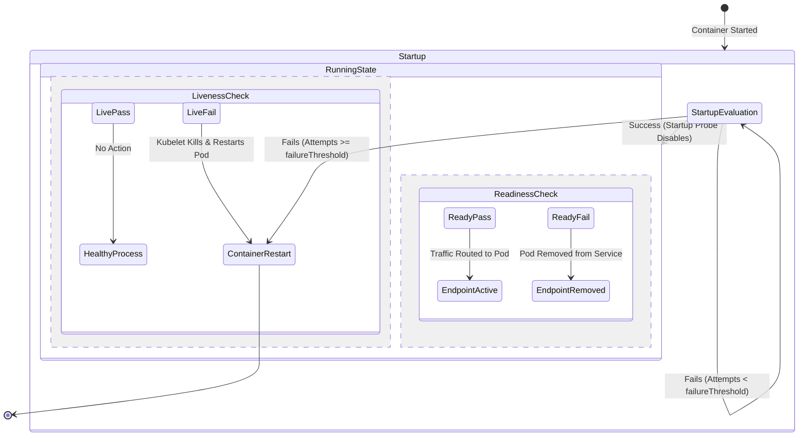

# Episode 06 — Liveness, Readiness, and Startup Probes

| | |
| :--- | :--- |
| **YouTube title** | Liveness, Readiness, and Startup Probes |
| **Film order** | 06 of 33 · Phase 1 · Week 6 |
| **Duration** | 10 minutes |
| **Lab repo** | `supercheck-io/supercheck` |
| **Supercheck files** | `readiness/liveness httpGet path /api/health port 3000` |
| **Next** | [07-rollouts.md](07-rollouts.md) |

## Overview

Supercheck app: readiness and liveness on `/api/health`. Never put PlanetScale in liveness. Init container migrates DB before the app is Ready. Outside-in Supercheck monitor can be green while readiness is false if you probe the wrong layer.

Film only Supercheck names: `supercheck-app`, `supercheck-worker-eu`, `supercheck-execution`, Traefik, BullMQ, PlanetScale/Postgres, Redis Sentinel. No toy `demo-api`.


## Episode 06: Liveness, Readiness, and Startup Probes

### 1. The Production Problem
*"During a minor network blip to our Postgres database, our API's liveness probe failed. Kubernetes restarted all 20 replicas at the exact same moment. When they rebooted, 20 pods hammered the database with connection handshakes, taking down the entire database in a thundering herd."*

### 2. Deep Technical Breakdown
Kubernetes provides three distinct probe types with completely different failure actions:
1. **Startup Probe:** Protects slow-starting applications (e.g. JVM apps, large cache warmups). While the startup probe is evaluating, liveness and readiness probes are completely disabled.
2. **Liveness Probe:** Determines if the container process is deadlocked or broken beyond recovery. **Failure Action: Kill and restart container.** *Golden Rule: Never test downstream dependencies in a liveness probe.*
3. **Readiness Probe:** Determines if the pod should receive incoming traffic from the Service EndpointSlice. **Failure Action: Remove pod IP from EndpointSlice.** The container is **not** restarted. If a downstream DB is overloaded, readiness fails, traffic stops, and the container survives without restarting.

### 3. Architecture: Probe State Transitions



### 4. Probe Configuration Parameter Matrix

| Parameter | Recommended Default | Production Purpose | Risk if Misconfigured |
| :--- | :---: | :--- | :--- |
| `initialDelaySeconds` | 2–5s | Time to wait before executing first probe | Too low: Probe fails before app binds port |
| `periodSeconds` | 5–10s | Frequency of health check execution | Too low: Overwhelms app with health check requests |
| `timeoutSeconds` | 2s | Time after which probe call is considered failed | Too low: Transient latency causes false restarts |
| `failureThreshold` | 3 | Consecutive failures before taking action | Too low (e.g. 1): Flaky network restarts healthy pod |
| `successThreshold` | 1 | Consecutive successes before marking ready | Controls how fast a recovered pod gets traffic |

### 5. Production Reference Probe Specification (from Supercheck `app-deployment.yaml`)
```yaml
containers:
- name: app
  image: ghcr.io/supercheck-io/supercheck/app:1.3.6
  # Schema migrate is initContainer db-migrate.js, not a probe.
  livenessProbe:
    httpGet:
      path: /api/health
      port: http
    initialDelaySeconds: 30
    periodSeconds: 10
    timeoutSeconds: 15
    failureThreshold: 3
  readinessProbe:
    httpGet:
      path: /api/health
      port: http
    initialDelaySeconds: 30
    periodSeconds: 10
    timeoutSeconds: 15
    failureThreshold: 3
```
Teaching extra: a dedicated `/api/ready` that checks Redis is the interview pattern — **never** put that on liveness.

### 6. 10-Minute Video Script Outline
* **1. The Hook (0:00–0:45):** Show a Kubernetes cluster where all 15 pods restart in a cascading thundering herd every 60 seconds because a downstream Redis cache had high latency.
* **2. The Stakes & Blast Radius (0:45–1:45):** Explain why checking downstream databases inside `/api/health` turns a minor dependency slowdown into a total company-wide outage.
* **3. Architecture & Mental Model (1:45–3:30):** Walk through the state diagram: Startup vs Liveness vs Readiness. Explain the difference between killing a process vs removing an IP from an EndpointSlice.
* **4. Hands-On Implementation (3:30–8:30):**
  - Step 1: Show Supercheck: initContainer db-migrate.js, then /api/health for live vs ready — do not ping PlanetScale in liveness: `/api/health` (checks migrations), `/api/health` (checks memory/goroutine deadlock), `/api/health` (checks DB ping).
  - Step 2: Simulate database disconnection: show readiness probe failing and pod IP disappearing from EndpointSlice, while pod remains running with 0 restarts.
  - Step 3: Simulate deadlocked goroutine: show liveness probe failing and Kubelet cleanly restarting container.
* **5. Verification & Guardrails (8:30–10:00):** Verify with `kubectl describe pod` and observe the exact event messages for `Readiness probe failed` vs `Liveness probe failed`.
* **6. Outro & Call to Action (10:00–10:30):** Rule of thumb: *"Liveness checks self; Readiness checks dependencies."* Next: Episode 07 — Zero-Downtime Rollouts.

---

---

## Creator prep (from original kit)

### Episode 06 Preparation: Liveness, Readiness, and Startup Probes

#### 1. High-Yield Learning Links (Watch & Read Before Filming)
* **YouTube**: *DevOps Toolkit (Viktor Farcic)* — "Kubernetes Health Checks Done Right: Liveness, Readiness, Startup" ([YouTube Search: DevOps Toolkit Kubernetes Health Checks](https://www.youtube.com/results?search_query=DevOps+Toolkit+Kubernetes+Health+Checks))
* **YouTube**: *TechWorld with Nana* — "Kubernetes Liveness and Readiness Probes Explained" ([YouTube Search: TechWorld with Nana Liveness Readiness Probes](https://www.youtube.com/results?search_query=TechWorld+with+Nana+Liveness+Readiness+Probes))
* **Official Docs**: [Configure Liveness, Readiness and Startup Probes](https://kubernetes.io/docs/tasks/configure-pod-container/configure-liveness-readiness-startup-probes/)

#### 2. Intuitive Mental Model
* **The Restaurant Kitchen & Traffic Light Analogy**:
  * **Startup Probe** = Waking up and warming the ovens in the morning. (Don't evaluate anything else until this succeeds).
  * **Readiness Probe** = The green/red light at the drive-thru window. If the chef is overwhelmed or running a database migration, turn the light RED. The kitchen doesn't burn down (pod isn't killed); you simply stop routing customer cars to that window.
  * **Liveness Probe** = The chef's pulse. If the chef is unconscious (deadlocked process), call an ambulance and restart the shift (restart the container).

#### 3. Pre-Flight (`/api/health` vs `/api/health/live` on Supercheck)

App readiness is `GET /api/health` (delay 30s). Liveness is `/api/health/live` (delay 60s). Worker: `/health/ready` and `/health/live`. Do not invent an nginx Pod with `cat /tmp/ready`.

```bash
kubectl get deploy supercheck-app -n supercheck -o yaml | grep -A12 readinessProbe
kubectl get deploy supercheck-app -n supercheck -o yaml | grep -A12 livenessProbe
kubectl get pod -n supercheck -l app.kubernetes.io/component=app
# Unready replica: describe Events (probe failed) — often PlanetScale/Redis, not "the process is dead"
```

#### 4. YouTube Retention & Growth Kit
* **Clickable Titles**:
  1. *Stop Putting Database Checks in Your Liveness Probe!*
  2. *Kubernetes Probes Explained: Liveness, Readiness & Startup*
  3. *How a Bad Health Check Took Down Our Entire Production Cluster*
* **Thumbnail Concept**: A chain reaction of dominoes tumbling down with a Kubernetes pod icon breaking. Bold text: **"CASCADING FAILURE!"**
* **30-Second Hook**: *"If your database experiences a temporary spike in latency, and your API liveness probe checks that database, Kubernetes will restart every single pod in your cluster simultaneously. When they come back up, they hammer the database even harder, causing a permanent cascading blackout. Here is how to write bulletproof probes."*
* **Beginner Gotcha**: NEVER ping downstream external dependencies (databases, third-party APIs) inside a Liveness Probe! Liveness should ONLY check if the local process itself is alive.

---
