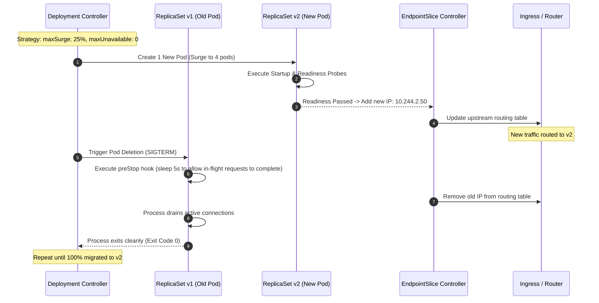

# Episode 07 — Zero-Downtime Rolling Updates

| | |
| :--- | :--- |
| **YouTube title** | Zero-Downtime Rolling Updates |
| **Film order** | 07 of 33 · Phase 1 · Week 7 |
| **Duration** | 10 minutes |
| **Lab repo** | `supercheck-io/supercheck` |
| **Supercheck files** | `strategy rollingUpdate maxSurge 1 maxUnavailable 0; preStop sleep 15` |
| **Next** | [08-rbac-networkpolicy.md](08-rbac-networkpolicy.md) |

## Overview

Production overlay can flip to maxSurge=0. Image already has preStop sleep 15. PDB later in Episode 25. Dogfood: k6/Supercheck load during rollout to prove zero 502s.

Film only Supercheck names: `supercheck-app`, `supercheck-worker-eu`, `supercheck-execution`, Traefik, BullMQ, PlanetScale/Postgres, Redis Sentinel. No toy `demo-api`.


## Episode 07: Zero-Downtime Rolling Updates

### 1. The Production Problem
*"We deployed v1.1.0 to production. During the 45-second deploy window, 1,200 active customer checkout requests were severed with `502 Bad Gateway` and `Connection Reset by Peer` because old pods were killed before new pods were ready."*

### 2. Deep Technical Breakdown
Zero-downtime rolling updates require coordinating three independent control loops:
1. **RollingUpdate Strategy:** `maxSurge` (how many extra pods can be created above target replicas) and `maxUnavailable` (how many pods can be destroyed below target replicas during deploy). Setting `maxUnavailable: 0` ensures the cluster never drops below 100% capacity.
2. **Readiness Gate:** A new pod is NOT considered ready until its Readiness Probe passes. Traffic is only directed to it after its IP is added to the EndpointSlice.
3. **Graceful Termination & `preStop` Hook:** When an old pod is marked for deletion:
   - Kubelet sends `SIGTERM` to the process.
   - EndpointSlice controller removes the pod IP.
   - However, **iptables / IPVS rule propagation across worker nodes takes 1–3 seconds.** If the application exits immediately on `SIGTERM`, packets already in flight will hit a dead socket. A `preStop` sleep hook (`sleep 5`) gives the network mesh time to drain before process shutdown.
4. **PodDisruptionBudget (introduce, don't drain):** `minAvailable` / `maxUnavailable` blocks voluntary evictions (drain, cluster autoscaler). Without a PDB, Episode 25's upgrade demo will look like a random outage. One YAML in this episode; the CKA drain lab later.

```yaml
apiVersion: policy/v1
kind: PodDisruptionBudget
metadata:
  name: supercheck-app
  namespace: supercheck
spec:
  minAvailable: 2
  selector:
    matchLabels:
      app.kubernetes.io/name: supercheck-app
```

### 3. Architecture: Zero-Downtime Rolling Update Sequence



### 4. Rollout Strategy Comparison Matrix

| Strategy | Zero Downtime? | Resource Overhead during Deploy | Rollback Speed | Best Used For |
| :--- | :---: | :---: | :---: | :--- |
| **Recreate** | **No** (Complete Downtime) | 0% | Slow | Stateful workloads with ReadWriteOnce volumes |
| **RollingUpdate (`maxSurge: 25%`)** | **Yes** | +25% CPU/RAM temporarily | Fast (`kubectl rollout undo`) | Standard enterprise stateless microservices |
| **Blue/Green** | **Yes** | +100% (Duplicate Cluster/Namespace) | Instant (Router switch) | High-risk architectural transitions, schema shifts |
| **Canary (Argo Rollouts)** | **Yes** | +5%–10% | Instant | Continuous delivery with automated metric analysis |

### 5. Production Reference Manifest with `preStop` Hook
```yaml
apiVersion: apps/v1
kind: Deployment
metadata:
  name: supercheck-app
  namespace: supercheck
spec:
  replicas: 4
  strategy:
    type: RollingUpdate
    rollingUpdate:
      maxSurge: 25%
      maxUnavailable: 0
  template:
    spec:
      terminationGracePeriodSeconds: 45
      containers:
      - name: api
        image: ghcr.io/supercheck-io/supercheck/app:1.3.6
        lifecycle:
          preStop:
            exec:
              command: ["/bin/sh", "-c", "sleep 5"]
        ports:
        - containerPort: 3000
```

### 6. 10-Minute Video Script Outline
* **1. The Hook (0:00–0:45):** Run `k6` load test hitting the service with 200 RPS. Trigger a deployment update. Show the terminal bursting with red 502 errors during the rollout.
* **2. The Stakes & Blast Radius (0:45–1:45):** Explain why default rolling update settings cause downtime. The race condition between `SIGTERM` and iptables rule propagation across worker nodes.
* **3. Architecture & Mental Model (1:45–3:30):** Walk through the sequence diagram: `maxSurge`, `maxUnavailable`, EndpointSlice removal, and the `preStop` sleep hook.
* **4. Hands-On Implementation (3:30–8:30):**
  - Step 1: Update Deployment manifest with `maxSurge: 25%` and `maxUnavailable: 0`.
  - Step 2: Add `preStop` hook with `sleep 5`.
  - Step 3: Re-run `k6` load test while executing `kubectl rollout restart deployment/supercheck-app`. Show 0 failed requests (100% 200 OK).
* **5. Verification & Guardrails (8:30–10:00):** Demonstrate instantaneous zero-downtime rollback: `kubectl rollout undo deployment/supercheck-app --to-revision=1`.
* **6. Outro & Call to Action (10:00–10:30):** Rule of thumb: *"Never kill an old pod until the new pod is serving traffic, and always give the network 5 seconds to drain."* Next: Episode 08 — RBAC & NetworkPolicy (then Phase 2 observability).

---

---

## Creator prep (from original kit)

### Episode 07 Preparation: Zero-Downtime Rolling Updates

#### 1. High-Yield Learning Links (Watch & Read Before Filming)
* **YouTube**: *TechWorld with Nana* — "Kubernetes Rolling Updates & Rollbacks Explained" ([YouTube Search: TechWorld with Nana Rolling Updates Rollbacks](https://www.youtube.com/results?search_query=TechWorld+with+Nana+Rolling+Updates+Rollbacks))
* **YouTube**: *ByteByteGo* — "How to Deploy Software with Zero Downtime" ([YouTube Search: ByteByteGo Zero Downtime Deployment](https://www.youtube.com/results?search_query=ByteByteGo+Zero+Downtime+Deployment))
* **Official Docs**: [Kubernetes RollingUpdate Deployment Strategy](https://kubernetes.io/docs/concepts/workloads/controllers/deployment/#rolling-update-deployment)

#### 2. Intuitive Mental Model
* **The Baton Pass Relay Analogy**:
  * In a relay race, runner A does not drop the baton on the track before runner B starts running. Runner B reaches full sprinting speed alongside runner A, takes the baton, and only *then* does runner A peel off and slow down.
  * In Kubernetes: `maxSurge: 25%` spins up the replacement runner first. The `preStop` hook gives runner A 5 seconds to finish in-flight requests before the process exits.

#### 3. Pre-Flight (staging rollout of `supercheck-app`)

Base strategy is `maxSurge: 1`, `maxUnavailable: 0`, `preStop sleep 15`. Production overlay may set `maxSurge: 0` on small nodes. Film staging.

```bash
kubectl get deploy supercheck-app -n supercheck -o jsonpath='{.spec.strategy}' | jq
kubectl rollout history deploy/supercheck-app -n supercheck
kubectl set image deploy/supercheck-app app=ghcr.io/supercheck-io/supercheck/app:<known-good-tag> -n supercheck
kubectl rollout status deploy/supercheck-app -n supercheck --timeout=180s
# PDB + drain interaction is Episode 25
```

#### 4. YouTube Retention & Growth Kit
* **Clickable Titles**:
  1. *Why Your Kubernetes Rolling Updates Still Cause Downtime*
  2. *Zero-Downtime Deployments in Kubernetes (The 5-Second Fix)*
  3. *Rollouts and Rollbacks in Production: `maxSurge` & `preStop` Secrets*
* **Thumbnail Concept**: A terminal running a continuous `curl` loop with green `HTTP 200 OK` flowing seamlessly while a pod version switches from `v1` to `v2`. Headline: **"ZERO 502s!"**
* **30-Second Hook**: *"You set up a RollingUpdate deployment in Kubernetes, but every time you deploy to production, your users see 502 Bad Gateway errors for 10 seconds. Why? Because Kubernetes kills old pods before the network router removes their IP addresses. In this video, we fix that race condition forever using two lines of YAML."*
* **Beginner Gotcha**: Remember that Kubernetes sends `SIGTERM` and updates `EndpointSlices` simultaneously in parallel. Without a `preStop` sleep, pods will terminate while requests are still being forwarded to them!
