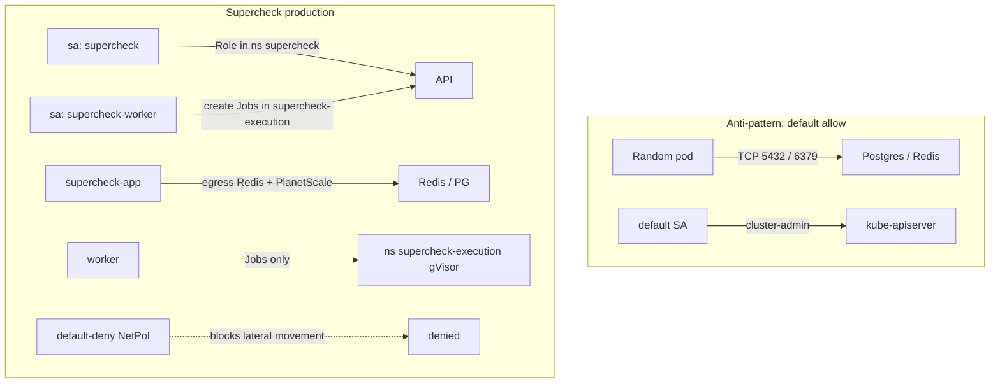
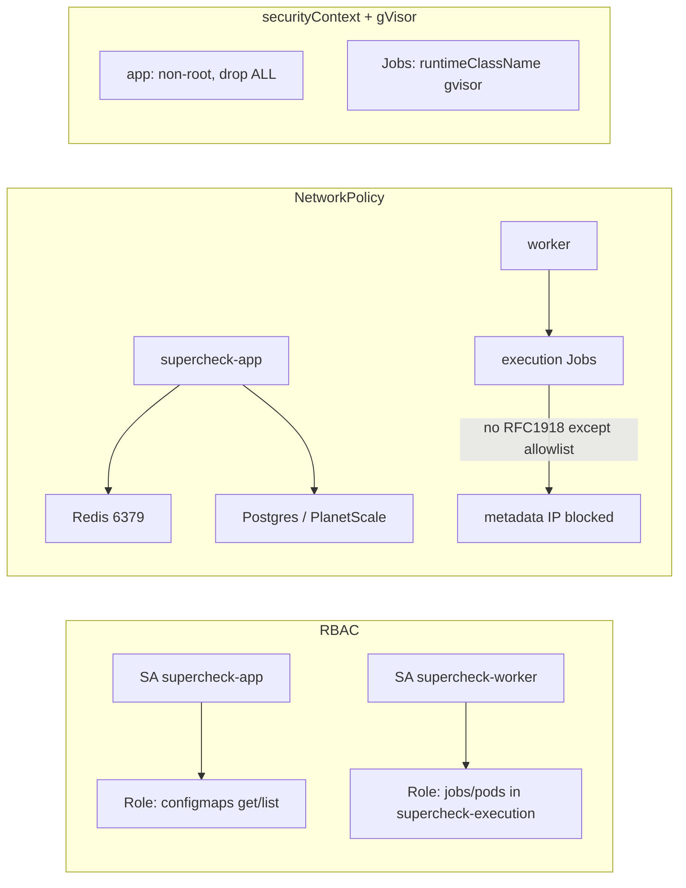

# Episode 08 — Kubernetes RBAC and NetworkPolicy

| | |
| :--- | :--- |
| **YouTube title** | Kubernetes RBAC and NetworkPolicy |
| **Film order** | 08 of 33 · Phase 1 · Week 8 |
| **Duration** | 10 minutes |
| **Lab repo** | `supercheck-io/supercheck` |
| **Supercheck files** | `base/network-policy.yaml, execution-rbac.yaml, serviceaccount.yaml, gvisor-runtimeclass.yaml` |
| **Next** | [09-golden-signals.md](09-golden-signals.md) |

## Overview

Three namespaces: supercheck, supercheck-workers, supercheck-execution. App SA vs worker SA that creates Jobs. Default-deny plus Traefik/Prometheus allow. gVisor is the worker sandbox, not distroless.

Film only Supercheck names: `supercheck-app`, `supercheck-worker-eu`, `supercheck-execution`, Traefik, BullMQ, PlanetScale/Postgres, Redis Sentinel.

## Supercheck namespaces (full-frame)



Open on camera: `deploy/k8s/base/network-policy.yaml` (default-deny + allow Traefik/Prometheus) and `execution-rbac.yaml`.


## Episode 08: Kubernetes RBAC and NetworkPolicy

### 1. The Production Problem
*"A compromised frontend pod (XSS → RCE) scanned the cluster network, connected to Postgres on 5432, and dumped customer rows. Separately, a CI bot using the `default` ServiceAccount could `kubectl delete namespace supercheck` because someone bound `cluster-admin` to `system:serviceaccounts`."*

### 2. Deep Technical Breakdown
1. **NetworkPolicy is enforced by the CNI.** Supercheck K3s must run a CNI that implements NetworkPolicy (not a no-op). Film `deploy/k8s/base/network-policy.yaml` and `execution-networkpolicy.yaml` as they are in staging/production.
2. **Default allow:** With zero NetworkPolicy objects, every pod can talk to every pod. Production baseline is **default-deny ingress+egress** per namespace, then allow DNS (UDP/TCP 53 to kube-dns) and explicit app flows.
3. **RBAC is additive.** `Role`/`ClusterRole` grant verbs on resources; `RoleBinding`/`ClusterRoleBinding` attach them to a User, Group, or ServiceAccount. There is no “deny” rule — least privilege means **small Roles**, not a deny list.
4. **Never use the `default` ServiceAccount for apps.** Create `sa/supercheck-app`, set `automountServiceAccountToken: false` unless the app must call the API, and bind a namespace-scoped Role.
5. **securityContext** (fold, don’t make a second video): `runAsNonRoot`, `allowPrivilegeEscalation: false`, `capabilities.drop: ["ALL"]`, `readOnlyRootFilesystem: true`, `seccompProfile: RuntimeDefault`. This is the CKAD/CKA securityContext question and matches Episode 01’s UID 1001 `nextjs` / `pwuser`.

### 3. Architecture: Identity vs Network vs Process



### 4. Policy decision matrix (on-screen table)

| Layer | Question | Default-insecure | Production baseline |
| :--- | :--- | :--- | :--- |
| **Network** | Can pod A reach pod B? | Yes (no NetPol) | Default-deny + explicit allow |
| **RBAC** | Can this SA delete pods? | Often yes (`cluster-admin` leftover) | Namespace Role, verbs you can justify |
| **SA token** | Is a JWT mounted? | Yes on `default` | Dedicated SA; automount false if unused |
| **Process** | Root + CAP_SYS_ADMIN? | Distro images often yes | non-root, drop ALL, no privilege escalation |
| **Secrets** | Can any SA `get secrets`? | Common misconfig | Split Roles; ESO later (Episode 24) |

### 5. Production manifests (lab)

```yaml
apiVersion: v1
kind: ServiceAccount
metadata:
  name: supercheck-app
  namespace: supercheck
---
apiVersion: rbac.authorization.k8s.io/v1
kind: Role
metadata:
  name: supercheck-app
  namespace: supercheck
rules:
- apiGroups: [""]
  resources: ["configmaps"]
  verbs: ["get", "list", "watch"]
---
apiVersion: rbac.authorization.k8s.io/v1
kind: RoleBinding
metadata:
  name: supercheck-app
  namespace: supercheck
subjects:
- kind: ServiceAccount
  name: supercheck-app
  namespace: supercheck
roleRef:
  kind: Role
  name: supercheck-app
  apiGroup: rbac.authorization.k8s.io
---
apiVersion: networking.k8s.io/v1
kind: NetworkPolicy
metadata:
  name: supercheck-app-egress
  namespace: supercheck
spec:
  podSelector:
    matchLabels:
      app.kubernetes.io/component: app
  policyTypes: ["Ingress", "Egress"]
  ingress:
  - from:
    - namespaceSelector:
        matchLabels:
          kubernetes.io/metadata.name: kube-system   # Traefik, not ingress-nginx
    ports:
    - protocol: TCP
      port: 3000
  egress:
  - to:
    - namespaceSelector:
        matchLabels:
          kubernetes.io/metadata.name: kube-system
      podSelector:
        matchLabels:
          k8s-app: kube-dns
    ports:
    - protocol: UDP
      port: 53
    - protocol: TCP
      port: 53
  - to:
    - podSelector:
        matchLabels:
          app.kubernetes.io/name: postgres
    ports:
    - protocol: TCP
      port: 5432
```

Pod snippet:

```yaml
spec:
  serviceAccountName: supercheck-app
  automountServiceAccountToken: false
  securityContext:
    runAsNonRoot: true
    seccompProfile:
      type: RuntimeDefault
  containers:
  - name: api
    securityContext:
      allowPrivilegeEscalation: false
      readOnlyRootFilesystem: true
      capabilities:
        drop: ["ALL"]
```

### 6. 10-minute video script outline
* **1. Hook (0:00–0:45):** From a frontend pod, `nc -zv postgres 5432` succeeds. Then `kubectl auth can-i delete pods --as=system:serviceaccount:prod:default` → `yes`.
* **2. Stakes (0:45–1:45):** Lateral movement + ransomware story. NIS2/DORA: you must show *access control* and *network segmentation*, not just a Trivy scan.
* **3. Mental model (1:45–3:30):** Three layers + Supercheck three namespaces. Show `kubectl get netpol -n supercheck`.
* **4. Lab (3:30–8:30):** (1) Dedicated SA + Role + `can-i`. (2) Default-deny + DNS + Postgres allow. (3) securityContext; show `kubectl exec` still works but `apt`/`curl` gone from distroless (tie Episode 01).
* **5. Guardrails (8:30–10:00):** `kubectl auth can-i --list --as=system:serviceaccount:prod:supercheck-app`. Optional: Kyverno mentioned as *parked*, not demoed.
* **6. Outro:** *"Identity, network, and process are three different planes. Lock all three."* Next: Phase 2 — what to measure.

---
