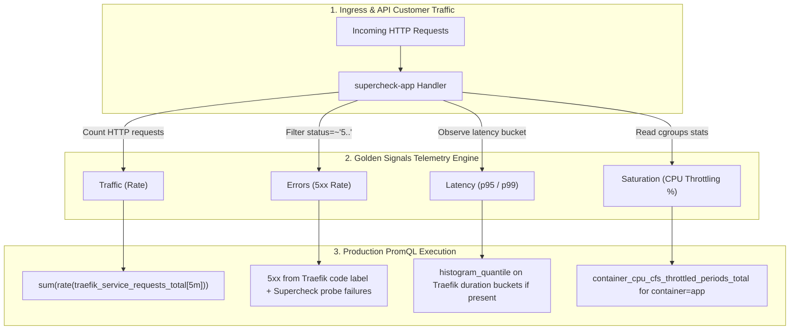

# Episode 09 — Golden Signals: RED, USE, and SLIs

| | |
| :--- | :--- |
| **YouTube title** | Golden Signals: RED, USE, and SLIs |
| **Film order** | 09 of 33 · Phase 2 · Week 9 |
| **Duration** | 10 minutes |
| **Lab repo** | `supercheck-io/supercheck` |
| **Supercheck files** | `app /api/health + Traefik/kube-state PromQL; Supercheck synthetics as outside-in` |
| **Next** | [10-prometheus.md](10-prometheus.md) |

## Overview

Next.js and Nest **do not export** `http_requests_total`. Customer RED comes from **Traefik** (or Cloudflare) plus **Supercheck synthetics**. USE comes from cAdvisor / kube-state / Redis exporters. Do not invent app `/metrics` on camera.

Film only Supercheck names: `supercheck-app`, `supercheck-worker-eu`, `supercheck-execution`, Traefik, BullMQ, PlanetScale/Postgres, Redis Sentinel. No toy `demo-api`.


## Episode 09: Golden Signals: RED, USE, and SLIs

### 1. The Production Problem
*"Our monitoring system collected 850 distinct metrics from our Kubernetes cluster. During a major customer incident, checkout requests failed with 6-second timeouts, but not a single alert fired because our dashboards were watching node CPU and memory rather than customer-facing signals."*

### 2. Deep Technical Breakdown
Modern SRE divides telemetry into three complementary frameworks:
1. **RED Method (Request-Driven Workloads):** Invented by Tom Wilkie for microservices and web APIs:
   - **Rate:** How many requests per second is the service processing?
   - **Errors:** How many requests are failing (HTTP 5xx)?
   - **Duration:** How long do requests take (p95 and p99 percentiles)?
2. **USE Method (Resource-Driven Systems):** Invented by Brendan Gregg for hardware and low-level infrastructure (CPUs, Disks, Memory, Database connection pools):
   - **Utilization:** What percentage of time is the resource busy?
   - **Saturation:** How much extra work is queued waiting for the resource?
   - **Errors:** Did the hardware or subsystem record error events?
3. **Google's 4 Golden Signals:** The unified SRE standard:
   - **Latency:** Time taken to service a request (differentiating successful requests from failed requests).
   - **Traffic:** Demand placed on the system (HTTP QPS, concurrent transactions).
   - **Errors:** Rate of requests that fail explicitly, implicitly, or by policy.
   - **Saturation:** How full the service is (CPU throttled periods, queue depth, thread pool usage).

### 3. Architecture: Golden Signals to PromQL Mapping



### 4. Telemetry Metric Types Matrix

| Metric Type | Internal Behavior | Reset Behavior | Mathematical Safety | Best Used For |
| :--- | :--- | :--- | :--- | :--- |
| **Counter** | Monotonically increasing number | Resets to 0 on pod restart | Safe with `rate()`, `increase()` | Total requests, errors, bytes sent |
| **Gauge** | Instantaneous value that goes up or down | Arbitrary jumps | Use `avg_over_time()`, `max_over_time()` | Memory usage, queue depth, thread count |
| **Histogram** | Samples observed in configurable buckets | Cumulative counters per bucket | Use `histogram_quantile()` | Request duration, response payload sizes |
| **Summary** | Direct client-side quantile calculation | Cannot be aggregated across pods! | **Do not aggregate in PromQL** | Single-instance client-side latency profiling |

### 5. Production PromQL Reference
```promql
# Traffic: Traefik (confirm metric names on the live Prometheus)
sum(rate(traefik_service_requests_total{service=~".*supercheck.*"}[5m]))

# Errors: HTTP 5xx at the edge
sum(rate(traefik_service_requests_total{code=~"5..", service=~".*supercheck.*"}[5m]))

# Saturation: CFS throttle on the app container (cAdvisor)
sum(increase(container_cpu_cfs_throttled_periods_total{namespace="supercheck", container="app"}[5m]))
/
sum(increase(container_cpu_cfs_periods_total{namespace="supercheck", container="app"}[5m]))

# Workload health without app /metrics
kube_deployment_status_replicas_unavailable{namespace="supercheck", deployment="supercheck-app"}
```

### 6. 10-Minute Video Script Outline
* **1. The Hook (0:00–0:45):** Show a Grafana dashboard with 40 green graphs showing 15% CPU usage, while customer support is blowing up with tweets that the site is down. *"Everything in your monitoring is green, but your users are staring at blank screens. Why?"*
* **2. The Stakes & Blast Radius (0:45–1:45):** Explain the danger of measuring low-level host metrics instead of user pain. How missing the Golden Signals creates multi-hour outages.
* **3. Architecture & Mental Model (1:45–3:30):** Walk through RED vs USE vs Google's 4 Golden Signals. Contrast request-driven systems with resource-driven systems.
* **4. Hands-On Implementation (3:30–8:30):**
  - Step 1: Open Supercheck Prometheus (monitoring ns). Confirm **no** `supercheck-app` ServiceMonitor (file comment in `service-monitors.yaml`).
  - Step 2: RED from Traefik + Supercheck EU/US/APAC synthetics; USE from Redis exporter + cAdvisor.
  - Step 3: Show why adding `tenant_id` to a future app metric would OOM Prometheus (Episode 10).
* **5. Verification & Guardrails (8:30–10:00):** Generate load using `hey` or `k6` and watch the PromQL queries accurately reflect the latency spike and error rates in real-time.
* **6. Outro & Call to Action (10:00–10:30):** Rule of thumb: *"If an alert doesn't tell you whether a user is suffering, it shouldn't be paging you."* Next: Episode 09 — Scraping in Kubernetes & Cardinality.

---

---

## Creator prep (from original kit)

### Episode 09 Preparation: Golden Signals: RED, USE, and SLIs

#### 1. High-Yield Learning Links (Watch & Read Before Filming)
* **YouTube**: *Tom Wilkie (Grafana Labs)* — "The RED Method: How to instrument your services" ([YouTube Search: Tom Wilkie RED Method Grafana](https://www.youtube.com/results?search_query=Tom+Wilkie+RED+Method+Grafana))
* **YouTube**: *ByteByteGo* — "Monitoring and Observability: Metrics vs Logs vs Traces" ([YouTube Search: ByteByteGo Metrics Logs Traces](https://www.youtube.com/results?search_query=ByteByteGo+Metrics+Logs+Traces))
* **Official Docs & Canonical Texts**: [Google SRE Book: Monitoring Distributed Systems](https://sre.google/sre-book/monitoring-distributed-systems/) & [Brendan Gregg's USE Method](https://www.brendangregg.com/usemethod.html)

#### 2. Intuitive Mental Model
* **The Doctor's Triage Analogy**:
  * If a patient arrives at an emergency room, the doctor doesn't measure the thickness of their fingernails or the number of hairs on their head (collecting 850 random metrics).
  * The doctor checks the **4 Vitals**: Pulse, Blood Pressure, Respiratory Rate, and Temperature (**The 4 Golden Signals**: Rate, Errors, Latency, Saturation).
  * **RED** is for human customers using an API (How many people entered the store? How many were refused entry? How long did they wait in line?).
  * **USE** is for machine hardware (Is the engine overheating? Is the conveyor belt full? Did a gear break?).

#### 3. Pre-Flight (Prometheus already on Supercheck K3s)

```bash
kubectl get prometheus,servicemonitor -n monitoring
kubectl get servicemonitor -n monitoring
# Confirm: supercheck-redis, sentinel, cluster-autoscaler, infisical — not the Next.js app

# Explore PromQL against the live TSDB (Grafana Explore or Prometheus UI)
# Do not docker-compose a second Prometheus on a laptop
```

#### 4. YouTube Retention & Growth Kit
* **Clickable Titles**:
  1. *Stop Monitoring Everything! (The 4 Metrics Senior SREs Actually Watch)*
  2. *RED vs USE vs Golden Signals: What Every Platform Engineer Gets Wrong*
  3. *Why Your Alerts Missed the Outage (And How to Fix Your PromQL)*
* **Thumbnail Concept**: Left: A chaotic dashboard with 50 unreadable graphs labeled "Junior SRE (850 Metrics)". Right: 4 clean, glowing dials labeled "Senior SRE (4 Golden Signals)". Bold text: **"LESS IS MORE!"**
* **30-Second Hook**: *"Our team collected 850 distinct metrics from our Kubernetes cluster. During a major customer outage, checkout failed with 6-second timeouts, but not a single alert fired because our dashboards were watching node memory instead of customer latency. In this video, we cut through the noise and master the 4 Golden Signals."*
* **Beginner Gotcha**: Don't say *"We monitor average latency."* Averages hide catastrophic outliers! A 99th percentile (p99) latency of 3 seconds is completely invisible if 99% of requests take 10ms (average looks like ~40ms!).

---
