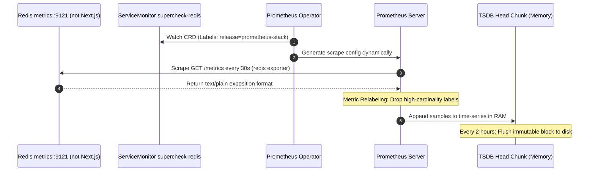

# Episode 10 — Prometheus in Kubernetes

| | |
| :--- | :--- |
| **YouTube title** | Prometheus in Kubernetes |
| **Film order** | 10 of 33 · Phase 2 · Week 10 |
| **Duration** | 10 minutes |
| **Lab repo** | `supercheck-io/supercheck` |
| **Supercheck files** | `deploy/k8s/observability/service-monitors.yaml` (Redis/Sentinel/CA/Infisical) |
| **Next** | [11-grafana.md](11-grafana.md) |

## Overview

**Do not** add a ServiceMonitor for `supercheck-app` or workers — they have no `/metrics`. That is already documented in `service-monitors.yaml` and causes permanent TargetDown. Film Redis/Sentinel exporters + cardinality on labels you *do* scrape. Prometheus OOM is still a Supercheck outage.

Film only Supercheck names: `supercheck-app`, `supercheck-worker-eu`, `supercheck-execution`, Traefik, BullMQ, PlanetScale/Postgres, Redis Sentinel. No toy `demo-api`.


## Episode 10: Prometheus in Kubernetes

### 1. The Production Problem
*"Prometheus crashed at 3 AM with an `OOMKilled` exit code 137. A developer merged a PR adding `user_id` and `customer_ip` as Prometheus labels, exploding the time-series database from 40,000 series to 6.2 million series in under two hours."*

### 2. Deep Technical Breakdown
Understanding Prometheus in Kubernetes:
1. **The Prometheus Operator & ServiceMonitors:** Rather than manually updating static scrape configurations in `prometheus.yml`, Kubernetes uses the Operator pattern. The Prometheus Operator watches for `ServiceMonitor` Custom Resources (CRDs), discovers the backing Service, finds pod endpoints in `EndpointSlices`, and dynamically registers them as scrape targets.
2. **Prometheus TSDB Head Block Mechanics:** Active time-series are held in memory in the TSDB Head Chunk. Every 2 hours, chunks are compressed and flushed to disk as immutable blocks.
3. **The Cardinality Bomb:** Every unique combination of key-value label pairs creates an independent time series in RAM:
   $$\text{Total Active Series} = \prod (\text{Cardinality of Label } i)$$
   If you add a label with high uniqueness (UUIDs, IP addresses, emails, timestamps), memory consumption scales linearly until Prometheus crashes.

### 3. Architecture: ServiceMonitor Discovery & Scrape Sequence



### 4. Cardinality Impact Estimation Matrix

| Label Name | Unique Values (Cardinality) | Resulting Series Impact | TSDB Status |
| :--- | :---: | :---: | :--- |
| `app="supercheck-app"` | 1 | 1 series | Safe |
| `status=~"200\|400\|500"` | 5 | 5 series | Safe |
| `handler=~"/checkout\|/login"` | 10 | 50 series | Safe |
| `user_id="usr_839210"` | 150,000 | **7,500,000 series** | **Prometheus Crashes (OOMKilled)** |
| `client_ip="192.168.1.1"` | 500,000 | **25,000,000 series** | **Cluster TSDB Collapse** |

### 5. Production ServiceMonitor (copy from Supercheck, do not invent app scrape)

```yaml
# From deploy/k8s/observability/service-monitors.yaml
# NOTE: supercheck-app and supercheck-worker ServiceMonitors are omitted on purpose.
apiVersion: monitoring.coreos.com/v1
kind: ServiceMonitor
metadata:
  name: supercheck-redis
  namespace: monitoring
spec:
  namespaceSelector:
    matchNames: [supercheck]
  selector:
    matchLabels:
      app.kubernetes.io/name: redis
      app.kubernetes.io/component: database
      app.kubernetes.io/role: write
  endpoints:
    - port: metrics
      interval: 30s
```

### 6. 10-Minute Video Script Outline
* **1. The Hook (0:00–0:45):** Show Prometheus logs throwing `out of memory: kill process` and Prometheus stuck in a continuous crash loop.
* **2. The Stakes & Blast Radius (0:45–1:45):** Explain what high cardinality is and why it's the number one cause of observability outages across the tech industry.
* **3. Architecture & Mental Model (1:45–3:30):** Explain the Prometheus Operator lifecycle and how ServiceMonitors find pods via EndpointSlices. Show the TSDB Head Block architecture.
* **4. Hands-On Implementation (3:30–8:30):**
  - Step 1: Scroll `service-monitors.yaml`. Show why app/worker monitors are omitted.
  - Step 2: Prometheus targets: Redis, Sentinel, cluster-autoscaler, Infisical operator.
  - Step 3: Cardinality: never put `tenant_id` / job IDs on Redis or future app metrics.
* **5. Verification & Guardrails (8:30–10:00):** Use the Prometheus TSDB analysis API: `promtool tsdb analyze /prometheus/data` to identify the top 10 highest-cardinality labels in seconds.
* **6. Outro & Call to Action (10:00–10:30):** Rule of thumb: *"Never put an unbounded string in a metric label; save IDs for traces and logs."* Next: Episode 10 — Grafana Dashboards for On-Call Triage.

---

---

## Creator prep (from original kit)

### Episode 10 Preparation: Prometheus in Kubernetes

#### 1. High-Yield Learning Links (Watch & Read Before Filming)
* **YouTube**: *TechWorld with Nana* — "Prometheus Explained in 100 Seconds" & "Prometheus Deep Dive" ([YouTube Search: TechWorld with Nana Prometheus](https://www.youtube.com/results?search_query=TechWorld+with+Nana+Prometheus))
* **YouTube**: *DevOps Toolkit (Viktor Farcic)* — "Prometheus Operator vs Plain Prometheus in Kubernetes" ([YouTube Search: DevOps Toolkit Prometheus Operator](https://www.youtube.com/results?search_query=DevOps+Toolkit+Prometheus+Operator))
* **Official Docs**: [Prometheus Operator ServiceMonitor Spec](https://prometheus-operator.dev/docs/operator/api/#monitoring.coreos.com/v1.ServiceMonitor) & [Prometheus Cardinality Best Practices](https://prometheus.io/docs/practices/naming/)

#### 2. Intuitive Mental Model
* **The Mail Carrier vs The Phone Book (Pull Scraping & Cardinality)**:
  * **Pull Scraping**: Prometheus is like a mail carrier who visits your front porch mailbox on a fixed 15-second schedule (`scrape_interval`). Your app doesn't need to know where Prometheus lives; it just leaves metrics on the porch (`/metrics`).
  * **Cardinality Explosion**: Think of a phone book. If you organize people by City, you have 50 entries. If you add a label for `user_id` or `email`, you have 10,000,000 entries. Prometheus must keep a separate time-series in RAM for every combination. High cardinality crashes your monitoring server!

#### 3. Pre-Flight (existing kube-prometheus-stack on Supercheck K3s)

```bash
kubectl get prometheus -n monitoring
kubectl get servicemonitor -n monitoring
kubectl describe servicemonitor supercheck-redis -n monitoring

# Targets UI via Grafana or Prometheus — do not helm install a second stack
# Bad PR to film: adding ServiceMonitor for supercheck-app → TargetDown forever
```

#### 4. YouTube Retention & Growth Kit
* **Clickable Titles**:
  1. *How Prometheus REALLY Works in Kubernetes (ServiceMonitors & CRDs)*
  2. *The Cardinality Trap: How One Label Crashed Our Monitoring Server*
  3. *Mastering PromQL: From Beginner to Senior SRE in 10 Minutes*
* **Thumbnail Concept**: A Prometheus flame icon burning through a server rack with memory usage pinned at 100%. Red banner: `Out of Memory: High Cardinality`. Bold text: **"KILLER LABELS!"**
* **30-Second Hook**: *"Why does Prometheus PULL metrics instead of letting apps PUSH them? And how did a single developer adding `user_id` to a metric label cost an enterprise $40,000 in cloud bills and crash the Prometheus server? Here is the truth about ServiceMonitors and cardinality in Kubernetes."*
* **Beginner Gotcha**: NEVER put dynamic IDs (UUIDs, user IDs, credit card numbers, email addresses) into Prometheus metric labels! Metric labels must have finite, low cardinality (e.g. `http_status`, `method`, `route`).

---
