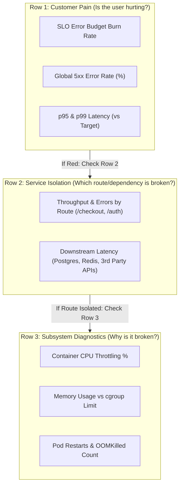

# Episode 11 — Grafana Dashboards for On-Call

| | |
| :--- | :--- |
| **YouTube title** | Grafana Dashboards for On-Call |
| **Film order** | 11 of 33 · Phase 2 · Week 11 |
| **Duration** | 10 minutes |
| **Lab repo** | `supercheck-io/supercheck` |
| **Supercheck files** | `3-row dashboard; Row 0 = Supercheck EU/US/APAC synthetics` |
| **Next** | [12-loki.md](12-loki.md) |

## Overview

Inside-out PromQL vs outside-in Supercheck probes. If probes red and Prom green, blame Traefik/Cloudflare. Opposite: app bug.

Film only Supercheck names: `supercheck-app`, `supercheck-worker-eu`, `supercheck-execution`, Traefik, BullMQ, PlanetScale/Postgres, Redis Sentinel. No toy `demo-api`.


## Episode 11: Grafana Dashboards for On-Call

### 1. The Production Problem
*"It's 2:30 AM and an SRE is paged. They open Grafana and are greeted by an unorganized dashboard with 52 individual graphs displaying disk writes, memory buffers, and GC pause times. It took 48 minutes just to figure out which microservice was failing."*

### 2. Deep Technical Breakdown
A production incident dashboard must be designed for **cognitive efficiency under extreme pressure**:
1. **The F-Pattern Visual Hierarchy:** On-call engineers read screens from top-left to bottom-right.
   - **Row 1 (Customer Impact - Top 20%):** SLO error budget burn rate, global p99 latency, and 5xx error percentage.
   - **Row 2 (Service Breakdown - Middle 50%):** Per-route throughput, response codes, and downstream dependency latency.
   - **Row 3 (Host & Infrastructure - Bottom 30%):** Pod CPU throttling, memory limits, and restart counters.
2. **Dashboard Variables:** Use template variables (`$namespace`, `$cluster`, `$service`) so a single standard dashboard covers 100+ services rather than maintaining 100 distinct dashboards.
3. **Supercheck Synergy (Outside-In vs Inside-Out):** Cluster metrics show what the pod thinks is happening (*Inside-Out*). Supercheck synthetic probes test the actual DNS, TLS, and ingress network path from external geographic regions (*Outside-In*). Comparing the two immediately isolates whether an outage is internal application logic or cloud CDN/ingress routing.

### 3. Architecture: Incident Dashboard Triage Flow



### 4. Dashboard Design Principles Comparison

| Feature | Anti-Pattern ("Junior Dashboard") | Production Standard ("Senior SRE") |
| :--- | :--- | :--- |
| **Information Density** | 50+ unorganized panels | Max 8–12 panels arranged in 3 logical tiers |
| **Alert Thresholds** | Random uncalibrated colors | Clear green/yellow/red color-coded status mappings |
| **Time Windows** | Hardcoded 6-hour windows | Default `now-15m` with synchronized time scrubbers |
| **Scope** | Monolithic dashboard per service | Single parameterized dashboard with dynamic dropdowns |
| **Perspective** | Purely internal cluster metrics | Unified view: Internal Prometheus + External Supercheck synthetics |

### 5. Reference Grafana Panel Configuration (JSON Schema Excerpt)
```json
{
  "title": "HTTP 5xx Error Rate (Golden Signal)",
  "type": "timeseries",
  "gridPos": { "h": 8, "w": 12, "x": 0, "y": 0 },
  "targets": [
    {
      "expr": "(sum(rate(http_requests_total{namespace=\"$namespace\", service=\"$service\", status=~\"5..\"}[2m])) / sum(rate(http_requests_total{namespace=\"$namespace\", service=\"$service\"}[2m]))) * 100",
      "legendFormat": "5xx Error Percentage"
    }
  ],
  "fieldConfig": {
    "defaults": {
      "unit": "percent",
      "thresholds": {
        "mode": "absolute",
        "steps": [
          { "color": "green", "value": null },
          { "color": "yellow", "value": 1.0 },
          { "color": "red", "value": 5.0 }
        ]
      }
    }
  }
}
```

### 6. 10-Minute Video Script Outline
* **1. The Hook (0:00–0:45):** Display an ugly, cluttered Grafana dashboard with 60 graphs. Set a timer. Try to answer: *"Which service caused the 502 error?"* Watch the timer hit 5 minutes with no answer.
* **2. The Stakes & Blast Radius (0:45–1:45):** Explain Mean Time to Identify (MTTI). Every minute spent hunting through disorganized dashboards during a Sev-1 incident costs companies thousands in revenue and burns out engineers.
* **3. Architecture & Mental Model (1:45–3:30):** Introduce the 3-Tier Dashboard Hierarchy: User Pain $\rightarrow$ Service Isolation $\rightarrow$ Infrastructure Subsystems.
* **4. Hands-On Implementation (3:30–8:30):**
  - Step 1: Set up dynamic dashboard variables for `$namespace` and `$service`.
  - Step 2: Build Row 1: The Golden Signals (Error rate percentage with color-coded threshold zones).
  - Step 3: Integrate Supercheck synthetic probe results alongside internal metrics to show the external customer perspective.
* **5. Verification & Guardrails (8:30–10:00):** Inject synthetic errors and observe how an on-call engineer can isolate root cause in under 30 seconds using the top-down hierarchy.
* **6. Outro & Call to Action (10:00–10:30):** Rule of thumb: *"If a dashboard panel doesn't change what an engineer does during an incident, delete it."* Next: Episode 11 — Distributed Tracing with OpenTelemetry.

---

---

---

## Creator prep (from original kit)

### Episode 11 Preparation: Grafana Dashboards for On-Call

#### 1. High-Yield Learning Links (Watch & Read Before Filming)
* **YouTube**: *Grafana Labs* — "How to Build Incident-Ready Dashboards" ([YouTube Search: Grafana Labs Incident Dashboards](https://www.youtube.com/results?search_query=Grafana+Labs+Incident+Dashboards))
* **YouTube**: *Jeff Geerling* — "Grafana & Prometheus Monitoring Lab" ([YouTube Search: Jeff Geerling Grafana Prometheus](https://www.youtube.com/results?search_query=Jeff+Geerling+Grafana+Prometheus))
* **Official Guide**: [Grafana Dashboard Best Practices](https://grafana.com/docs/grafana/latest/best-practices/dashboards-best-practices/)

#### 2. Intuitive Mental Model
* **The Airplane Cockpit at 30,000 Feet**:
  * An airline pilot has hundreds of switches and dials. But during severe turbulence or an engine fire at night, they only look at the **Primary Flight Display (PFD)**: Altitude, Airspeed, Heading, Attitude.
  * An SRE on-call dashboard is that PFD:
    * **Row 1 (Top Level)**: Is the customer happy? (HTTP Error % & p99 Latency).
    * **Row 2 (Traffic & Workload)**: Is traffic surging? (Total QPS by route).
    * **Row 3 (Resources)**: Is hardware failing? (CPU throttling %, Memory vs Limit).

#### 3. Pre-Flight (Grafana already in `monitoring`)

```bash
kubectl get cm supercheck-overview-dashboard -n monitoring
kubectl get svc -n monitoring | grep -i grafana
# Open the Supercheck overview dashboard — not Grafana.com ID 315
# Do not assume default Helm admin/prom-operator on production
```

#### 4. YouTube Retention & Growth Kit
* **Clickable Titles**:
  1. *Stop Building Wall-of-Glow Dashboards! (The 3-Row SRE Rule)*
  2. *How to Build a Grafana Dashboard for 2 AM Production Outages*
  3. *The Only 4 Panels You Need on an On-Call Dashboard*
* **Thumbnail Concept**: Screen split: Left shows a messy wall of 40 tiny unreadable charts with red question marks ("Useless at 2 AM"). Right shows 3 clean horizontal rows with instant green/red status indicators ("Incident Ready"). Bold text: **"DON'T PANIC!"**
* **30-Second Hook**: *"It's 2 AM, your phone wakes you up with a P1 critical alert, and you open Grafana. What do you see? A chaotic wall of 60 vibrating graphs that nobody knows how to read. In an active outage, your dashboard must answer one question in 5 seconds: Which service is broken and why? Here is the 3-row layout top SREs use."*
* **Beginner Gotcha**: Don't use non-standard color palettes or rainbow lines. Use standard semantic colors: Green = Good, Yellow = Approaching SLO threshold, Red = Burning Error Budget.

---
