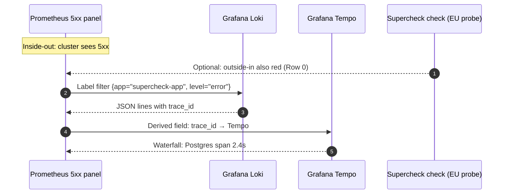

# Episode 12 — Loki: Logs That Correlate

| | |
| :--- | :--- |
| **YouTube title** | Loki: Logs That Correlate |
| **Film order** | 12 of 33 · Phase 2 · Week 12 |
| **Duration** | 10 minutes |
| **Lab repo** | `supercheck-io/supercheck` |
| **Supercheck files** | `JSON logs from Next.js/NestJS; Loki labels namespace/app only` |
| **Next** | [13-tracing.md](13-tracing.md) |

## Overview

Complete LGTM. Pivot 5xx → LogQL → trace_id. No PII (GDPR). Supercheck failed-check timestamp is the query window.

Film only Supercheck names: `supercheck-app`, `supercheck-worker-eu`, `supercheck-execution`, Traefik, BullMQ, PlanetScale/Postgres, Redis Sentinel. No toy `demo-api`.


## Episode 12: Loki: Logs That Correlate

> **Film-order Episode 12.** Completes LGTM: Loki was named in the stack and never taught. Senior loops always ask “how do you go from a 5xx panel to the exact log line?”

### 1. The Production Problem
*"Grafana shows a 6% 5xx spike. Tempo sampling dropped the slow traces. `kubectl logs` across 40 replicas is a haystack of unstructured lines with no request ID. Mean time to the guilty line: 40 minutes."*

### 2. Deep Technical Breakdown
1. **Logs are not a substitute for metrics.** You cannot SLO on `grep`. Metrics detect; logs explain; traces locate the hop.
2. **Loki indexes labels, not full text** (like Prometheus). High-cardinality labels (`user_id`, IP) explode Loki just like Prometheus. Keep labels to `namespace`, `app`, `level`, `pod`. Put `trace_id` and `request_id` **in the JSON body** and filter with `| json | trace_id="..."`.
3. **Correlation contract:** Every log line from `supercheck-app` is JSON: `ts`, `level`, `msg`, `trace_id`, `span_id`, `http_status`, `route`. Grafana: Metrics panel → Explore logs with the same `app` label → Tempo via derived field on `trace_id`.
4. **GDPR:** Do not log emails, PANs, or access tokens. EU interviews will ask. Redact at the logger, not in Loki retention.

### 3. Architecture: Metrics → Logs → Traces



### 4. Log design matrix (on-screen)

| Approach | Query speed | Cardinality risk | GDPR risk | Use |
| :--- | :--- | :--- | :--- | :--- |
| Unstructured `fmt.Println` | Grep only | Low | Accidental PII | Never in prod |
| JSON + **labels** = user_id | Fast | **Explodes Loki** | High | Forbidden |
| JSON body + low-card labels | Filter `| json` | Safe | OK if redacted | **Standard** |
| `trace_id` in body + Grafana derived field | Pivot to Tempo | Safe | OK | **Senior pattern** |

### 5. Promtail / DaemonSet sketch + LogQL

```logql
{namespace="prod", app="supercheck-app"}
  | json
  | level="error"
  | http_status >= 500
  | line_format "{{.ts}} {{.route}} {{.msg}} trace={{.trace_id}}"
```

Go logger rule: `slog` JSON handler; pull `trace_id` from `r.Context()`. Never log `Authorization` headers.

### 6. 10-minute script
* **Hook:** 40 `kubectl logs` windows vs one LogQL query that returns 12 lines with the same `trace_id`.
* **Stakes:** GDPR (PII in logs = incident). Cardinality (Loki OOM). Supercheck: failed EU check timestamp is the query window — don’t start from `now-6h`.
* **Mental model:** Index labels vs body; three-pillar pivot.
* **Lab:** (1) JSON logs from supercheck-app. (2) Promtail scrape. (3) Grafana derived field to Tempo. (4) 15s Supercheck: open the failed check, copy time range into Loki.
* **Guardrail:** linter/CI grep for `log.Print` / email regex; Loki `retention_period` 14d for demo.
* **Rule:** *"Metrics tell you it broke; logs tell you which request; traces tell you which hop. Pivot on `trace_id`."* Next: OpenTelemetry (film-order 13).

---

---

## Creator prep (from original kit)

### Episode 12 Preparation: Loki: Logs That Correlate

#### 1. High-yield links
* Grafana: Loki overview, LogQL, derived fields
* [OpenTelemetry log–trace correlation](https://opentelemetry.io/docs/concepts/signals/logs/)

#### 2. Mental model
* **Library card catalog vs the books.** Loki's labels are the card catalog (`namespace`, `app`). The JSON body is the book (`trace_id`, `msg`). You do not photocopy every page into the catalog (that is high-cardinality labels).

#### 3. Pre-flight
```bash
# Emit one JSON line you can query
kubectl logs deploy/supercheck-app -n supercheck --tail=20
# Confirm fields: level, trace_id, route — no email, no token
```

#### 4. YouTube retention kit
* **Titles:** `Stop kubectl logs -f (Use Loki + Trace IDs)` / `The Missing L in LGTM` / `From 5xx Panel to One Log Line`
* **Thumbnail:** Haystack vs one JSON line with `trace_id` glowing. **"40 PODS → 1 LINE"**
* **Hook:** Split screen: 40 terminals vs one LogQL query.
* **Gotcha:** Putting `trace_id` in Loki **labels**. It belongs in the JSON body.
* **Supercheck beat:** Failed check time range → Loki `{app="supercheck-app"}` for that 5-minute window.
