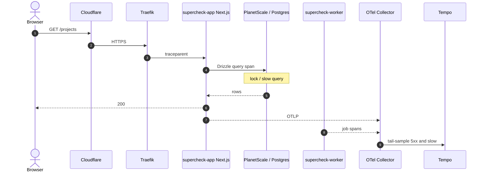

# Episode 13 — Distributed Tracing with OpenTelemetry

| | |
| :--- | :--- |
| **YouTube title** | Distributed Tracing with OpenTelemetry |
| **Film order** | 13 of 33 · Phase 2 · Week 13 |
| **Duration** | 10 minutes |
| **Lab repo** | `supercheck-io/supercheck` |
| **Supercheck files** | `OTel Node on supercheck-app; Tempo; W3C traceparent` |
| **Next** | [14-slo-error-budgets.md](14-slo-error-budgets.md) |

## Overview

A dashboard request: Cloudflare → Traefik → Next.js → PlanetScale/Redis → maybe worker Job. Metrics say slow; traces say which hop.

Film only Supercheck names: `supercheck-app`, `supercheck-worker-eu`, `supercheck-execution`, Traefik, BullMQ, PlanetScale/Postgres, Redis Sentinel. No toy `demo-api`.


## Episode 13: Distributed Tracing with OpenTelemetry

### 1. The Production Problem
*"Our API latency spiked from 50ms to 2,800ms. Prometheus metrics showed that `supercheck-app` was slow, but host CPU was at 15% and database query times appeared normal. The API calls four other microservices, and nobody knew which hop in the network was holding the connection open."*

### 2. Deep Technical Breakdown
Distributed tracing tracks the complete lifecycle of a request as it crosses process, container, and network boundaries:
1. **W3C TraceContext Standard:** When a request arrives, the edge service generates a globally unique **Trace ID** (16-byte hex) and a **Span ID** (8-byte hex). These are passed downstream in HTTP headers via the standardized `traceparent` header:
   `traceparent: 00-4bf92f3577b34da6a3ce929d0e0e4736-00f067aa0ba902b7-01`
2. **Context Propagation:** In Go, the `context.Context` object carries the trace context across function boundaries and injects it into outbound HTTP and SQL queries.
3. **Tail-Based Sampling:** Tracing 100% of requests in high-volume production systems is cost-prohibitive. Modern OpenTelemetry collectors use **tail-based sampling**: retain 1% of normal 200 OK fast requests, but retain **100% of traces that contain HTTP 5xx errors or exceed 1,000ms latency**.

### 3. Architecture: End-to-End Distributed Trace Flow



### 4. Distributed Tracing Protocols Comparison Matrix

| Protocol / Standard | Origin | Header Format | Vendor Neutral? | Production Status |
| :--- | :--- | :--- | :---: | :--- |
| **OpenTelemetry (OTLP)** | CNCF Standard | W3C (`traceparent`) | **Yes** | **Gold standard for all new microservices** |
| **Jaeger** | CNCF (Legacy) | `uber-trace-id` | Partially | Deprecated in favor of OpenTelemetry SDKs |
| **Zipkin / B3** | Twitter | `X-B3-TraceId` | Partially | Legacy standard; supported via OTel bridges |
| **AWS X-Ray** | AWS Proprietary | `X-Amzn-Trace-Id` | No | Cloud lock-in; requires OTel exporter |

### 5. Production Reference: OpenTelemetry (same W3C model Supercheck uses in Node)

On camera, instrument **supercheck-app** (Node OTel). The Go snippet below is only the mental model for `traceparent` propagation — do not switch the lab language.
```go
package telemetry

import (
	"context"
	"go.opentelemetry.io/otel"
	"go.opentelemetry.io/otel/exporters/otlp/otlptrace/otlptracegrpc"
	"go.opentelemetry.io/otel/propagation"
	"go.opentelemetry.io/otel/sdk/resource"
	sdktrace "go.opentelemetry.io/otel/sdk/trace"
	semconv "go.opentelemetry.io/otel/semconv/v1.24.0"
	"google.golang.org/grpc"
)

func InitTracer(ctx context.Context, collectorAddr string) (*sdktrace.TracerProvider, error) {
	exporter, err := otlptracegrpc.New(ctx,
		otlptracegrpc.WithInsecure(),
		otlptracegrpc.WithEndpoint(collectorAddr),
		otlptracegrpc.WithDialOption(grpc.WithBlock()),
	)
	if err != nil {
		return nil, err
	}

	res, err := resource.New(ctx,
		resource.WithAttributes(
			semconv.ServiceNameKey.String("supercheck-app"),
			semconv.ServiceVersionKey.String("v1.0.0"),
		),
	)
	if err != nil {
		return nil, err
	}

	tp := sdktrace.NewTracerProvider(
		sdktrace.WithBatcher(exporter),
		sdktrace.WithResource(res),
	)

	otel.SetTracerProvider(tp)
	otel.SetTextMapPropagator(propagation.NewCompositeTextMapPropagator(
		propagation.TraceContext{},
		propagation.Baggage{},
	))

	return tp, nil
}
```

### 6. 10-Minute Video Script Outline
* **1. The Hook (0:00–0:45):** Show an endpoint timing out with 3 seconds of latency. Prometheus says the app is healthy. Open Grafana Tempo, search by endpoint, and instantly reveal a single database row lock consuming 2,850ms of the 3,000ms request.
* **2. The Stakes & Blast Radius (0:45–1:45):** Why metrics fail in distributed microservices. Metrics tell you *that* you're slow; traces tell you *where* and *why*.
* **3. Architecture & Mental Model (1:45–3:30):** Trace vs Span. Context propagation and the W3C `traceparent` header format. How the OpenTelemetry Collector acts as a buffer.
* **4. Hands-On Implementation (3:30–8:30):**
  - Step 1: Initialize the OpenTelemetry Go SDK with OTLP gRPC exporter.
  - Step 2: Wrap an HTTP router with `otelhttp.NewHandler` to automatically extract traceparent headers.
  - Step 3: Pass `r.Context()` into a database call and create a child span.
* **5. Verification & Guardrails (8:30–10:00):** Fire test requests, open Grafana Tempo, link Prometheus metrics directly to traces, and inspect the flame graph breakdown.
* **6. Outro & Call to Action (10:00–10:30):** Rule of thumb: *"Never pass a raw context; propagate context through your entire call stack to preserve trace lineage."* Next: Episode 12 — Error Budgets & SLO Math.

---

---

## Creator prep (from original kit)

### Episode 13 Preparation: Distributed Tracing with OpenTelemetry

#### 1. High-Yield Learning Links (Watch & Read Before Filming)
* **YouTube**: *OpenTelemetry (CNCF)* — "What is OpenTelemetry? Beginner's Guide" ([YouTube Search: CNCF OpenTelemetry Beginner Guide](https://www.youtube.com/results?search_query=CNCF+OpenTelemetry+Beginner+Guide))
* **YouTube**: *That DevOps Guy* — "Distributed Tracing with OpenTelemetry & Grafana Tempo" ([YouTube Search: That DevOps Guy OpenTelemetry Tempo](https://www.youtube.com/results?search_query=That+DevOps+Guy+OpenTelemetry+Tempo))
* **Official Docs**: [OpenTelemetry Documentation](https://opentelemetry.io/docs/) & [W3C Trace Context Specification](https://www.w3.org/TR/trace-context/)

#### 2. Intuitive Mental Model
* **The Fedex Tracking Number Analogy**:
  * If you order a package online and it takes 3 weeks to arrive, a general metric saying "Postal Service delivery time: 21 days" tells you nothing about where it got delayed.
  * A **Trace** is the FedEx tracking barcode (`traceparent` header). It logs every single stop:
    * Span 1: Left warehouse in Germany (50ms)
    * Span 2: Airplane to London (200ms)
    * Span 3: Stuck in customs queue (20 days!)
  * Distributed tracing stamps that tracking barcode on every microservice request so you immediately see which exact SQL query or downstream API stalled the user.

#### 3. Pre-Flight (Tempo on Supercheck K3s)

```bash
kubectl get deploy,svc -n monitoring | grep -i tempo
# Grafana Explore → Tempo datasource from kube-prometheus-stack-values additionalDataSources / Tempo manifests
# Do not docker run a laptop Tempo
```

#### 4. YouTube Retention & Growth Kit
* **Clickable Titles**:
  1. *Distributed Tracing with OpenTelemetry: From Zero to Production*
  2. *Why Metrics Lie (And Why You Need Distributed Tracing)*
  3. *How to Find the Exact Line of Code Slowing Down Your API*
* **Thumbnail Concept**: A waterfall flame graph zooming in with a magnifying glass on a red span taking 2,850ms. An arrow points to the text: `SELECT * FROM orders FOR UPDATE`. Bold text: **"FOUND IT!"**
* **30-Second Hook**: *"Your Prometheus metrics say your API is responding in 4 seconds. But your backend calls 8 different microservices and 3 databases. Which one is guilty? In this video, we implement OpenTelemetry and Grafana Tempo to uncover the exact database lock killing our performance in under 10 seconds."*
* **Beginner Gotcha**: Don't confuse `Trace` with `Span`. A `Trace` is the entire end-to-end journey of a single request through the system. A `Span` is a single unit of work (e.g. one HTTP call or one SQL query) within that trace!

---
