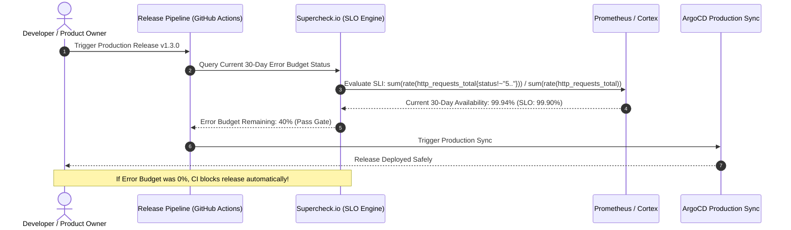

# Episode 14 — SLOs and Error Budgets

| | |
| :--- | :--- |
| **YouTube title** | SLOs and Error Budgets |
| **Film order** | 14 of 33 · Phase 2 · Week 14 |
| **Duration** | 10 minutes |
| **Lab repo** | `supercheck-io/supercheck` |
| **Supercheck files** | `SLI = Supercheck synthetic availability + inbound 5xx` |
| **Next** | [15-alerting.md](15-alerting.md) |

## Overview

Product vs SRE argument ends with math. DORA: this is operational evidence. Gate releases when budget is empty.

Film only Supercheck names: `supercheck-app`, `supercheck-worker-eu`, `supercheck-execution`, Traefik, BullMQ, PlanetScale/Postgres, Redis Sentinel. No toy `demo-api`.


## Episode 14: SLOs and Error Budgets

### 1. The Production Problem
*"The Product Manager wants to ship a major new checkout feature today. The SRE on call feels the system is unstable and pushes back. Every release review descends into an emotional argument with no objective standard of truth."*

### 2. Deep Technical Breakdown
Google SRE defines three distinct reliability boundaries:
1. **SLI (Service Level Indicator):** A quantifiable metric of service performance:
   $$\text{SLI} = \frac{\text{Successful Good Requests}}{\text{Total Valid Requests}} \times 100$$
2. **SLO (Service Level Objective):** The agreed reliability target negotiated between Product and SRE (e.g., 99.9% availability over a rolling 30-day window).
3. **Error Budget:** The allowable room for failure:
   $$\text{Error Budget} = 100\% - \text{SLO} = 0.1\% \text{ (for 99.9\%)}$$
4. **Multi-Window Multi-Burn-Rate Alerting (Google SRE Ch. 5):** Rather than alerting on 1-minute failure spikes, alerts trigger based on the **rate of consumption** of the error budget over varying time horizons (1 hour vs 6 hours vs 3 days).

### 3. Architecture: Error Budget Gated Release Workflow



### 4. SLO Availability & Downtime Budget Reference Table

| SLO Target (Rolling 30 Days) | Error Budget (%) | Allowed Downtime / 30 Days | Allowed Downtime / Year | Target Workload Examples |
| :--- | :---: | :---: | :---: | :--- |
| **99.0% (Two Nines)** | 1.0% | 7.2 hours | 3.65 days | Internal dev tools, batch processing |
| **99.5% (Two and a Half)** | 0.5% | 3.6 hours | 1.83 days | Non-critical internal services |
| **99.9% (Three Nines)** | **0.1%** | **43.2 minutes** | **8.76 hours** | **Consumer web applications, SaaS APIs** |
| **99.95%** | 0.05% | 21.6 minutes | 4.38 hours | High-priority e-commerce checkouts |
| **99.99% (Four Nines)** | **0.01%** | **4.32 minutes** | **52.6 minutes** | **Payment processors, core banking, auth** |

### 5. Multi-Burn-Rate Prometheus Alerting Rules
```yaml
apiVersion: monitoring.coreos.com/v1
kind: PrometheusRule
metadata:
  name: supercheck-app-slo-alerts
  namespace: supercheck
spec:
  groups:
  - name: slo-burn-rate
    rules:
    # Page immediately: 14.4x burn rate (consumes 2% of budget in 1 hour)
    - alert: ErrorBudgetBurnRateCritical
      expr: |
        (
          sum(rate(http_requests_total{app="supercheck-app", status=~"5.."}[1h]))
          /
          sum(rate(http_requests_total{app="supercheck-app"}[1h]))
        ) > (1 - 0.999) * 14.4
      for: 2m
      labels:
        severity: critical
      annotations:
        summary: "High error budget burn rate: 2% burned in 1 hour"

    # Ticket next business day: 1x burn rate (consumes budget over 30 days)
    - alert: ErrorBudgetBurnRateWarning
      expr: |
        (
          sum(rate(http_requests_total{app="supercheck-app", status=~"5.."}[6h]))
          /
          sum(rate(http_requests_total{app="supercheck-app"}[6h]))
        ) > (1 - 0.999) * 6
      for: 15m
      labels:
        severity: warning
      annotations:
        summary: "Moderate error budget burn rate: 5% burned in 6 hours"
```

### 6. 10-Minute Video Script Outline
* **1. The Hook (0:00–0:45):** Show a Slack release channel with engineering leads arguing aggressively over whether to ship a Friday afternoon release. *"Release meetings shouldn't be emotional arguments. In Google SRE, math makes this decision for you."*
* **2. The Stakes & Blast Radius (0:45–1:45):** What happens when teams chase 100% uptime (engineering velocity grinds to zero, costs 10x) vs when they ignore SLOs (customers churn due to chronic instability).
* **3. Architecture & Mental Model (1:45–3:30):** Break down SLI vs SLO vs Error Budget with clear visual math. Introduce the concept of multi-window burn rate alerting from Chapter 5 of the Google SRE Workbook.
* **4. Hands-On Implementation (3:30–8:30):**
  - Step 1: Calculate the exact 30-day budget for a 99.9% service (43.2 minutes).
  - Step 2: Write the multi-burn-rate PromQL query for a 14.4x burn rate.
  - Step 3: Connect Supercheck.io synthetic monitors to evaluate external availability and feed the SLO status into a GitHub Actions release gate.
* **5. Verification & Guardrails (8:30–10:00):** Inject simulated faults; demonstrate GitHub Actions failing a release check when error budget drops below policy threshold.
* **6. Outro & Call to Action (10:00–10:30):** Rule of thumb: *"Reliability is a feature, and error budgets are how you spend it."* Next: Episode 13 — Alerting That Doesn't Burn You Out.

---

---

## Creator prep (from original kit)

### Episode 14 Preparation: SLOs and Error Budgets

#### 1. High-Yield Learning Links (Watch & Read Before Filming)
* **YouTube**: *Google Cloud Tech* — "SLIs, SLOs, SLAs, oh my! (Class SRE)" ([YouTube Search: Google Cloud Tech SLI SLO SLA](https://www.youtube.com/results?search_query=Google+Cloud+Tech+SLI+SLO+SLA))
* **YouTube**: *ByteByteGo* — "SLA, SLO, SLI Explained with Real-World Examples" ([YouTube Search: ByteByteGo SLA SLO SLI](https://www.youtube.com/results?search_query=ByteByteGo+SLA+SLO+SLI))
* **Canonical Texts**: [Google SRE Book: Service Level Objectives](https://sre.google/sre-book/service-level-objectives/) & [Google SRE Workbook: Implementing SLOs](https://sre.google/workbook/implementing-slos/)

#### 2. Intuitive Mental Model
* **The Speeding Ticket & Driver's License Points Analogy**:
  * An **SLO (99.9%)** says you are allowed to drive fast, but you have 12 penalty points per year (**The Error Budget = 43.2 minutes of downtime per month**).
  * If you drive safely and have 10 points left, product managers can ship risky experimental features as fast as they want.
  * If an outage consumes all 12 points in one weekend (**Error Budget Exhausted**), your license is suspended: all feature releases are frozen, and the entire engineering team works exclusively on technical debt and reliability.

#### 3. Pre-Flight Demo Setup (SLO Math Calculation on Camera)
```bash
# 1. Quick mental math formula to write on screen:
# For a 30-day month (43,200 total minutes):
# 99.0%  SLO -> 1% error budget    = 432 minutes (~7.2 hours)
# 99.9%  SLO -> 0.1% error budget  = 43.2 minutes
# 99.99% SLO -> 0.01% error budget = 4.32 minutes

# 2. Multi-Window Multi-Burn-Rate formula (Google SRE Chapter 5):
# Burn Rate 1x    -> Consumes 100% budget in 30 days (No page)
# Burn Rate 14.4x -> Consumes 2% budget in 1 hour (PAGE IMMEDIATELY!)
```

#### 4. YouTube Retention & Growth Kit
* **Clickable Titles**:
  1. *Stop Arguing with Product! (The Google SRE Error Budget Formula)*
  2. *SLI vs SLO vs SLA: The Exact Math Top Tech Companies Use*
  3. *Why 100% Uptime Is a Terrible Idea (Google SRE Truth)*
* **Thumbnail Concept**: A release rocket ship blasting off, but a massive red padlock labeled "ERROR BUDGET EXHAUSTED: RELEASE BLOCKED" stops it. Text: **"WHEN TO SHIP?"**
* **30-Second Hook**: *"The product manager wants to ship a massive new feature today. The on-call SRE feels the system is too shaky. In most companies, this turns into a loud, emotional shouting match. But at Google, engineers don't argue—they look at one number: the Error Budget. Here is the mathematical formula that decides whether you ship or freeze."*
* **Beginner Gotcha**: Don't say *"Our goal is 100% availability."* 100% reliability is impossible and economically reckless; Google deliberately targets 99.9% so teams have an error budget to innovate and deploy fast!

---
