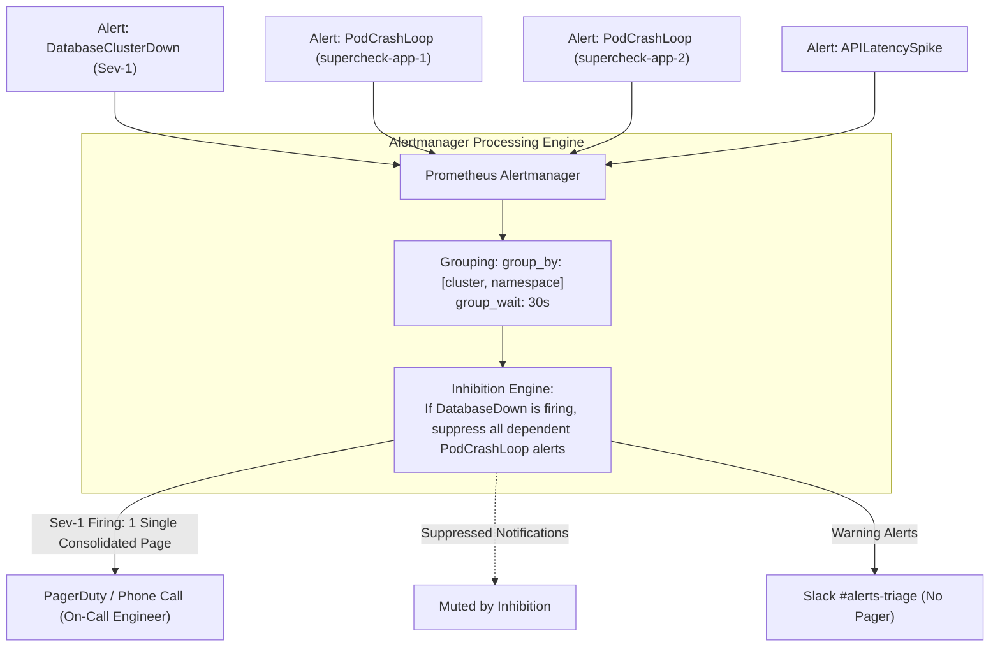

# Episode 15 — Alertmanager: Symptom-Based Alerting

| | |
| :--- | :--- |
| **YouTube title** | Alertmanager: Symptom-Based Alerting |
| **Film order** | 15 of 33 · Phase 2 · Week 15 |
| **Duration** | 10 minutes |
| **Lab repo** | `supercheck-io/supercheck` |
| **Supercheck files** | `Symptom alerts on SLO burn, not CPU; EU rest rules` |
| **Next** | [16-postmortems.md](16-postmortems.md) |

## Overview

Page on customer symptoms. Inhibit app alerts if Redis/Postgres parent is down. Working Time Directive: fewer pages is labour law, not softness.

Film only Supercheck names: `supercheck-app`, `supercheck-worker-eu`, `supercheck-execution`, Traefik, BullMQ, PlanetScale/Postgres, Redis Sentinel. No toy `demo-api`.


## Episode 15: Alertmanager: Symptom-Based Alerting

### 1. The Production Problem
*"Our on-call team was paged 160 times over seven days. 150 of those pages were transient spikes that resolved themselves within 60 seconds ('Node CPU 85% for 30s'). When a real database deadlock occurred, the on-call engineer silenced the pager out of fatigue, causing a 4-hour customer outage."*

### 2. Deep Technical Breakdown
Alert fatigue is the leading cause of SRE burnout. An effective alert pipeline enforces:
1. **Symptom-Based Alerting:** Only wake up a human if a customer is experiencing degraded latency or errors. Never page on high CPU or memory utilization alone if customer SLIs remain green.
2. **Alertmanager Grouping:** When a network switch fails, Alertmanager collects 50 individual pod failure alerts into a single deduplicated notification.
3. **Inhibition Rules:** If a parent resource is down (e.g. `DatabaseDown`), Alertmanager **inhibits** all downstream alerts (e.g. `APICantConnectToDB`) to keep communication channels clean.
4. **Toil Budgeting:** SRE teams cap operational toil (manual, repetitive, automatable work) at **50% of an engineer's time**. The remaining 50% must be spent on engineering projects that permanently eliminate failure modes.

### 3. Architecture: Alertmanager Deduplication & Inhibition Flow



### 4. Alert Routing & Notification Channel Matrix

| Severity Level | Definition | Delivery Channel | Action Required Within | Alert Rules Examples |
| :--- | :--- | :--- | :---: | :--- |
| **Critical (P1)** | Active customer outage; error budget burning rapidly | PagerDuty / Opsgenie (Phone Call) | **5–15 minutes** | High Error Budget Burn Rate, Database Down |
| **Major (P2)** | Redundancy lost; system at risk of total failure | Push Notification / SMS | **30 minutes** | Primary DB failed over to replica, AZ unreachable |
| **Warning (P3)** | Subsystem degradation; no immediate customer pain | Slack / Teams triage channel | **Next Business Day** | Single pod crash, disk usage at 75%, SSL expiring in 2 weeks |
| **Info / Audit** | Informational state change | Email / Ticket / Datadog feed | **No Action** | Deployment succeeded, node scaled up |

### 5. Production Alertmanager Configuration Manifest
```yaml
apiVersion: monitoring.coreos.com/v1alpha1
kind: AlertmanagerConfig
metadata:
  name: production-alertmanager
  namespace: supercheck
spec:
  route:
    groupBy: ['alertname', 'namespace', 'service']
    groupWait: 30s
    groupInterval: 5m
    repeatInterval: 4h
    receiver: 'slack-triage'
    routes:
    - matchers:
      - name: severity
        value: critical
      receiver: 'pagerduty-urgent'
      continue: false

  inhibitRules:
  # Inhibit all API pod crash alerts if the database cluster is confirmed down
  - sourceMatch:
    - name: alertname
      value: 'PostgresDown'
    targetMatch:
    - name: alertname
      value: 'KubePodNotReady'
    equal: ['namespace']

  receivers:
  - name: 'pagerduty-urgent'
    pagerdutyConfigs:
    - routingKey:
        name: pagerduty-keys
        key: routing-key
  - name: 'slack-triage'
    slackConfigs:
    - channel: '#alerts-supercheck'
      sendResolved: true
```

### 6. 10-Minute Video Script Outline
* **1. The Hook (0:00–0:45):** Show a smartphone vibrating relentlessly with 30 PagerDuty alerts in 2 minutes. The on-call engineer wakes up in sheer panic. *"If your on-call feels like this, your alerting system is broken. Here is how to fix it."*
* **2. The Stakes & Blast Radius (0:45–1:45):** The cost of alert fatigue: high engineer turnover, missed Sev-1 outages, and dangerous cynicism towards monitoring.
* **3. Architecture & Mental Model (1:45–3:30):** The 2 Golden Rules of Alerting: Alert on Symptoms, not causes; Every alert must be actionable. Walk through the Alertmanager grouping and inhibition sequence diagram.
* **4. Hands-On Implementation (3:30–8:30):**
  - Step 1: Configure Alertmanager grouping (`group_wait: 30s`) to bundle noisy pod restarts into one alert.
  - Step 2: Implement an inhibition rule that silences application alerts when the core database fails.
  - Step 3: Route non-critical warnings to Slack while keeping PagerDuty reserved exclusively for SLO burn-rate emergencies.
* **5. Verification & Guardrails (8:30–10:00):** Kill a simulated database pod and verify that only ONE clean page fires on the phone instead of 25 noisy alerts.
* **6. Outro & Call to Action (10:00–10:30):** Rule of thumb: *"If an alert wakes you up and there's nothing you can fix in the next 15 minutes, delete it in the morning."* Next: Episode 14 — Incident Command & Blameless Postmortems.

---

---

## Creator prep (from original kit)

### Episode 15 Preparation: Alertmanager: Symptom-Based Alerting

#### 1. High-Yield Learning Links (Watch & Read Before Filming)
* **YouTube**: *TechWorld with Nana* — "Alertmanager in Kubernetes Explained" ([YouTube Search: TechWorld with Nana Alertmanager](https://www.youtube.com/results?search_query=TechWorld+with+Nana+Alertmanager))
* **YouTube**: *Google Cloud Tech* — "Managing Alert Fatigue & SRE On-Call" ([YouTube Search: Google Cloud Tech SRE On-Call Fatigue](https://www.youtube.com/results?search_query=Google+Cloud+Tech+SRE+On-Call+Fatigue))
* **Canonical Guide**: [Google SRE Book: Being On-Call](https://sre.google/sre-book/being-on-call/) & [Robust Perception: Alertmanager Routing](https://www.robustperception.io/alertmanager-routing/)

#### 2. Intuitive Mental Model
* **The Boy Who Cried Wolf & The Fire Alarm Analogy**:
  * If a smoke detector goes off every time you toast a piece of bread at 3 AM (alerting on CPU spikes that cause zero user impact), you eventually pull the batteries out. When the house actually catches fire, nobody responds.
  * **The Golden SRE Rule**: Only page a human being in the middle of the night if:
    1. A real customer is experiencing broken functionality right now.
    2. An automated runbook cannot fix it.
    3. The human has a clear, actionable runbook step to take.

#### 3. Pre-Flight (Alertmanager + Supercheck PrometheusRules)

```bash
kubectl get prometheusrules -n monitoring
kubectl get prometheusrule supercheck-alerts supercheck-cluster-health -n monitoring
amtool check-config  # against the live Alertmanager config in the cluster, not a /tmp toy file
```

#### 4. YouTube Retention & Growth Kit
* **Clickable Titles**:
  1. *How to Stop 2 AM False Alarms (Alertmanager Masterclass)*
  2. *The 3 Golden Rules of Alerting That SREs Swear By*
  3. *Why Your On-Call Engineers Are Burning Out (And How to Fix It)*
* **Thumbnail Concept**: A tired developer looking at a phone screen with "28 New Alerts" at 03:15 AM. A trash can icon incinerating the spam alerts, leaving 1 red emergency beacon. Text: **"STOP THE NOISE!"**
* **30-Second Hook**: *"If your phone rings 20 times a night for non-critical warnings, you don't have monitoring—you have spam. And when a real outage hits, your team sleeps right through it because of alert fatigue. In this video, we rebuild Alertmanager to ensure you are ONLY paged when customer symptoms demand immediate human action."*
* **Beginner Gotcha**: Don't alert on causes (e.g. `High CPU > 85%`). Alert on symptoms (e.g. `High 5xx error rate` or `Elevated p99 latency`)! A pod running at 95% CPU serving 10ms requests with zero errors does NOT warrant a 3 AM page.

---
