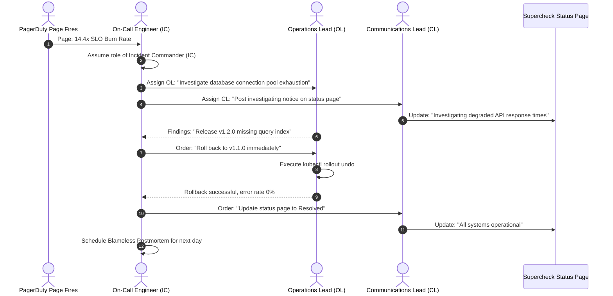

# Episode 16 — Incident Command and Blameless Postmortems

| | |
| :--- | :--- |
| **YouTube title** | Incident Command and Blameless Postmortems |
| **Film order** | 16 of 33 · Phase 2 · Week 16 |
| **Duration** | 10 minutes |
| **Lab repo** | `supercheck-io/supercheck` |
| **Supercheck files** | `ICS roles; Comms Lead uses Supercheck status page` |
| **Next** | [17-helm-kustomize.md](17-helm-kustomize.md) |

## Overview

IC does not type kubectl. Blameless 5 whys. Status page is the product surface Supercheck sells — dogfood it.

Film only Supercheck names: `supercheck-app`, `supercheck-worker-eu`, `supercheck-execution`, Traefik, BullMQ, PlanetScale/Postgres, Redis Sentinel. No toy `demo-api`.


## Episode 16: Incident Command and Blameless Postmortems

### 1. The Production Problem
*"During a severe outage, 18 engineers joined a bridge call. Five people tried different hotfixes in production simultaneously, nobody notified customer support, and after the outage was over, management fired the engineer who clicked the deploy button."*

### 2. Deep Technical Breakdown
Effective incident response separates technical firefighting from coordination:
1. **The Incident Command System (ICS):** Adopted from emergency services:
   - **Incident Commander (IC):** Holds the pen. Directs the response, assigns investigation tasks, and maintains focus. **The IC does not debug or touch keyboards.**
   - **Operations Lead (OL):** Executes tactical diagnostic commands and deploys mitigations.
   - **Communications Lead (CL):** Updates internal executives and updates the public **Status Page** (via Supercheck) every 15 minutes.
2. **Blameless Culture:** Humans do not wake up intending to break production. Human error is a *symptom* of a flawed system (missing guardrails, ambiguous tooling, lack of automated rollbacks). Blaming individuals causes engineers to hide mistakes.
3. **The 5 Whys Technique:** Digging past surface-level symptoms to discover architectural and organizational failure modes.

### 3. Architecture: Incident Command Response Sequence



### 4. Postmortem Action Item Rubric Matrix

| Action Item Category | Focus | Example | Long-Term Reliability Impact |
| :--- | :--- | :--- | :--- |
| **Preventative** | Eliminate the entire class of failure | Add automated database migration linter in CI | Highest (Bug cannot occur again) |
| **Detective** | Detect the failure significantly faster | Add burn-rate alert to trigger in 2 min instead of 30 min | Medium (Reduces MTTI) |
| **Mitigative** | Reduce time to restore service (MTTR) | Add automated one-click rollback script to runbook | High (Shortens outage duration) |
| **Organizational / Training** | Review practices and documentation | Update on-call runbook with new CLI commands | Low to Medium |

### 5. Production Reference: Blameless Postmortem Template
```markdown
# Incident Postmortem: Supercheck checkout / dashboard Outage (2026-09-08)

**Date**: 2026-09-08 | **Authors**: @krish, @team | **Status**: Complete  
**Duration**: 22 minutes | **Customer Impact**: 35% of checkout calls failed with HTTP 504

---

## Creator prep (from original kit)

### Episode 16 Preparation: Incident Command and Blameless Postmortems

#### 1. High-Yield Learning Links (Watch & Read Before Filming)
* **YouTube**: *Etsy / USENIX SREcon* — "Blameless Postmortems & Resilience Engineering" ([YouTube Search: SREcon Blameless Postmortems Etsy](https://www.youtube.com/results?search_query=SREcon+Blameless+Postmortems+Etsy))
* **YouTube**: *PagerDuty* — "Incident Command System for Tech Companies" ([YouTube Search: PagerDuty Incident Command Training](https://www.youtube.com/results?search_query=PagerDuty+Incident+Command+Training))
* **Canonical Guide**: [Google SRE Book: Postmortem Culture: Learning from Failure](https://sre.google/sre-book/postmortem-culture/)

#### 2. Intuitive Mental Model
* **The Commercial Airline Crash Investigation Analogy**:
  * When an airplane engine fails, the aviation authority does not fire the pilot and say "Problem solved."
  * They ask: Why did the warning chime sound similar to another chime? Why was the manual confusing? Why did maintenance miss the crack?
  * Humans are never the root cause; humans operate within complex systems designed by engineers. Fixing the system prevents the next 100 people from making the same mistake.

#### 3. Pre-Flight Demo Setup
* Have the [postmortem markdown template](https://sre.google/workbook/postmortem-culture/) open in VS Code.
* Prepare a realistic scenario: *"Postgres connection pool exhausted after unindexed query pushed in release v1.2.0."*
* Demonstrate filling out the 5-Whys timeline live on screen.

#### 4. YouTube Retention & Growth Kit
* **Clickable Titles**:
  1. *How Google Runs Blameless Postmortems (Template Included)*
  2. *What REALLY Happens During a Sev-1 Outage Call*
  3. *Why Firing Engineers for Outages Makes Your System Worse*
* **Thumbnail Concept**: A dramatic split: Left shows an angry boss shouting "WHO DEPLOYED THIS?!" with a red X. Right shows a calm SRE whiteboard with the "5 Whys" and green preventative tickets. Text: **"BLAMELESS RCA"**
* **30-Second Hook**: *"The fastest way to guarantee your company has another massive outage is to blame the engineer who touched the keyboard. In top-tier tech companies, we don't ask 'Who broke it?'—we ask 'Why did the system allow a human to break it?' Here is the exact Incident Command and Blameless Postmortem framework used at Google and Etsy."*
* **Beginner Gotcha**: In a postmortem, never write *"Developer made a typo."* Write *"The deployment pipeline lacked automated schema validation to catch syntax errors prior to production apply."* Always fix the tool, not the human!
