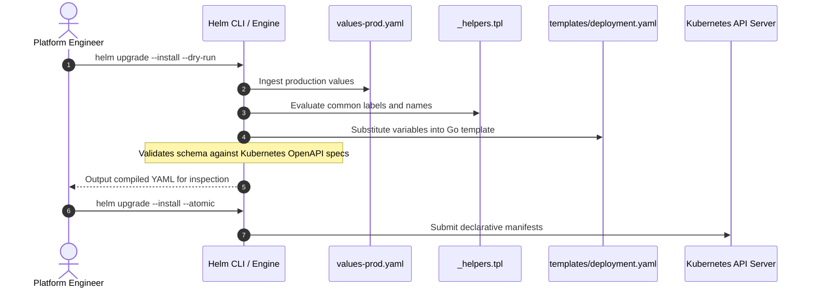

# Episode 17 — Kustomize and Helm in Production

| | |
| :--- | :--- |
| **YouTube title** | Kustomize and Helm in Production |
| **Film order** | 17 of 33 · Phase 3 · Week 17 |
| **Duration** | 10 minutes |
| **Lab repo** | `supercheck-io/supercheck` |
| **Supercheck files** | `deploy/k8s/base` + `overlays/staging` + `overlays/production` |
| **Next** | [18-argocd.md](18-argocd.md) |

## Overview

Supercheck already is Kustomize. Film `kubectl kustomize deploy/k8s/overlays/staging` vs `production`. Do **not** film `overlays/local` (laptop single-node). Helm is interview language only — Supercheck does not `helm create` this stack.

Film only Supercheck names: `supercheck-app`, `supercheck-worker-eu`, `supercheck-execution`, Traefik, BullMQ, PlanetScale/Postgres, Redis Sentinel. No toy `demo-api`.


## Episode 17: Kustomize and Helm in Production

### 1. The Production Problem
*"Our team maintains 4 separate copies of the same raw YAML manifests for Dev, QA, Staging, and Production. A critical security change (updating resource limits and adding non-root user) was applied to Production but missed in Staging. On the next release, untested staging configurations wiped out the production security baseline."*

### 2. Deep Technical Breakdown
Managing raw YAML across environments creates exponential configuration drift:
1. **The Helm Template Engine:** Helm combines raw Kubernetes YAML skeletons with the Go `text/template` engine. Variables defined in `values.yaml` are substituted into `templates/*.yaml` using built-in objects (`.Values`, `.Release`, `.Chart`).
2. **Template Helpers (`_helpers.tpl`):** Standardizes Kubernetes labels (`app.kubernetes.io/name`, `app.kubernetes.io/instance`) across all resources to ensure Prometheus scraping and Service selectors never desynchronize.
3. **Values File Hierarchy:** A reusable chart maintains a base `values.yaml` (sensible defaults) and overrides them cleanly with environment-specific files: `values-dev.yaml` and `values-prod.yaml`.
4. **Validation via `helm lint` and `helm template`:** Allows developers to test and validate manifest compilation locally in CI without requiring cluster access.

### 3. Architecture: Helm Compilation Pipeline



### 4. Manifest Management Comparison Matrix

| Approach | Parameterization | Dry-Run Capability | Package Distribution | Production Recommendation |
| :--- | :--- | :---: | :--- | :--- |
| **Raw YAML** | None (Copy-paste per environment) | `kubectl apply --dry-run` | Git clone | High risk of configuration drift; avoid in prod |
| **Kustomize** | Overlay patching (No templating) | `kubectl kustomize` | Git repository | Excellent for simple environment overlays without variables |
| **Helm Charts** | **Full Go templating & functions** | `helm template` | **OCI Registries (ECR/Artifact Registry)** | **Gold standard for reusable microservices and platform add-ons** |
| **Helm + Kustomize** | Template chart, patch with overlay | Combined | OCI + Git | Enterprise standard: ArgoCD renders Helm then patches with Kustomize |

### 5. Production Helm Chart Structure & Code
```
charts/supercheck-app/
├── Chart.yaml
├── values.yaml
├── values-prod.yaml
└── templates/
    ├── _helpers.tpl
    ├── deployment.yaml
    ├── service.yaml
    └── ingress.yaml
```

#### `values-prod.yaml` (Production Override Baseline)
```yaml
replicaCount: 4

image:
  repository: ghcr.io/supercheck-io/supercheck
  tag: "v1.1.0"
  pullPolicy: IfNotPresent

resources:
  requests:
    cpu: 200m
    memory: 256Mi
  limits:
    cpu: 1000m
    memory: 512Mi

autoscaling:
  enabled: true
  minReplicas: 4
  maxReplicas: 16
  targetCPUUtilizationPercentage: 75

ingress:
  enabled: true
  className: traefik
  host: app.supercheck.io
  tls:
    - secretName: supercheck-app-tls
      hosts:
        - app.supercheck.io
```

### 6. 10-Minute Video Script Outline
* **1. The Hook (0:00–0:45):** Show a developer with 12 open tabs in VS Code editing four almost identical `deployment.yaml` files. Cut to a broken production alert. *"This is YAML spaghetti, and it's the easiest way to take down production. Here is how to package this once into a reusable enterprise Helm chart."*
* **2. The Stakes & Blast Radius (0:45–1:45):** The dangers of raw YAML copy-pasting. How a single missing label breaks Service routing and blinds Prometheus monitoring across environments.
* **3. Architecture & Mental Model (1:45–3:30):** Explain the Helm template compiler. Walk through how `.Values` overrides defaults, and how `_helpers.tpl` enforces standard Kubernetes labels.
* **4. Hands-On Implementation (3:30–8:30):**
  - Step 1: Diff `overlays/staging/kustomization.yaml` vs `overlays/production`.
  - Step 2: `kubectl kustomize deploy/k8s/overlays/production | less` — Traefik, replicas, maxSurge.
  - Step 3: Why `overlays/local` exists in the repo but is **out of scope** for this channel.
* **5. Verification & Guardrails (8:30–10:00):** `kubectl diff -k deploy/k8s/overlays/staging` against the live staging cluster. Never apply production from a laptop.
* **6. Outro & Call to Action (10:00–10:30):** Rule of thumb: *"Never copy-paste YAML; parameterize differences in values files and lint in CI."* Next: Episode 16 — Killing `kubectl apply` with ArgoCD.

---
