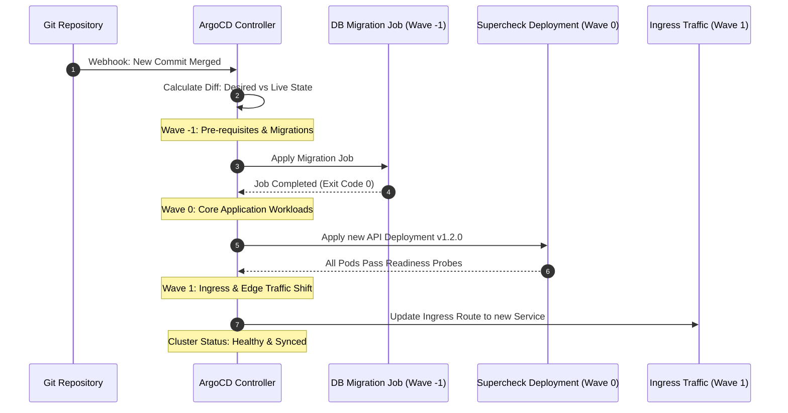

# Episode 18 — GitOps with Argo CD

| | |
| :--- | :--- |
| **YouTube title** | GitOps with Argo CD |
| **Film order** | 18 of 33 · Phase 3 · Week 18 |
| **Duration** | 10 minutes |
| **Lab repo** | `supercheck-io/supercheck` |
| **Supercheck files** | `Argo Application pointing at deploy/k8s/overlays/production` |
| **Next** | [19-github-actions.md](19-github-actions.md) |

## Overview

No kubectl apply from laptops. Auto-sync + self-heal. Supercheck synthetics can be a pre-sync check conceptually.

Film only Supercheck names: `supercheck-app`, `supercheck-worker-eu`, `supercheck-execution`, Traefik, BullMQ, PlanetScale/Postgres, Redis Sentinel. No toy `demo-api`.


## Episode 18: GitOps with Argo CD

### 1. The Production Problem
*"An engineer on call hotfixed a memory limit and bumped replica count directly in the cluster using `kubectl edit`. Three days later, another engineer pushed a minor commit to Git. CI ran `kubectl apply`, which silently wiped out the hotfix and caused a second outage."*

### 2. Deep Technical Breakdown
Direct cluster mutations via `kubectl` create untracked, dangerous drift. **Pull-based GitOps** inverts the deployment model:
1. **Pull vs Push Deployment:** Instead of an external CI runner pushing changes to Kubernetes with cluster-admin tokens, the **ArgoCD Application Controller** runs inside the cluster, polling Git every 3 minutes (or triggered via webhook) and pulling desired state.
2. **Reconciliation & Self-Healing:** ArgoCD continuously diffs the Git repository (desired state) against the live cluster state. If an engineer manually edits a resource with `kubectl`, ArgoCD's **Self-Heal** mechanism immediately overwrites the manual change to match Git.
3. **Sync Waves & Hooks:** Real-world applications require ordered deployments (e.g., run database schema migrations *before* launching new API replicas). ArgoCD **Sync Waves** (`argocd.argoproj.io/sync-wave`) enforce strict phased ordering across resources.

### 3. Architecture: ArgoCD Sync Waves & Phased Migration



### 4. ArgoCD Sync Wave Phases Reference Table

| Sync Wave | Typical Resource Types | Execution Condition | If Wave Fails |
| :---: | :--- | :--- | :--- |
| **Wave -2** | Namespaces, CRDs, RBAC Roles | Initial prerequisite creation | Abort sync immediately |
| **Wave -1** | Database Migration Jobs, Secrets | Must complete with Exit 0 | Stop rollout before touching API pods |
| **Wave 0** | Core Deployments, StatefulSets, Services | Wait for all pods to pass Readiness Probes | Trigger automatic rollback |
| **Wave 1** | Ingress, Route53 DNS, Prometheus ServiceMonitors | Shift traffic to verified workloads | Alert SRE; keep old traffic path |

### 5. Production ArgoCD `Application` Manifest
```yaml
apiVersion: argoproj.io/v1alpha1
kind: Application
metadata:
  name: supercheck-app-prod
  namespace: argocd
  finalizers:
  - resources-finalizer.argocd.argoproj.io
spec:
  project: default
  source:
    repoURL: https://github.com/prodlinehq/supercheck-app-gitops.git
    targetRevision: main
    path: charts/supercheck-app
    helm:
      valueFiles:
      - values-prod.yaml
  destination:
    server: https://kubernetes.default.svc
    namespace: supercheck
  syncPolicy:
    automated:
      prune: true       # Automatically delete resources removed from Git
      selfHeal: true    # Overwrite manual kubectl changes made in cluster
    syncOptions:
    - CreateNamespace=true
    - PruneLast=true
    retry:
      limit: 3
      backoff:
        duration: 5s
        factor: 2
        maxDuration: 3m
```

### 6. 10-Minute Video Script Outline
* **1. The Hook (0:00–0:45):** Open terminal. Run `kubectl edit deployment supercheck-app` and change replicas to 10. Open ArgoCD web UI: within 5 seconds, ArgoCD turns yellow, reports OutOfSync, and automatically reverts replicas back to 3. *"Your cluster just healed itself. Here is why we killed `kubectl apply` forever."*
* **2. The Stakes & Blast Radius (0:45–1:45):** Why CI/CD push pipelines that execute `kubectl apply` are security liabilities. Giving CI runners cluster-admin keys vs running an internal controller.
* **3. Architecture & Mental Model (1:45–3:30):** The GitOps pull model. Desired state vs live state. Walk through the Sync Waves sequence diagram: DB Migration $\rightarrow$ Pod Rollout $\rightarrow$ Ingress.
* **4. Hands-On Implementation (3:30–8:30):**
  - Step 1: Install ArgoCD and declare the `Application` manifest.
  - Step 2: Configure `selfHeal: true` and `prune: true`.
  - Step 3: Add an annotated database migration Job with `argocd.argoproj.io/sync-wave: "-1"` and observe phased rollout execution.
* **5. Verification & Guardrails (8:30–10:00):** Push a commit to Git; watch ArgoCD automatically sync, verify health status, and reflect changes in under 10 seconds.
* **6. Outro & Call to Action (10:00–10:30):** Rule of thumb: *"If it isn't in Git, it doesn't exist in production."* Next: Episode 17 — CI/CD Automation & Passwordless AWS OIDC.

---
