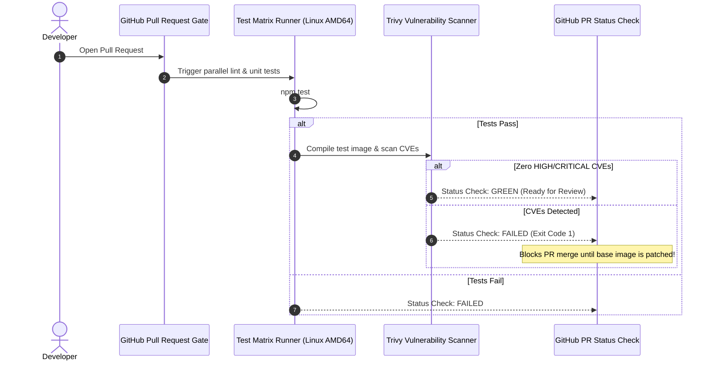

# Episode 19 — GitHub Actions: Tests, Trivy, and Image CI

| | |
| :--- | :--- |
| **YouTube title** | GitHub Actions: Tests, Trivy, and Image CI |
| **Film order** | 19 of 33 · Phase 3 · Week 19 |
| **Duration** | 10 minutes |
| **Lab repo** | `supercheck-io/supercheck` |
| **Supercheck files** | `.github/workflows in supercheck-io/supercheck` |
| **Next** | [20-oidc.md](20-oidc.md) |

## Overview

npm matrix, BuildKit app+worker, Trivy, then a Playwright journey against preview — Supercheck testing Supercheck. Do not teach locators.

Film only Supercheck names: `supercheck-app`, `supercheck-worker-eu`, `supercheck-execution`, Traefik, BullMQ, PlanetScale/Postgres, Redis Sentinel. No toy `demo-api`.


## Episode 19: GitHub Actions: Tests, Trivy, and Image CI

### 1. The Production Problem
*"A critical bug escaped to production because tests passed on a developer's local Mac (ARM64) but deadlocked under concurrent requests on Linux AMD64. Furthermore, developers were merging bloated 800MB container images with known High/Critical CVEs because CI lacked automated security gates."*

### 2. Deep Technical Breakdown
1. **Parallel Matrix Execution:** Testing across multiple versions or OS platforms concurrently reduces feedback loop times while catching platform-specific race conditions using `npm test` on the Supercheck app/worker.
2. **Deterministic BuildKit Caching in CI:** Using GitHub Actions cache backends (`cache-from: type=gha`, `cache-to: type=gha,mode=max`) caches both npm + BuildKit layers and intermediate container layers, dropping build times from 6 minutes to 30 seconds.
3. **Automated Security Compliance Gating:** Trivy runs inside the pipeline. If any vulnerability is classified as `HIGH` or `CRITICAL`, Trivy exits with code 1, immediately halting the pipeline before the image can be tagged or pushed.
4. **Supercheck (or equivalent) E2E status check:** After unit tests, call Supercheck CLI/API to run the canonical Playwright journey against the preview environment. **Do not teach locators here** — that is Supercheck series 01. On camera: one job named `e2e-supercheck` that must be green to merge. If Supercheck is not launched yet, stub the job with `playwright test` and say the hosted runner is the product path.

### 3. Architecture: Fast-Feedback PR Quality Gate



### 4. Production Workflow (.github/workflows/ci-pr-gate.yml)
```yaml
name: CI Quality & Security Gate

on:
  pull_request:
    branches: [main]

permissions:
  contents: read

jobs:
  test-and-lint:
    name: Parallel Test Matrix
    runs-on: ubuntu-latest
    strategy:
      fail-fast: false
      matrix:
        go-version: ['1.22', '1.23']
    steps:
    - name: Checkout Code
      uses: actions/checkout@v4

    - name: Set up Go
      uses: actions/setup-go@v5
      with:
        go-version: ${{ matrix.go-version }}
        cache: true

    - name: Run Tests with Race Detector
      run: npm test -- --coverage

  container-security:
    name: Build & Security Scan
    needs: test-and-lint
    runs-on: ubuntu-latest
    steps:
    - name: Checkout Code
      uses: actions/checkout@v4

    - name: Set up Docker Buildx
      uses: docker/setup-buildx-action@v3

    - name: Build Test Image (Local Cache)
      uses: docker/build-push-action@v5
      with:
        context: .
        load: true
        tags: supercheck-app:test
        cache-from: type=gha
        cache-to: type=gha,mode=max

    - name: Scan Image for Vulnerabilities
      uses: aquasecurity/trivy-action@master
      with:
        image-ref: supercheck-app:test
        format: 'table'
        exit-code: '1'
        severity: 'HIGH,CRITICAL'
```

---


## Pipeline Security Hardening Checklist

| # | Guardrail | Rationale |
| :-: | :--- | :--- |
| **1** | **Pin Actions to Immutable Commit SHAs** | Use `actions/checkout@b4ffde65f46336ab88eb53be808477a3936bae11` instead of `@v4` to prevent supply chain attacks if an action repository is hijacked. |
| **2** | **Minimal Default Permissions** | Set top-level `permissions: {}` and only enable `id-token: write` on jobs requiring AWS authentication. |
| **3** | **Branch-Restricted Trust Policies** | Never use `repo:org/repo:*` in the AWS IAM trust policy. Always enforce `ref:refs/heads/main` so malicious feature branches cannot assume production roles. |
| **4** | **Step Security Scanning** | Run automated tools like `StepSecurity/harden-runner` to monitor outbound network traffic from GitHub Action runners. |

---
