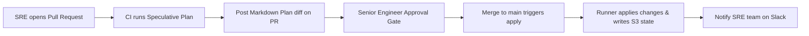

# Episode 22 — Terraform Modules, PR Plans, and Drift

| | |
| :--- | :--- |
| **YouTube title** | Terraform Modules, PR Plans, and Drift |
| **Film order** | 22 of 33 · Phase 3 · Week 22 |
| **Duration** | 10 minutes |
| **Lab repo** | `supercheck-io/supercheck` |
| **Supercheck files** | `PR tofu plan: app node vs worker node in nbg1/ash/sin` |
| **Next** | [23-network.md](23-network.md) |

## Overview

Dev/staging/prod modules. Drift detection. Adding a Singapore worker is a Supercheck capacity change, not a toy VPC.

Film only Supercheck names: `supercheck-app`, `supercheck-worker-eu`, `supercheck-execution`, Traefik, BullMQ, PlanetScale/Postgres, Redis Sentinel. No toy `demo-api`.

## Episode 22: Terraform Modules, PR Plans, and Drift

### 1. The Production Problem
*"Our team had 3,000 lines of Terraform in a single monolithic `main.tf`. Applying a change in staging took 25 minutes, and a bug introduced in staging accidentally modified production resources because environments were not isolated."*

### 2. Deep Technical Breakdown
1. **Modular Architecture Hierarchy:** Split infrastructure into reusable modules (`modules/vpc`, `modules/eks`, `modules/rds`) and reference them in environment directories (`environments/dev`, `environments/prod`). Each environment has its own independent state file and lock key!
2. **Speculative Planning vs Stale State:** A plan generated at 10:00 AM might be invalid by 10:15 AM if another engineer merged infrastructure changes. Safe pipelines require speculative plan files (`-out=tfplan`) pinned to exact git commit hashes.
3. **Automated PR-Gated Apply Workflow:** Never allow `terraform apply` locally. Pull requests run `terraform plan` and comment the formatted diff directly on the PR. Apply executes strictly after peer review approval on merge to `main`.

### 3. PR-Gated Apply Workflow Architecture

## Supercheck module map (film this)

| Module / overlay | Supercheck meaning |
| :--- | :--- |
| App node group (nbg1) | `supercheck-app` + Redis Sentinel |
| Worker EU / US / APAC | `supercheck-worker-*` + gVisor capable nodes |
| Execution namespace | Jobs only, not long-lived app |
| `overlays/staging` vs `overlays/production` | Same Kustomize base; production overlay can set `maxSurge: 0` |

## 10-minute script

| Time | Do |
| :--- | :--- |
| 0:00 | Show a 3k-line `main.tf` vs Supercheck `deploy/` layout |
| 1:45 | Module vs environment state keys |
| 3:30 | `tofu plan` on a PR that adds a Singapore worker |
| 8:30 | Drift: `tofu plan` with no code change |
| 10:00 | Rule: no local apply; Infisical for tokens |

**Interview:** *"Staging and prod are different state files. A Singapore worker is a Supercheck capacity module, not a copy-paste VPC."*
