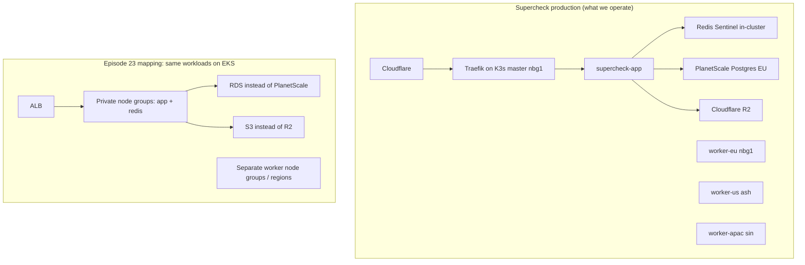
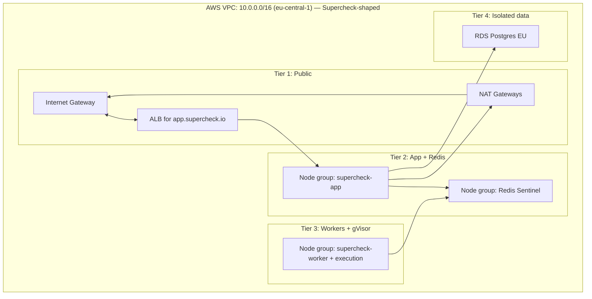
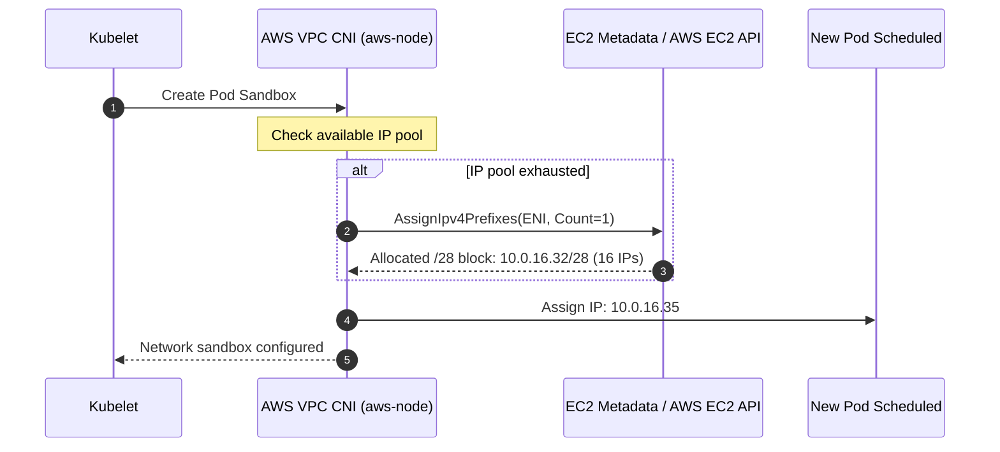

# Episode 23 — Production Kubernetes Networking

| | |
| :--- | :--- |
| **YouTube title** | Production Kubernetes Networking |
| **Film order** | 23 of 33 · Phase 3 · Week 23 |
| **Duration** | 10 minutes |
| **Lab repo** | `supercheck-io/supercheck` |
| **Supercheck files** | `Hetzner nbg1 + Tailscale mesh; Episode also maps same topology to EKS` |
| **Next** | [24-irsa-eso.md](24-irsa-eso.md) |

## Overview

Real prod: Cloudflare, Traefik, private nodes, PlanetScale EU, R2. EKS lab teaches the same isolation if a customer runs Supercheck on AWS.

Film only Supercheck names: `supercheck-app`, `supercheck-worker-eu`, `supercheck-execution`, Traefik, BullMQ, PlanetScale/Postgres, Redis Sentinel. No toy `demo-api`.


## Episode 23: Production Kubernetes Networking

### 1. The Production Problem
*"A platform team provisioned an EKS cluster with worker nodes in public subnets. An attacker scanned the node's public IP and found Kubelet port 10250 exposed. Simultaneously, during a busy morning scale-out, the VPC completely ran out of available private IP addresses due to default AWS VPC CNI secondary IP allocations."*

### 2. Deep Technical Breakdown
Production Kubernetes networking in AWS requires strict subnet segregation and IP planning:
1. **The 3-Tier Subnet Topology:**
   - **Tier 1: Public Subnets (`10.0.1.0/24`, `10.0.2.0/24`, `10.0.3.0/24`):** Only Internet-facing Application Load Balancers (ALBs) and NAT Gateways live here. **No worker nodes ever.**
   - **Tier 2: Private Application Subnets (`10.0.16.0/20`, `10.0.32.0/20`, `10.0.48.0/20`):** Large `/20` CIDR blocks (4,094 IPs per AZ). Hosts EKS managed node groups and pods. Outbound internet traffic routes strictly via NAT Gateways.
   - **Tier 3: Isolated Database Subnets (`10.0.64.0/24`, `10.0.65.0/24`):** Hosts Amazon RDS / Aurora Postgres. Zero route to the internet (no NAT, no IGW).
2. **AWS VPC CNI & Prefix Delegation:** By default, the AWS VPC CNI allocates individual secondary IPv4 addresses to Elastic Network Interfaces (ENIs). Small EC2 instances (e.g. `m5.large`) are capped at 29 pods. By enabling **Prefix Delegation** (`ENABLE_PREFIX_DELEGATION=true`), the CNI allocates `/28` IPv4 prefixes (16 IPs per slot), allowing up to 110 pods per instance without subnet exhaustion.
3. **Subnet Tagging for AWS Load Balancer Controller:** Subnets must be tagged so Kubernetes ingress controllers can dynamically discover where to provision public vs internal load balancers.

### 3. Architecture: 3-Tier Multi-AZ VPC Topology



On camera: *“Supercheck actually runs on Hetzner K3s in Nuremberg. These VPC rules are how you would land the same app/worker/execution topology on AWS — private nodes, no public kubelets, data in-region.”*



### 4. AWS VPC CNI Prefix Delegation IP Allocation Flow



### 5. Subnet Classification & Routing Table Matrix

| Subnet Tier | CIDR Block Size | Default Route (`0.0.0.0/0`) | Required EKS Subnet Tag | Workloads Hosted |
| :--- | :---: | :--- | :--- | :--- |
| **Public** | `/24` (251 IPs) | `igw-xxxx` (Internet Gateway) | `kubernetes.io/role/elb = 1` | Public ALBs, NAT Gateways |
| **Private App** | `/20` (4,091 IPs) | `nat-xxxx` (NAT Gateway) | `kubernetes.io/role/internal-elb = 1` | EKS Managed Nodes, Microservices |
| **Isolated DB** | `/24` (251 IPs) | **None (Local only)** | None | RDS Postgres, ElastiCache Redis |

### 6. Production Terraform VPC Module Reference
```hcl
module "vpc" {
  source  = "terraform-aws-modules/vpc/aws"
  version = "~> 5.8"

  name = "supercheck-vpc"
  cidr = "10.0.0.0/16"

  azs              = ["eu-west-1a", "eu-west-1b", "eu-west-1c"]
  public_subnets   = ["10.0.1.0/24", "10.0.2.0/24", "10.0.3.0/24"]
  private_subnets  = ["10.0.16.0/20", "10.0.32.0/20", "10.0.48.0/20"]
  database_subnets = ["10.0.64.0/24", "10.0.65.0/24", "10.0.66.0/24"]

  enable_nat_gateway     = true
  single_nat_gateway     = false # Multi-AZ High Availability
  one_nat_gateway_per_az = true

  public_subnet_tags = {
    "kubernetes.io/role/elb"                    = "1"
    "kubernetes.io/cluster/prodline-production" = "shared"
  }

  private_subnet_tags = {
    "kubernetes.io/role/internal-elb"           = "1"
    "kubernetes.io/cluster/prodline-production" = "shared"
  }
}
```

### 7. 10-Minute Video Script Outline
* **1. The Hook (0:00–0:45):** Show an EKS cluster where new pods fail to launch with `FailedCreatePodSandBox: no IP addresses available in network`. At the same time, show a security scan exposing public IPs on worker nodes.
* **2. The Stakes & Blast Radius (0:45–1:45):** Why running worker nodes in public subnets violates every security standard. How the default AWS VPC CNI exhausts subnet IPs before cluster CPU is even at 20%.
* **3. Architecture & Mental Model (1:45–3:30):** Walk through the 3-Tier Multi-AZ VPC diagram: Public (ALB) $\rightarrow$ Private (EKS Nodes) $\rightarrow$ Isolated (RDS). Explain Prefix Delegation.
* **4. Hands-On Implementation (3:30–8:30):**
  - Step 1: Provision the VPC with Terraform using `/20` subnets and required Kubernetes tags.
  - Step 2: Configure the AWS VPC CNI DaemonSet to enable prefix delegation (`ENABLE_PREFIX_DELEGATION=true`).
  - Step 3: Verify pod limits increase from 29 to 110 pods per instance.
* **5. Verification & Guardrails (8:30–10:00):** Deploy 50 test replicas; verify that node IP allocation executes smoothly without draining the VPC CIDR block.
* **6. Outro & Call to Action (10:00–10:30):** Rule of thumb: *"Never place an EC2 worker node in a public subnet, and always enable Prefix Delegation on modern EKS."* Next: Episode 22 — IAM Least Privilege with IRSA & External Secrets Operator.

---
