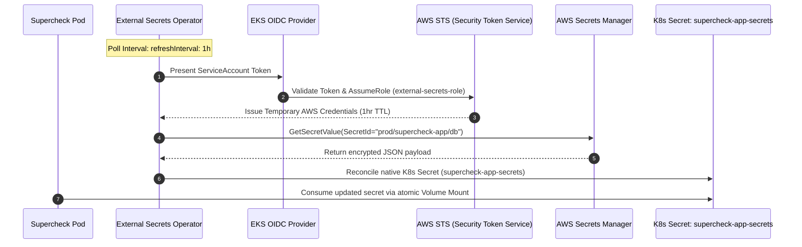

# Episode 24 — Workload Identity and Secrets Operators

| | |
| :--- | :--- |
| **YouTube title** | Workload Identity and Secrets Operators |
| **Film order** | 24 of 33 · Phase 3 · Week 24 |
| **Duration** | 10 minutes |
| **Lab repo** | `supercheck-io/supercheck` |
| **Supercheck files** | `Infisical auto-reload annotation on Supercheck pods; ESO/IRSA if on AWS` |
| **Next** | [25-cluster-upgrade.md](25-cluster-upgrade.md) |

## Overview

Pods must not use node cloud credentials. Supercheck secret sync + least privilege IRSA mapping.

Film only Supercheck names: `supercheck-app`, `supercheck-worker-eu`, `supercheck-execution`, Traefik, BullMQ, PlanetScale/Postgres, Redis Sentinel. No toy `demo-api`.


## Episode 24: Workload Identity and Secrets Operators

### 1. The Production Problem
*"To let our API read a secret from AWS Secrets Manager, an engineer attached an AmazonSecretsManagerReadWrite policy directly to the EC2 Node Instance Role. Every single pod running on that worker node—including a third-party metrics daemon—could now read all company production secrets."*

### 2. Deep Technical Breakdown
Enterprise cloud security requires **Pod-level Identity Isolation**:
1. **IAM Roles for Service Accounts (IRSA):** Uses OIDC federation between EKS and AWS IAM. Kubelet projects an OIDC JSON Web Token into the pod. The AWS SDK uses this token with `sts:AssumeRoleWithWebIdentity` to acquire short-lived IAM credentials scoped strictly to that pod's ServiceAccount.
2. **External Secrets Operator (ESO):** Rather than writing AWS SDK calls into every microservice, ESO runs as an in-cluster controller. It reconciles an `ExternalSecret` manifest against AWS Secrets Manager and generates a native Kubernetes `Secret`. Applications consume secrets as standard volume mounts without AWS code dependencies.
3. **Automated Secret Rotation:** ESO continuously polls AWS Secrets Manager (e.g. `refreshInterval: 1h`). When credentials rotate in AWS, ESO automatically updates the Kubernetes Secret.

### 3. Architecture: IRSA & External Secrets Operator Sync Flow



### 4. Secrets Management Solutions Comparison Matrix

| Solution | Code Changes Required? | Cloud Native Sync | Automatic Rotation? | Complexity | Production Fit |
| :--- | :---: | :---: | :---: | :---: | :--- |
| **Static K8s Secret** | No | No | No | Minimal | Not secure for production credentials |
| **AWS SDK in App** | **Yes (AWS code in app)** | Yes | Manual app polling | Medium | Locks application code to AWS |
| **HashiCorp Vault Agent** | No (Sidecar injection) | Yes | Yes | High | Heavy memory overhead per pod |
| **External Secrets Operator (ESO)** | **No (Native K8s Secrets)** | **Yes (AWS, GCP, Azure, Vault)** | **Yes (Automated)** | **Low** | **Enterprise Gold Standard for Kubernetes** |

### 5. Production External Secrets Operator Manifests
```yaml
apiVersion: external-secrets.io/v1beta1
kind: SecretStore
metadata:
  name: aws-secrets-manager
  namespace: supercheck
spec:
  provider:
    aws:
      service: SecretsManager
      region: eu-west-1
      auth:
        jwt:
          serviceAccountRef:
            name: external-secrets-sa
---
apiVersion: external-secrets.io/v1beta1
kind: ExternalSecret
metadata:
  name: supercheck-app-db-sync
  namespace: supercheck
spec:
  refreshInterval: "1h"
  secretStoreRef:
    name: aws-secrets-manager
    kind: SecretStore
  target:
    name: supercheck-app-secrets
    creationPolicy: Owner
  data:
  - secretKey: DB_PASSWORD
    remoteRef:
      key: prod/supercheck-app/credentials
      property: password
```

### 6. 10-Minute Video Script Outline
* **1. The Hook (0:00–0:45):** Exec into an unprivileged test container on a worker node. Run `aws secretsmanager get-secret-value` using the default EC2 node role and dump the production database password. *"Any pod on this machine just stole your database. Here is how to lock this down with IRSA and External Secrets Operator."*
* **2. The Stakes & Blast Radius (0:45–1:45):** Node instance role poisoning. The principle of least privilege: why pods must never inherit host permissions.
* **3. Architecture & Mental Model (1:45–3:30):** Explain the IRSA OIDC handshake and ESO sync architecture using the sequence diagram.
* **4. Hands-On Implementation (3:30–8:30):**
  - Step 1: Associate IAM OIDC provider with EKS cluster via Terraform.
  - Step 2: Create IAM role with scoped trust policy for `external-secrets-sa`.
  - Step 3: Deploy SecretStore and ExternalSecret manifests.
* **5. Verification & Guardrails (8:30–10:00):** Update a password in the AWS Secrets Manager console. Watch ESO sync the change into the native Kubernetes Secret within seconds.
* **6. Outro & Call to Action (10:00–10:30):** Rule of thumb: *"Never put cloud IAM credentials on an EC2 instance role; bind identities directly to Kubernetes ServiceAccounts."* Next: Phase 4 — CKA Administration & Deep Troubleshooting.

---
