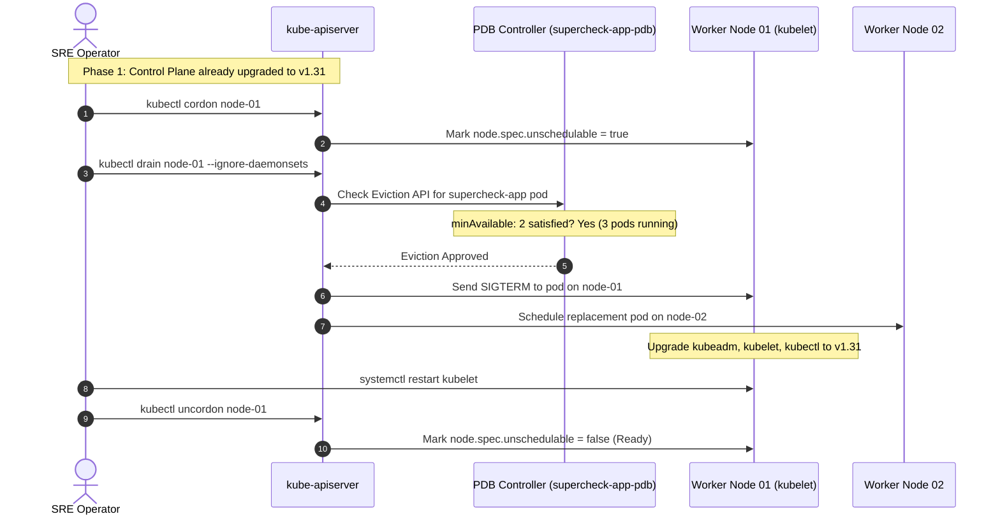

# Episode 25 — Kubernetes Cluster Upgrades Without Downtime

| | |
| :--- | :--- |
| **YouTube title** | Kubernetes Cluster Upgrades Without Downtime |
| **Film order** | 25 of 33 · Phase 4 · Week 25 |
| **Duration** | 10 minutes |
| **Lab repo** | `supercheck-io/supercheck` |
| **Supercheck files** | `PDB on supercheck-app; cordon/drain` |
| **Next** | [26-etcd.md](26-etcd.md) |

## Overview

Version skew. Drain respects PDB. Supercheck must stay up. Film **staging K3s** (same topology as prod: tainted app/worker nodes). Do not snapshot customer production etcd on camera.

Film only Supercheck names: `supercheck-app`, `supercheck-worker-eu`, `supercheck-execution`, Traefik, BullMQ, PlanetScale/Postgres, Redis Sentinel. No toy `demo-api`.


## Episode 25: Kubernetes Cluster Upgrades Without Downtime

### 1. The Production Problem
*"During a minor version cluster upgrade from v1.30 to v1.31, an operator rebooted worker nodes without draining active workloads. Database connections dropped, in-flight transactions corrupted, and the API experienced 8 minutes of total outage."*

### 2. Deep Technical Breakdown
Zero-downtime cluster upgrades require strict sequencing based on the **Kubernetes Version Skew Policy**:
1. **Control Plane First:** `kube-apiserver` must always be upgraded first. Kubelet can never be newer than the API server (`kube-apiserver` $\ge$ `kubelet`).
2. **The Eviction API vs Pod Deletion:** Running `kubectl drain` does not simply delete pods; it issues requests to the Kubernetes **Eviction API** (`/api/v1/namespaces/{ns}/pods/{name}/eviction`). The Eviction API evaluates active `PodDisruptionBudgets` (PDBs). If evicting a pod would violate `minAvailable`, the drain operation blocks until a replica becomes healthy on another node.
3. **The Drain Sequence:**
   - `kubectl cordon <node>`: Sets `spec.unschedulable = true` to prevent new pods from landing on the node.
   - `kubectl drain <node> --ignore-daemonsets --delete-emptydir-data`: Evicts workloads while ignoring DaemonSets (which must run on every node).
   - Upgrade `kubeadm`, run `kubeadm upgrade node`, upgrade `kubelet` and `kubectl`, restart systemd service.
   - `kubectl uncordon <node>`: Restores node to active scheduling.

### 3. Architecture: Zero-Downtime Node Drain & Upgrade Sequence



### 4. Kubernetes Version Skew Compatibility Matrix

| Component | Can be Newer than API Server? | Max Versions Older than API Server | Production Upgrade Rule |
| :--- | :---: | :---: | :--- |
| **`kube-apiserver`** | N/A | N/A | **Always upgrade first** |
| **`kube-controller-manager`** | **No** | 1 minor version older | Upgrade immediately after API server |
| **`kube-scheduler`** | **No** | 1 minor version older | Upgrade immediately after API server |
| **`kubelet` (Worker Nodes)** | **No** | Up to 2 minor versions older ($N-2$) | Drain node, upgrade kubelet, uncordon |
| **`kubectl`** | Yes (1 version) | 1 version older ($N \pm 1$) | Keep aligned with current cluster version |

### 5. Essential Guardrail Manifest: PodDisruptionBudget (PDB)
```yaml
apiVersion: policy/v1
kind: PodDisruptionBudget
metadata:
  name: supercheck-app-pdb
  namespace: supercheck
spec:
  minAvailable: 2     # Kubelet drain will block if evicting would drop below 2 healthy pods
  selector:
    matchLabels:
      app.kubernetes.io/name: supercheck-app
```

### 6. 10-Minute Video Script Outline
* **1. The Hook (0:00–0:45):** Run `kubectl drain` on a worker node without a PDB while running a synthetic load test. Show the website crash with 503 Service Unavailable as all pods are evicted simultaneously.
* **2. The Stakes & Blast Radius (0:45–1:45):** Why minor version upgrades are terrifying for teams that don't understand the Version Skew Policy. The disaster of upgrading worker nodes before control planes.
* **3. Architecture & Mental Model (1:45–3:30):** Explain the Eviction API and how PodDisruptionBudgets protect active services. Walk through the sequence diagram.
* **4. Hands-On Implementation (3:30–8:30):**
  - Step 1: Deploy a PodDisruptionBudget requiring `minAvailable: 2`.
  - Step 2: Upgrade control plane: `apt-get install kubeadm=1.31.0` $\rightarrow$ `kubeadm upgrade apply v1.31.0`.
  - Step 3: Upgrade worker nodes: `kubectl cordon` $\rightarrow$ `kubectl drain` $\rightarrow$ upgrade packages $\rightarrow$ restart kubelet $\rightarrow$ `kubectl uncordon`.
* **5. Verification & Guardrails (8:30–10:00):** Verify zero dropped requests during the entire drain and upgrade sequence using our load test monitor.
* **6. Outro & Call to Action (10:00–10:30):** Rule of thumb: *"Control plane first, worker nodes second, and never drain without a PodDisruptionBudget."* Next: Episode 24 — etcd Disaster Recovery.

---
