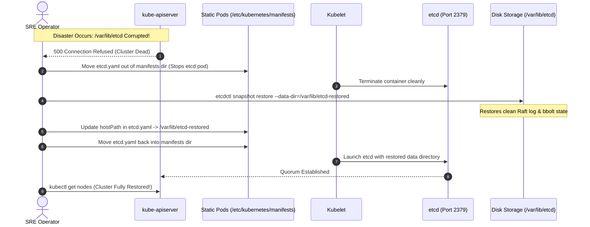

# Episode 26 — etcd Backup and Restore

| | |
| :--- | :--- |
| **YouTube title** | etcd Backup and Restore |
| **Film order** | 26 of 33 · Phase 4 · Week 26 |
| **Duration** | 10 minutes |
| **Lab repo** | `supercheck-io/supercheck` |
| **Supercheck files** | `operations/k3s-etcd-snapshot-config.yaml` on **staging** K3s server |
| **Next** | [27-triage.md](27-triage.md) |

## Overview

Supercheck is **K3s**, not kubeadm. Snapshots: cron every 6h, compress, retain 28, **S3/R2** (`etcd-s3-config-secret: k3s-etcd-s3`). Film **staging** master only. Postgres is PlanetScale — etcd restore does not bring back customer data.

Film only Supercheck names: `supercheck-app`, `supercheck-worker-eu`, `supercheck-execution`, Traefik, BullMQ, PlanetScale/Postgres, Redis Sentinel. No toy `demo-api`.


## Episode 26: etcd Backup and Restore

### 1. The Production Problem
*"A misconfigured cleanup script or disk failure corrupted `/var/lib/etcd` on the primary control plane node. The entire cluster state—every namespace, deployment, secret, and configmap—disappeared instantly. `kubectl get pods` returned: `Unable to connect to the server: dial tcp: getsockopt: connection refused`."*

### 2. Deep Technical Breakdown
etcd is the brain and distributed consensus database of Kubernetes:
1. **Raft Consensus Protocol:** etcd maintains state across odd-numbered quorum nodes (3 or 5). It uses a Write-Ahead Log (WAL) to record transactions before committing to the bbolt disk storage engine.
2. **The 10ms fsync Latency Rule:** etcd requires consistent fsync disk write latencies under 10 milliseconds. Slow disks cause leader election timeouts and cluster-wide control plane dropouts.
3. **Restoration Mechanics:** You cannot restore an etcd snapshot into an active data directory. You must:
   - Stop the running etcd process (or move the static pod manifest).
   - Restore the snapshot into a **new, clean data directory** using `etcdctl snapshot restore --data-dir=/var/lib/etcd-restored`.
   - Update `/etc/kubernetes/manifests/etcd.yaml` to point to the new directory. Kubelet automatically restarts the etcd static pod.

### 3. Architecture: etcd Disaster Recovery Sequence



### 4. etcd Performance & Production Thresholds Matrix

| Metric / Threshold | Safe Operational Baseline | Critical Warning Limit | Failure Mode |
| :--- | :---: | :---: | :--- |
| **Disk fsync Latency** | **< 5ms** | **> 10ms** | Raft leader election storms, API timeouts |
| **DB Size** | < 2 GB | > 8 GB (Hard quota) | Exceeds space quota; etcd enters read-only mode |
| **Network RTT** | < 2ms (within AZ) | > 15ms (cross-region) | Heartbeat dropped, frequent re-elections |
| **Cluster Node Count** | 3 or 5 nodes | Even number (e.g. 4) | **Split-brain risk; even nodes offer zero added fault tolerance** |

### 5. Disaster Recovery Runbook Commands (K3s, staging server)

```bash
# Supercheck is K3s — not kubeadm static pods under /etc/kubernetes/manifests
sudo k3s etcd-snapshot save
sudo k3s etcd-snapshot ls
# Off-cluster copies: R2 via operations/k3s-etcd-snapshot-config.yaml (cron 0 */6, retain 28)

# Restore only on a dedicated staging control plane, then verify API comes back
# sudo k3s etcd-snapshot restore <snapshot-name>
```

### 6. 10-Minute Video Script Outline
* **1. The Hook (0:00–0:45):** Show `k3s etcd-snapshot ls` empty vs R2 retention. *"If this list is empty, Supercheck's control plane has no rewind."* Do not `rm -rf` etcd on camera.
* **2. The Stakes & Blast Radius (0:45–1:45):** Why etcd failure is a catastrophic Sev-1 incident. Without etcd, Kubernetes cannot schedule pods, scale, update endpoints, or heal failed nodes.
* **3. Architecture & Mental Model (1:45–3:30):** Raft consensus, Write-Ahead Logging (WAL), and why you must never overwrite an existing etcd data directory in-place during restoration.
* **4. Hands-On Implementation (3:30–8:30):**
  - Step 1: `k3s etcd-snapshot save` on staging; show S3/R2 config ConfigMap.
  - Step 2: Explain K3s embedded etcd vs kubeadm static pod (interview trap).
  - Step 3: Restore drill on staging only; PlanetScale still holds app data.
* **5. Verification & Guardrails (8:30–10:00):** Run `kubectl get all -A` and demonstrate that every deployment, secret, and pod returns completely intact.
* **6. Outro & Call to Action (10:00–10:30):** Rule of thumb: *"An untested backup is not a backup; run quarterly etcd restore drills."* Next: Episode 25 — The SRE Troubleshooting Methodology.

---
