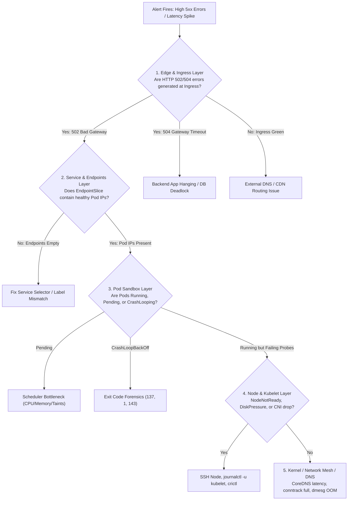

# Episode 27 — Kubernetes Incident Triage

| | |
| :--- | :--- |
| **YouTube title** | Kubernetes Incident Triage |
| **Film order** | 27 of 33 · Phase 4 · Week 27 |
| **Duration** | 10 minutes |
| **Lab repo** | `supercheck-io/supercheck` |
| **Supercheck files** | `Cloudflare → Traefik → Service → supercheck-app → node` |
| **Next** | [28-crashloop.md](28-crashloop.md) |

## Overview

Confirm Supercheck synthetic is red first (user pain). Then walk layers. AI SRE is 20s read-only after layer 1–2.

Film only Supercheck names: `supercheck-app`, `supercheck-worker-eu`, `supercheck-execution`, Traefik, BullMQ, PlanetScale/Postgres, Redis Sentinel. No toy `demo-api`.


## Episode 27: Kubernetes Incident Triage

### 1. The Production Problem
*"An alert triggers: `API High 5xx Error Rate`. An engineer jumps between five random pods, restarts the ingress controller, and checks database logs blindly without finding the problem. MTTI takes 50 minutes because there is no systematic triage process."*

### 2. Deep Technical Breakdown
Effective debugging follows a **Top-Down 5-Layer Diagnostic Loop**:
1. **Layer 1: Edge & Ingress:** Is traffic reaching the cluster? Check cloud load balancers, DNS, and Ingress Controller access logs (502 vs 504 vs 404).
2. **Layer 2: Service & Routing:** Does the Service have endpoints? Check `EndpointSlices` and label selectors (`kubectl get endpointslices`).
3. **Layer 3: Pod Sandbox & Lifecycle:** What phase is the pod in? Inspect pod events, status conditions, restart counts, and exit codes (`kubectl describe pod`).
4. **Layer 4: Node & Kubelet:** Is the host node healthy? Inspect node conditions (`MemoryPressure`, `DiskPressure`, `PIDPressure`), cgroup resource saturation, and Kubelet systemd logs (`journalctl -u kubelet`).
5. **Layer 5: Kernel & Infrastructure:** Kernel out-of-memory killer, conntrack table exhaustion, or CNI network routing failures (`dmesg -T`, `sysctl`).

### 3. Architecture: Top-Down SRE Diagnostic Flowchart



### 4. Fast-Triage Diagnostic CLI Matrix

| Triage Objective | Command | What to Look For |
| :--- | :--- | :--- |
| **Chronological Cluster Events** | `kubectl get events -n supercheck --sort-by='.metadata.creationTimestamp'` | FailedScheduling, Unhealthy, BackOff, Evicted |
| **Non-Running Pods Across Cluster** | `kubectl get pods -A --field-selector=status.phase!=Running` | Workloads stuck in Pending, Terminating, or CrashLoop |
| **Pod Termination State & Exit Code** | `kubectl get pod <name> -o jsonpath='{.status.containerStatuses[*].state.terminated}'` | `exitCode: 137`, `reason: OOMKilled` |
| **Previous Container Crash Log** | `kubectl logs <name> -c <container> --previous --tail=100` | Panic traces, fatal exceptions before the crash |
| **EndpointSlice Health** | `kubectl get endpointslices -l kubernetes.io/service-name=<svc>` | Verify addresses list contains ready pod IPs |

### 5. 10-Minute Video Script Outline
* **1. The Hook (0:00–0:45):** Display a PagerDuty critical alert: `API Latency > 5s`. Show an engineer frantically typing random commands without a plan. *"When production is burning, guessing is your worst enemy. Here is the 5-layer diagnostic blueprint senior SREs use to find root causes in under 2 minutes."*
* **2. The Stakes & Blast Radius (0:45–1:45):** Why random pod restarts destroy forensic evidence and delay recovery.
* **3. Architecture & Mental Model (1:45–3:30):** Walk through the 5-layer flowchart: Ingress $\rightarrow$ Service $\rightarrow$ Pod $\rightarrow$ Node $\rightarrow$ Kernel.
* **4. Hands-On Implementation (3:30–8:30):**
  - Step 1: Simulate a broken service with empty EndpointSlices. Follow Layer 1 to Layer 2 and isolate it immediately.
  - Step 2: Simulate a scheduling failure. Use `kubectl get events --sort-by` to pinpoint resource starvation.
  - Step 3: Run the triage CLI matrix to extract the exact container termination state.
* **5. Verification & Guardrails (8:30–10:00):** Show how to turn this checklist into an automated Slack slash-command bot that dumps the 5-layer triage summary on alert trigger.
* **6. Outro & Call to Action (10:00–10:30):** Rule of thumb: *"Never restart a pod until you have preserved its events and previous crash logs."* Next: Episode 24 — CrashLoopBackOff & Exit Code Forensics.

---

---

## Creator prep (from original kit)

### Episode 27 Preparation: Kubernetes Incident Triage

#### 1. High-Yield Learning Links (Watch & Read Before Filming)
* **YouTube**: *TechWorld with Nana* — "How to Troubleshoot Kubernetes Pods, Services and Ingress" ([YouTube Search: TechWorld with Nana Troubleshoot Kubernetes](https://www.youtube.com/results?search_query=TechWorld+with+Nana+Troubleshoot+Kubernetes))
* **YouTube**: *That DevOps Guy (Viktor Farcic)* — "How to Debug Kubernetes Applications" ([YouTube Search: Viktor Farcic Debug Kubernetes](https://www.youtube.com/results?search_query=Viktor+Farcic+Debug+Kubernetes))
* **Official Docs & Literature**: [Kubernetes Official Troubleshooting Guide](https://kubernetes.io/docs/tasks/debug/) & Julia Evans' *Networking and Debugging Zines*.

#### 2. Intuitive Mental Model
* **The Emergency Room Trauma Protocol**:
  * When an emergency patient arrives, ER doctors never start by sequencing DNA. They follow the ABC protocol: Airway, Breathing, Circulation.
  * In Kubernetes, never start by reading application stack traces or node kernel dmesg. Follow the 5 layers top-down:
    1. **Layer 1: Edge & DNS**: Can users resolve your domain?
    2. **Layer 2: Ingress / Controller**: Is the ingress routing to the service, or returning 502 Bad Gateway?
    3. **Layer 3: Service & Endpoints**: Does `kubectl get endpoints` have target IPs, or is it `<none>` due to a label selector typo?
    4. **Layer 4: Pod & Containers**: Are pods Running, Pending (insufficient CPU/memory), or CrashLoopBackOff?
    5. **Layer 5: Node & OS**: Is the node DiskPressure, or is Kubelet dead?

#### 3. Pre-Flight (5-layer on Supercheck, staging)

```bash
# L1: public health
curl -sI https://app.supercheck.io/api/health   # or staging host
# L2: Traefik Ingress
kubectl get ingress -n supercheck -o wide
# L3: EndpointSlices for supercheck-app
kubectl get endpointslices -n supercheck -l kubernetes.io/service-name=supercheck-app
# L4: pods
kubectl get pods -n supercheck -o wide
# L5: nodes / taints
kubectl get nodes -o custom-columns=NAME:.metadata.name,TAINTS:.spec.taints,READY:.status.conditions[?\(@.type==\"Ready\"\)].status
```

#### 4. YouTube Retention & Growth Kit
* **Clickable Titles**:
  1. *How Staff SREs Debug Kubernetes Incidents in 2 Minutes*
  2. *Stop Guessing: The 5-Layer Kubernetes Troubleshooting Hierarchy*
  3. *The Incident Triage Playbook Every Senior Engineer Uses*
* **Thumbnail Concept**: A 5-layer vertical pyramid (Edge, Ingress, Service, Pod, Node). Green checkmarks down to Layer 3 where a red flashing exclamation point highlights `Endpoints: <none>`. Bold text: **"THE 2-MIN FIX"**
* **30-Second Hook**: *"It's 2 AM on a Saturday. PagerDuty screams: Checkout API is returning 502 Bad Gateway. Ten engineers join the bridge, frantically arguing over database locks and node memory. 90% of engineers waste 45 minutes randomly guessing. In this video, I will show you the exact 5-layer top-down triage framework used by Staff SREs at top tech companies to isolate any Kubernetes failure in under 120 seconds."*
* **Beginner Gotcha**: Never jump straight into `kubectl logs`! If your service selector has a typo, `kubectl get endpoints` shows `<none>`. Zero packets ever reach the pod, so pod logs are completely clean and will deceive you into thinking the app is healthy while users see 502 Bad Gateway.

---
