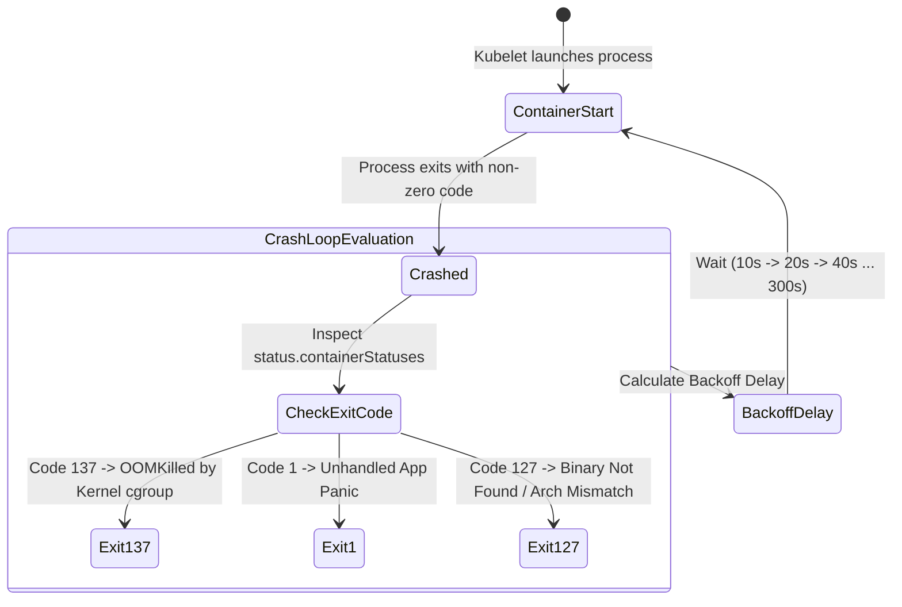

# Episode 28 — CrashLoopBackOff and Exit Codes

| | |
| :--- | :--- |
| **YouTube title** | CrashLoopBackOff and Exit Codes |
| **Film order** | 28 of 33 · Phase 4 · Week 28 |
| **Duration** | 10 minutes |
| **Lab repo** | `supercheck-io/supercheck` |
| **Supercheck files** | `exit codes; kubectl logs --previous; migrate init fail` |
| **Next** | [29-dns.md](29-dns.md) |

## Overview

137 OOM vs 1 migrate vs 127 arch. Supercheck Jobs die fast — always --previous. Worker Jobs ≠ app Deployment.

Film only Supercheck names: `supercheck-app`, `supercheck-worker-eu`, `supercheck-execution`, Traefik, BullMQ, PlanetScale/Postgres, Redis Sentinel. No toy `demo-api`.


## Episode 28: CrashLoopBackOff and Exit Codes

### 1. The Production Problem
*"A pod is trapped in `CrashLoopBackOff`. An engineer types `kubectl logs <pod-name>` and gets completely blank output. The container dies so quickly during bootstrap that no logs are flushed to disk, leaving the team blind."*

### 2. Deep Technical Breakdown
When a container dies, the Linux kernel and container runtime record an **Exit Code** that reveals the exact termination mechanism:
1. **Exit Code 0 (Clean Exit):** The process terminated intentionally. If this occurs in a Deployment, you likely packaged a short-lived script or migration job instead of a long-running daemon.
2. **Exit Code 1 / 2 (Application Fatal Error):** Process exited due to an unhandled exception, syntax error, missing environment variable, or file permissions failure.
3. **Exit Code 137 (`SIGKILL` - 128 + 9):**
   - In 95% of cases: **OOMKilled** by the Linux kernel cgroup memory controller.
   - In 5% of cases: Force-killed by `kubectl delete --grace-period=0` or external agent.
4. **Exit Code 143 (`SIGTERM` - 128 + 15):** The container received a termination signal from Kubelet but failed to drain connections before `terminationGracePeriodSeconds` expired.
5. **Exit Code 126 / 127:** Executable format error (binary compiled for wrong architecture, e.g. ARM64 binary on AMD64 node) or command not found in container `PATH`.
6. **Exponential Backoff:** Kubelet delays container restarts exponentially: **10s $\rightarrow$ 20s $\rightarrow$ 40s $\rightarrow$ 80s $\rightarrow$ 160s $\rightarrow$ 300s (max 5 minutes)** to prevent CPU thrashing.

### 3. Architecture: Pod CrashLoop State Machine & Exponential Backoff



### 4. Exit Code Forensic Diagnostic Matrix

| Exit Code | Signal Number | Underlying Root Cause | Verification Command | Permanent Fix |
| :---: | :---: | :--- | :--- | :--- |
| **0** | `0` | Batch process finished | `kubectl describe pod` | Change Deployment to a K8s `Job` |
| **1** | N/A | Application panic / missing config | `kubectl logs <pod> --previous` | Fix config/env in Secret or ConfigMap |
| **137** | `9 (SIGKILL)` | **OOMKilled by Linux Kernel** | `kubectl describe pod \| grep -i oom` | Increase `resources.limits.memory` |
| **143** | `15 (SIGTERM)` | Timed out during graceful drain | `kubectl describe pod` | Bump `terminationGracePeriodSeconds` |
| **126** | N/A | Binary lacks execute permissions (`chmod +x`) | Inspect Dockerfile `RUN chmod +x` | Add `chmod +x` or fix ENTRYPOINT |
| **127** | N/A | Command not found / architecture mismatch | Inspect binary arch (`file /app/bin`) | Cross-compile for `GOARCH=amd64` |

### 5. Forensic CLI Runbook
```bash
# 1. Extract exact exit code and termination reason
kubectl get pod supercheck-app-7b8f94cb-x4z9q -n supercheck -o jsonpath='{range .status.containerStatuses[*]}{.name}{"\tExitCode: "}{.state.waiting.message}{.lastState.terminated.exitCode}{"\tReason: "}{.lastState.terminated.reason}{"\n"}{end}'

# 2. View previous logs before the crash
kubectl logs supercheck-app-7b8f94cb-x4z9q -n supercheck -c api --previous

# 3. Check for Linux kernel OOM killer events on worker node
dmesg -T | grep -iE "(oom[-_]killer|killed process)"
```

### 6. 10-Minute Video Script Outline
* **1. The Hook (0:00–0:45):** Show a pod in `CrashLoopBackOff`. Run `kubectl logs` and reveal completely empty output. *"Your pod is crashing, your logs are blank, and your service is down. What do you do? You decode the container's exit code."*
* **2. The Stakes & Blast Radius (0:45–1:45):** Explain the exponential backoff delay (300 seconds). How a crash-looping pod delays deployment rollouts and ties up node resources.
* **3. Architecture & Mental Model (1:45–3:30):** Break down the Exit Code Formula: `128 + Signal`. Explain Signal 9 (SIGKILL = 137) vs Signal 15 (SIGTERM = 143).
* **4. Hands-On Implementation (3:30–8:30):**
  - Step 1: Trigger an application panic (Exit 1). Show how to retrieve the panic trace using `--previous`.
  - Step 2: Trigger an OOMKilled crash (Exit 137). Show the `OOMKilled: true` flag in `kubectl describe`.
  - Step 3: Simulate an architecture mismatch (Exit 127). Show how an ARM64 macOS binary crashes on an AMD64 Linux node.
* **5. Verification & Guardrails (8:30–10:00):** Add a Prometheus alerting rule for pods in CrashLoopBackOff: `rate(kube_pod_container_status_restarts_total[15m]) > 0`.
* **6. Outro & Call to Action (10:00–10:30):** Rule of thumb: *"Exit codes never lie. 137 is memory, 1 is application code, 127 is binary format."* Next: Episode 25 — When Pods Can't Talk: CoreDNS & Network Debugging.

---

---

## Creator prep (from original kit)

### Episode 28 Preparation: CrashLoopBackOff and Exit Codes

#### 1. High-Yield Learning Links (Watch & Read Before Filming)
* **YouTube**: *TechWorld with Nana* — "CrashLoopBackOff in Kubernetes: Causes and How to Fix" ([YouTube Search: TechWorld with Nana CrashLoopBackOff](https://www.youtube.com/results?search_query=TechWorld+with+Nana+CrashLoopBackOff))
* **YouTube**: *Hussein Nasser* — "Linux Signals & Process Exit Codes Explained" ([YouTube Search: Hussein Nasser Linux Signals Exit Codes](https://www.youtube.com/results?search_query=Hussein+Nasser+Linux+Signals+Exit+Codes))
* **Official Docs**: [Kubernetes Container Lifecycle Hooks & Exit Statuses](https://kubernetes.io/docs/concepts/containers/container-lifecycle-hooks/)

#### 2. Intuitive Mental Model
* **The Coroner's Autopsy Report**:
  * In Linux and Kubernetes, processes don't "just crash"; they leave an exact forensic exit code:
  * **Exit Code 0**: Natural peaceful death (process completed its task successfully).
  * **Exit Code 1 / 2**: Medical illness (unhandled application exception, missing configuration, syntax crash).
  * **Exit Code 137 (128 + 9)**: Executed by the SWAT team (Signal 9 SIGKILL sent by the Linux kernel Out-Of-Memory Killer because container memory exceeded cgroup limits).
  * **Exit Code 143 (128 + 15)**: Eviction notice expired (Signal 15 SIGTERM sent during pod shutdown, but graceful timeout expired before the app closed cleanly).
  * **Exit Code 126 / 127**: Missing passport (126 = permission denied; 127 = binary or command not found).

#### 3. Pre-Flight (real Supercheck failures)

```bash
# App: initContainer db-migrate.js vs container app
kubectl get pods -n supercheck -l app.kubernetes.io/component=app
kubectl describe pod -n supercheck -l app.kubernetes.io/component=app | grep -A8 -E 'Last State|Exit Code|OOMKilled|Init'

# Jobs: gVisor execution namespace
kubectl get pods -n supercheck-execution --field-selector=status.phase=Failed | tail
kubectl logs -n supercheck-execution <failed-job-pod> --previous

# Workers
kubectl get pods -n supercheck-workers
kubectl describe pod -n supercheck-workers -l app.kubernetes.io/component=worker | grep -A6 'Last State'
```

#### 4. YouTube Retention & Growth Kit
* **Clickable Titles**:
  1. *Kubernetes Exit Codes Explained: 137, 143, 1 & CrashLoopBackOff*
  2. *Why Your Pod Is CrashLooping (And How to Fix It in 60 Seconds)*
  3. *The Forensic Autopsy of a Kubernetes Crash*
* **Thumbnail Concept**: A pod status badge reading `CrashLoopBackOff` in glowing red, pointing to an autopsy death certificate stamped: `Exit Code 137: Killed by Linux OOM Killer`. Bold text: **"DECODE THE CRASH"**
* **30-Second Hook**: *"CrashLoopBackOff is the most common error in all of Kubernetes. But did you know that Kubernetes tells you the exact murder weapon in a single number? Exit Code 137, 143, 1, 127—every number tells a completely different forensic story. In this video, we decode every Kubernetes exit code so you can fix crashing pods instantly without guessing."*
* **Beginner Gotcha**: Running `kubectl logs <pod>` on a restarting container often shows empty output or brand new startup lines! You must always pass the `--previous` flag (`kubectl logs <pod> --previous`) to view the logs generated right before the crash occurred.

---
