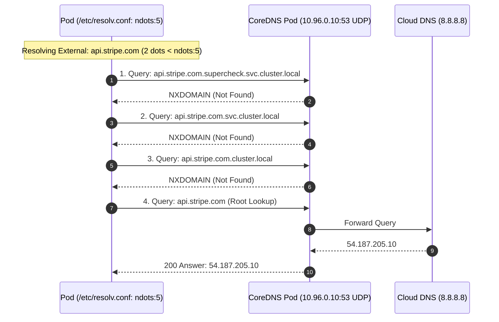

# Episode 29 — Kubernetes DNS and ndots

| | |
| :--- | :--- |
| **YouTube title** | Kubernetes DNS and ndots |
| **Film order** | 29 of 33 · Phase 4 · Week 29 |
| **Duration** | 10 minutes |
| **Lab repo** | `supercheck-io/supercheck` |
| **Supercheck files** | `app-deployment dnsConfig ndots:2 single-request` |
| **Next** | [30-nodenotready.md](30-nodenotready.md) |

## Overview

Supercheck already sets ndots:2 because musl/Node DNS deadlocks. Teach why. NetPol vs DNS vs Endpoints.

Film only Supercheck names: `supercheck-app`, `supercheck-worker-eu`, `supercheck-execution`, Traefik, BullMQ, PlanetScale/Postgres, Redis Sentinel. No toy `demo-api`.


## Episode 29: Kubernetes DNS and ndots

### 1. The Production Problem
*"Pod A intermittently times out attempting to reach `supercheck-app.supercheck.svc.cluster.local`. External calls to Stripe and GitHub APIs also fail with 5-second connection timeouts. Database connections fail randomly during traffic surges."*

### 2. Deep Technical Breakdown
Kubernetes networking and DNS failures usually stem from three architectural bottlenecks:
1. **The `ndots:5` Search Domain Amplification:** By default, `/etc/resolv.conf` in Kubernetes sets `ndots:5` with a search list:
   `search supercheck.svc.cluster.local svc.cluster.local cluster.local <cloud-domain>`
   When an application queries an external domain with fewer than 5 dots (e.g. `api.stripe.com` has 2 dots), the Linux resolver queries CoreDNS for:
   1. `api.stripe.com.supercheck.svc.cluster.local` (NXDOMAIN)
   2. `api.stripe.com.svc.cluster.local` (NXDOMAIN)
   3. `api.stripe.com.cluster.local` (NXDOMAIN)
   4. `api.stripe.com` (Direct Hit!)
   Every external call triggers **four DNS queries**, quadrupling CoreDNS load!
2. **Conntrack Table Exhaustion:** Linux uses `nf_conntrack` to track NAT states for Services. Under high UDP/DNS load, the conntrack table fills up, causing the kernel to drop UDP packets silently.
3. **NetworkPolicies:** A misconfigured NetworkPolicy can isolate pods without logging explicit reject packets, masquerading as a network timeout.

### 3. Architecture: CoreDNS Resolution & Packet Flow



### 4. Network & DNS Troubleshooting Matrix

| Symptom | Underlying Cause | Diagnostic Command | Permanent Solution |
| :--- | :--- | :--- | :--- |
| **5-Second DNS Timeouts** | CoreDNS dropped UDP packets due to packet drops / race conditions | `dig api.stripe.com +trace` | Deploy NodeLocal DNSCache |
| **NXDOMAIN Storms** | `ndots:5` search path amplification | `tcpdump -nn -i eth0 port 53` | Add trailing dot (`api.stripe.com.`) or tune `ndots:2` in pod spec |
| **Connection Refused** | Target port closed or app listening only on `127.0.0.1` | `nc -zv <pod-ip> 3000` | Bind app to `0.0.0.0` |
| **Connection Timeout** | NetworkPolicy blocking ingress/egress | `kubectl get netpol -n supercheck` | Add NetworkPolicy egress rule for target port |
| **`insert_failed` in dmesg** | Linux `nf_conntrack` table exhausted | `sysctl net.netfilter.nf_conntrack_count` | Bump `nf_conntrack_max` or switch to IPVS/eBPF |

### 5. Netshoot Diagnostic Lab Runbook
```bash
# 1. Launch ephemeral networking Swiss Army knife in the target namespace
kubectl debug -it deploy/supercheck-app -n supercheck --image=nicolaka/netshoot --target=app -- bash

# 2. Test DNS query timing and resolution path
dig supercheck-app.supercheck.svc.cluster.local +trace

# 3. Test raw TCP connectivity directly to pod IP (bypassing DNS and Service)
nc -zv 10.244.1.45 3000

# 4. Sniff network traffic on port 3000
tcpdump -nnvv -i eth0 port 3000
```

### 6. 10-Minute Video Script Outline
* **1. The Hook (0:00–0:45):** Run `curl https://api.stripe.com` inside a pod and watch it hang for exactly 5.002 seconds before returning. *"Why does every external API call take 5 seconds? It is not your network. It is Kubernetes DNS defaults."*
* **2. The Stakes & Blast Radius (0:45–1:45):** How `ndots:5` and UDP packet loss create intermittent latency spikes that don't show up in standard application logs.
* **3. Architecture & Mental Model (1:45–3:30):** Walk through the sequence diagram showing the sequential NXDOMAIN search path and conntrack race conditions.
* **4. Hands-On Implementation (3:30–8:30):**
  - Step 1: Launch `netshoot` container and inspect `/etc/resolv.conf`.
  - Step 2: Use `dig` to demonstrate the 4 extra NXDOMAIN round trips for external queries.
  - Step 3: Configure `dnsConfig` in the Pod spec to set `ndots: 2` and test the immediate drop to sub-millisecond lookups.
  - Step 4: Introduce NodeLocal DNSCache DaemonSet to handle DNS over local TCP.
* **5. Verification & Guardrails (8:30–10:00):** Verify CoreDNS metrics in Grafana: `rate(coredns_dns_responses_total{rcode="NXDOMAIN"}[5m])`.
* **6. Outro & Call to Action (10:00–10:30):** Rule of thumb: *"Always add a trailing dot to external URLs in high-throughput apps to bypass ndots:5."* Next: Episode 26 — NodeNotReady Triage.

---

---

## Creator prep (from original kit)

### Episode 29 Preparation: Kubernetes DNS and ndots

#### 1. High-Yield Learning Links (Watch & Read Before Filming)
* **YouTube**: *KubeCon + CloudNativeCon* — "Kubernetes DNS: The Mystery of ndots:5 and How It Affects Latency" ([YouTube Search: KubeCon Kubernetes DNS ndots 5](https://www.youtube.com/results?search_query=KubeCon+Kubernetes+DNS+ndots+5))
* **YouTube**: *Julia Evans / Computer Networking* — "DNS Resolution in Kubernetes and Linux Containers" ([YouTube Search: Julia Evans DNS Resolution Linux](https://www.youtube.com/results?search_query=Julia+Evans+DNS+Resolution+Linux))
* **Authoritative Article**: Laurent Bernaille — *Rethinking DNS in Kubernetes at Scale* & [Kubernetes DNS for Services and Pods](https://kubernetes.io/docs/concepts/services-networking/dns-pod-service/)

#### 2. Intuitive Mental Model
* **The Mailroom Suffix Madness**:
  * By default, Kubernetes configures `/etc/resolv.conf` with `options ndots:5` and 3 cluster search domains (`<namespace>.svc.cluster.local`, `svc.cluster.local`, `cluster.local`).
  * If your app requests `api.stripe.com` (which has 2 dots, less than 5), the glibc resolver assumes it might be a local cluster service!
  * It queries CoreDNS 4 times sequentially:
    1. `api.stripe.com.default.svc.cluster.local` (NXDOMAIN)
    2. `api.stripe.com.svc.cluster.local` (NXDOMAIN)
    3. `api.stripe.com.cluster.local` (NXDOMAIN)
    4. `api.stripe.com.us-east-1.compute.internal` (NXDOMAIN)
    5. `api.stripe.com.` (Finally returns the public IP!)
  * Result: 80% of CoreDNS queries in your cluster are completely bogus, wasting CPU, dropping UDP packets, and adding 5ms–5000ms latency to external API calls!

#### 3. Pre-Flight (`dnsConfig` already on Supercheck app)

```bash
kubectl get deploy supercheck-app -n supercheck -o jsonpath='{.spec.template.spec.dnsConfig}' | jq
# Expect ndots:2, single-request, single-request-reopen, timeout:2 (musl/Node deadlock comment in YAML)

POD=$(kubectl get pod -n supercheck -l app.kubernetes.io/component=app -o jsonpath='{.items[0].metadata.name}')
kubectl exec -n supercheck "$POD" -c app -- cat /etc/resolv.conf
# Contrast: a default Pod without dnsConfig still has ndots:5 — film that as the incident, then show Supercheck already fixed it
```

#### 4. YouTube Retention & Growth Kit
* **Clickable Titles**:
  1. *The Kubernetes DNS Bug Hiding in Your Cluster (ndots:5 Explained)*
  2. *Why Kubernetes CoreDNS Melts Under Load (And the 1-Line Fix)*
  3. *Kubernetes Networking: How DNS Resolution Actually Works*
* **Thumbnail Concept**: CoreDNS logo surrounded by red warning flames with 5 sequential arrows firing. A single checkmark pointing to a trailing dot `.`. Bold text: **"80% DNS DROP"**
* **30-Second Hook**: *"Did you know that every time your Kubernetes pod calls Stripe, AWS S3, or an external payment gateway, it fires up to five separate DNS queries instead of one? Under heavy load, this default setting floods CoreDNS, triggers UDP packet drops, and causes random 5-second timeouts. In this video, we dive into packet flow, `/etc/resolv.conf`, and fix the infamous ndots:5 problem with a single manifest tweak."*
* **Beginner Gotcha**: Don't blindly set `ndots:1` cluster-wide without testing! If your code calls internal short names like `http://payment-service` (0 dots), it works. But if you call `http://payment-service.prod` (1 dot), setting `ndots:1` skips the search path and breaks internal resolution! Setting `ndots:2` or using trailing dots for external domains (`api.stripe.com.`) is the battle-tested standard.

---
