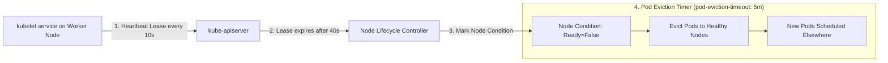

# Episode 30 — NodeNotReady Triage

| | |
| :--- | :--- |
| **YouTube title** | NodeNotReady Triage |
| **Film order** | 30 of 33 · Phase 4 · Week 30 |
| **Duration** | 10 minutes |
| **Lab repo** | `supercheck-io/supercheck` |
| **Supercheck files** | `Hetzner worker disk / containerd; journalctl kubelet` |
| **Next** | [31-ephemeral-debug.md](31-ephemeral-debug.md) |

## Overview

App nodes vs worker nodes are tainted. A NotReady worker stops Playwright Jobs. Do not reboot first.

Film only Supercheck names: `supercheck-app`, `supercheck-worker-eu`, `supercheck-execution`, Traefik, BullMQ, PlanetScale/Postgres, Redis Sentinel. No toy `demo-api`.


## Episode 30: NodeNotReady Triage

### 1. The Production Problem
*"At 2:00 AM, a Kubernetes worker node hosting 45 production pods transitioned to `NodeNotReady`. Workloads were evicted, cluster capacity dropped by 30%, and new pods were trapped in `Pending`."*

### 2. Deep Technical Breakdown
How Kubernetes determines node health:
1. **The 40-Second Lease Timeout:** Kubelet sends a heartbeat update every 10 seconds. If `kube-apiserver` does not receive a heartbeat within the `node-monitor-grace-period` (default 40 seconds), the Node Controller marks the node condition as `Ready: Unknown` or `Ready: False`.
2. **Kubelet Eviction Thresholds:** If node disk space or memory crosses safety limits, Kubelet enters pressure mode:
   - `DiskPressure`: Available disk space < 10% (or inodes < 5%). Kubelet evicts pods and pauses image pulling.
   - `MemoryPressure`: `memory.available < 100Mi`. Kubelet evicts `BestEffort` and `Burstable` pods.
   - `PIDPressure`: System PID allocation exhausted (process leak / fork bomb).
3. **Container Runtime Failures:** If `containerd` crashes, hangs on an unmounted filesystem, or runs out of disk space in `/var/lib/containerd`, Kubelet cannot manage containers and stops reporting status.

### 3. Architecture: Node Health & Eviction Loop



### 4. Node Condition & Triage Matrix

| Node Condition | Underlying Trigger | Host Diagnostic Command | Recovery Action |
| :--- | :--- | :--- | :--- |
| **`Ready: False`** | Kubelet stopped running or crashed | `sudo systemctl status kubelet` | `sudo systemctl restart kubelet` |
| **`DiskPressure: True`** | `/var/lib/containerd` or `/` > 90% full | `df -h /var/lib/containerd` | `crictl rmi --prune` or expand EBS volume |
| **`MemoryPressure: True`** | Node free memory < 100Mi | `free -m` | Identify rogue container; increase node memory |
| **`PIDPressure: True`** | Thread pool leak / fork bomb (>32k PIDs) | `cat /proc/sys/kernel/pid_max` | Kill zombie processes; add PID limits in pod spec |

### 5. Host-Level Triage Runbook (SSH to Worker Node)
```bash
# 1. Check Kubelet systemd service status
sudo systemctl status kubelet

# 2. Inspect recent Kubelet errors
sudo journalctl -u kubelet -e --no-pager | grep -iE "(error|fatal|eviction|pressure)"

# 3. Check disk space and inode utilization
df -h /var/lib/containerd
df -i /

# 4. Clean dangling dead containers and unused images via crictl
sudo crictl rmi --prune
sudo crictl rm $(sudo crictl ps -a -q --state Exited)
```

### 6. 10-Minute Video Script Outline
* **1. The Hook (0:00–0:45):** Show `kubectl get nodes` with a node screaming `NotReady`. Show 35 pods evicted and rescheduling storms destabilizing the remaining nodes. *"A node died in production. Rebooting it wipes out the evidence. Here is how to SSH in and diagnose it like a Linux kernel engineer."*
* **2. The Stakes & Blast Radius (0:45–1:45):** What happens when multiple nodes hit DiskPressure simultaneously: cascading evictions that overload the surviving nodes.
* **3. Architecture & Mental Model (1:45–3:30):** The 40-second node lease mechanism. Kubelet eviction thresholds (`DiskPressure`, `MemoryPressure`, `PIDPressure`).
* **4. Hands-On Implementation (3:30–8:30):**
  - Step 1: SSH into the broken node. Run `systemctl status kubelet` and `journalctl -u kubelet`.
  - Step 2: Diagnose `/var/lib/containerd` disk saturation. Show why Docker/containerd doesn't clean old images automatically.
  - Step 3: Run `crictl rmi --prune` to reclaim 20GB of disk space. Watch the node transition back to `Ready: True` in real-time.
* **5. Verification & Guardrails (8:30–10:00):** Configure Kubelet image garbage collection flags (`imageGCHighThresholdPercent: 80`, `imageGCLowThresholdPercent: 70`) in `/var/lib/kubelet/config.yaml`.
* **6. Outro & Call to Action (10:00–10:30):** Rule of thumb: *"Never reboot a NotReady node until you have checked journalctl and df -h."* Next: Episode 27 — Debugging Distroless Pods with Ephemeral Containers.

---

---

## Creator prep (from original kit)

### Episode 30 Preparation: NodeNotReady Triage

#### 1. High-Yield Learning Links (Watch & Read Before Filming)
* **YouTube**: *TechWorld with Nana* — "Kubernetes Node NotReady: Troubleshooting Guide" ([YouTube Search: TechWorld with Nana Kubernetes Node NotReady](https://www.youtube.com/results?search_query=TechWorld+with+Nana+Kubernetes+Node+NotReady))
* **YouTube**: *Brendan Gregg* — "Linux Systems Performance & cgroup Analysis" ([YouTube Search: Brendan Gregg Linux Performance](https://www.youtube.com/results?search_query=Brendan+Gregg+Linux+Performance))
* **Official Docs**: [Kubernetes Node Lifecycle & Conditions](https://kubernetes.io/docs/concepts/architecture/nodes/) & [Node Pressure Eviction](https://kubernetes.io/docs/concepts/scheduling-eviction/node-pressure-eviction/)

#### 2. Intuitive Mental Model
* **The Landlord & The Building Super**:
  * The Control Plane (`kube-controller-manager`) is the landlord; Kubelet is the on-site building superintendent.
  * Every 10 seconds, Kubelet must call the landlord with a heartbeat: *"Building 4 is healthy!"*
  * If Kubelet stops reporting for 40 seconds (`node-monitor-grace-period`), the landlord panics and marks the node **`NotReady`**.
  * Why did the super stop calling?
    1. **DiskPressure**: Root disk is 95% full; containerd froze.
    2. **PIDPressure**: A fork bomb in a container exhausted the Linux kernel PID table (`/proc/sys/kernel/pid_max`).
    3. **OOM Killer**: Kubelet itself was killed because the node had no reserved memory (`system-reserved` / `kube-reserved`).

#### 3. Pre-Flight Demo Setup (Node Inspection Commands)
```bash
# 1. Inspect cluster node conditions and heartbeats
kubectl get nodes -o wide
kubectl describe nodes | grep -A 5 "Conditions:"

# 2. Check node resource capacity vs allocatable
kubectl get nodes -o custom-columns=\
NAME:.metadata.name,\
CPU_ALLOC:.status.allocatable.cpu,\
MEM_ALLOC:.status.allocatable.memory

# 3. Host triage on a Hetzner worker (K3s agent, not generic kubelet unit):
# journalctl -u k3s-agent -e --no-pager -n 80
# df -h /var/lib/rancher/k3s
kubectl get nodes -o json | jq -r '.items[] | [.metadata.name, (.spec.taints // [] | map(.key+"="+(.value//"")+"\:"+.effect) | join(";"))] | @tsv'
```

#### 4. YouTube Retention & Growth Kit
* **Clickable Titles**:
  1. *When Kubernetes Nodes Go NotReady (Staff SRE Triage Playbook)*
  2. *Why Kubelet Stops Posting Status: DiskPressure, cgroups & Eviction*
  3. *Never Reboot a Broken Node: The 4-Step SRE Node Triage*
* **Thumbnail Concept**: A terminal showing `worker-02   NotReady` in bright amber. Diagnostic arrows pointing to Disk Space, Kubelet systemd, and Linux Kernel PIDs. Bold text: **"DON'T REBOOT"**
* **30-Second Hook**: *"A production node suddenly switches to `NotReady`, and within five minutes, Kubernetes begins aggressively evicting dozens of pods, triggering a thundering herd on your remaining workers. Your first instinct might be to hard-reboot the machine. Don't do it. In this video, we debug NodeNotReady like a Staff SRE: diagnosing Kubelet heartbeats, DiskPressure, PID exhaustion, and cgroup v2 memory throttling."*
* **Beginner Gotcha**: Remember the eviction delay! When a node goes `NotReady`, Kubernetes does NOT evict pods immediately. It waits for the `pod-eviction-timeout` (default 300 seconds / 5 minutes) before terminating pods. If the node recovers within 5 minutes, pods remain unharmed.

---
