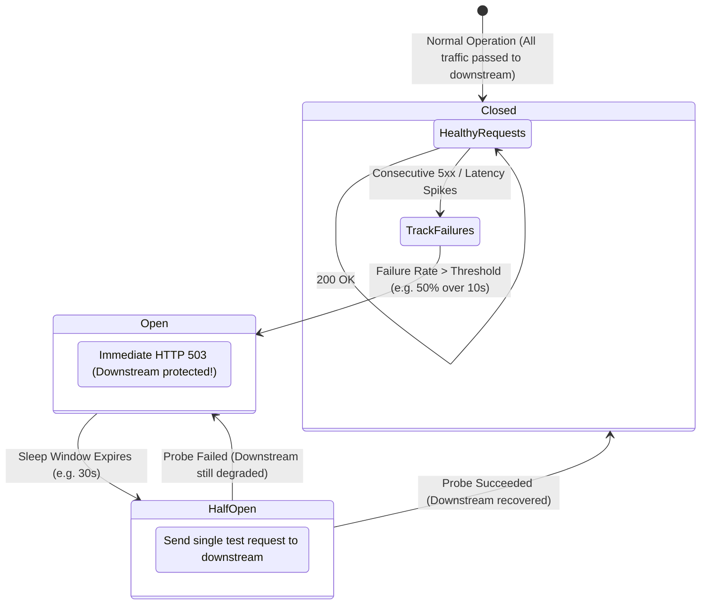

# Episode 32 — Circuit Breakers and Retry Storms

| | |
| :--- | :--- |
| **YouTube title** | Circuit Breakers and Retry Storms |
| **Film order** | 32 of 33 · Phase 4 · Week 32 |
| **Duration** | 10 minutes |
| **Lab repo** | `supercheck-io/supercheck` |
| **Supercheck files** | `timeouts, retries, Traefik rate limit; k6 from Supercheck` |
| **Next** | [33-keda.md](33-keda.md) |

## Overview

Slow Postgres should not OOM Next.js. Retry storms. Supercheck/k6 induces the failure you then contain.

Film only Supercheck names: `supercheck-app`, `supercheck-worker-eu`, `supercheck-execution`, Traefik, BullMQ, PlanetScale/Postgres, Redis Sentinel. No toy `demo-api`.


## Episode 32: Circuit Breakers and Retry Storms

### 1. The Production Problem
*"Our downstream payment database experienced a 600ms latency slowdown. Upstream frontend pods timed out and immediately retried. The retry storm tripled cluster QPS, exhausted connection pools, crashed the frontend services, and turned a minor database hiccup into a catastrophic, company-wide outage."*

### 2. Deep Technical Breakdown
Cascading failures occur when a local failure spreads to consume cluster-wide resources:
1. **The Retry Storm:** If 1,000 clients time out and retry immediately without delay, downstream traffic jumps from 1,000 QPS to 3,000 QPS at the exact moment the downstream service is weakest.
2. **Circuit Breaker Pattern (Netflix Hystrix / Envoy):**
   - **Closed:** Normal state. Requests pass through.
   - **Open:** If consecutive failure percentage exceeds threshold (e.g. 50% 5xx over 10s), the circuit **trips Open**. All future requests fail-fast immediately (HTTP 503) *without calling the downstream database*.
   - **Half-Open:** After a sleep window (e.g. 30s), the breaker allows a single probe request through. If it succeeds, the circuit closes; if it fails, it remains open.
3. **Full Jitter Exponential Backoff:** Instead of fixed retries, add randomness to desynchronize retry waves:
   $$T_{\text{sleep}} = \text{random}(0, \min(T_{\text{max}}, T_{\text{base}} \times 2^{\text{attempt}}))$$
4. **Ingress Traffic Shedding:** When cluster CPU or latency crosses critical thresholds, the ingress proxy sheds excess traffic with HTTP 429 rather than queueing requests to the point of memory exhaustion.

### 3. Architecture: The Circuit Breaker State Machine



### 4. Resilience Architecture Comparison Matrix

| Resilience Pattern | Layer Enforced | Primary Protection | Anti-Pattern to Avoid |
| :--- | :--- | :--- | :--- |
| **Circuit Breaker** | Service Mesh (Envoy) / Application SDK | Prevents exhausting thread pools on dead dependencies | Retrying without a circuit breaker |
| **Exponential Backoff + Jitter** | Client / Calling SDK | Desynchronizes retry storms | Fixed 1-second retry loops |
| **Traffic Shedding (Rate Limiting)** | Ingress Controller (NGINX / Envoy) | Drops excess load (HTTP 429) before nodes crash | Allowing queues to grow infinitely |
| **Deadlines & Timeouts** | Ingress & HTTP Client | Cancels stale work | Unlimited HTTP client timeouts |

### 5. Production Envoy / Ingress Rate-Limiting Spec
```yaml
apiVersion: networking.k8s.io/v1
kind: Ingress
metadata:
  name: supercheck-app-ingress
  namespace: supercheck
  annotations:
    traefik.ingress.kubernetes.io/limit-rps: "100"
    traefik.ingress.kubernetes.io/limit-connections: "20"
    traefik.ingress.kubernetes.io/proxy-connect-timeout: "2"
    traefik.ingress.kubernetes.io/proxy-read-timeout: "5"
spec:
  ingressClassName: traefik
  rules:
  - host: app.supercheck.io
    http:
      paths:
      - path: /
        pathType: Prefix
        backend:
          service:
            name: supercheck-app
            port:
              number: 80
```

### 6. 10-Minute Video Script Outline
* **1. The Hook (0:00–0:45):** Simulate a 500ms database delay. Watch an upstream Go service spiral out of control as memory climbs and all 10 replicas crash with OOMKilled within 90 seconds. *"A slow database shouldn't kill your entire frontend. Here is how cascading failures happen, and how circuit breakers stop them cold."*
* **2. The Stakes & Blast Radius (0:45–1:45):** The math of retry storms. How 100 failed requests become 10,000 synchronized retries.
* **3. Architecture & Mental Model (1:45–3:30):** The Circuit Breaker State Machine: Closed $\rightarrow$ Open $\rightarrow$ Half-Open. Full Jitter backoff algorithms.
* **4. Hands-On Implementation (3:30–8:30):**
  - Step 1: Implement an HTTP client with exponential backoff and jitter.
  - Step 2: Configure a circuit breaker using `sony/gobreaker` or Envoy.
  - Step 3: Stress-test the broken database: show the circuit breaker trip Open and instantly return HTTP 503, keeping frontend CPU at 10%.
* **5. Verification & Guardrails (8:30–10:00):** Recover the database. Show the circuit breaker transition to Half-Open, probe the service, and seamlessly restore 200 OK traffic.
* **6. Outro & Call to Action (10:00–10:30):** Rule of thumb: *"Always set strict timeouts, never retry without jitter, and fail-fast when downstream is failing."* Next: Episode 31 — Event-Driven Autoscaling with KEDA.

---

---

## Creator prep (from original kit)

### Episode 32 Preparation: Circuit Breakers and Retry Storms

#### 1. High-Yield Learning Links (Watch & Read Before Filming)
* **YouTube**: *Hussein Nasser* — "Cascading Failures & Circuit Breakers in Distributed Systems" ([YouTube Search: Hussein Nasser Cascading Failures Circuit Breakers](https://www.youtube.com/results?search_query=Hussein+Nasser+Cascading+Failures+Circuit+Breakers))
* **YouTube**: *ByteByteGo* — "Thundering Herd and Retry Storms Explained" ([YouTube Search: ByteByteGo Retry Storm Thundering Herd](https://www.youtube.com/results?search_query=ByteByteGo+Retry+Storm+Thundering+Herd))
* **Google SRE Book**: [Chapter 22: Addressing Cascading Failures](https://sre.google/sre-book/addressing-cascading-failures/) & Michael Nygard's *Release It!* (Circuit Breaker Design Pattern).

#### 2. Intuitive Mental Model
* **The Home Electrical Fuse Box**:
  * If you plug five heavy space heaters into the same bedroom outlet, the wiring overheats.
  * Instead of letting your house burn down, the circuit breaker in your electrical panel trips **Open**, instantly cutting power to that single room.
  * A software circuit breaker does the exact same thing: when downstream database latency climbs from 10ms to 800ms, instead of letting thousands of waiting HTTP requests exhaust memory and crash all frontend pods, the circuit breaker trips **Open** and immediately fails fast with HTTP 503, preserving frontend stability until the database recovers.

#### 3. Pre-Flight Demo Setup (Retry Storm Math & Jitter Verification)
```bash
# Exponential Backoff with Full Jitter Formula:
# sleep = random_between(0, min(max_backoff, base * 2 ^ attempt))

# Quick Python verification of jitter distribution:
python3 -c "
import random
base = 0.5
max_backoff = 8.0
for attempt in range(5):
    temp = min(max_backoff, base * (2 ** attempt))
    sleep_time = random.uniform(0, temp)
    print(f'Attempt {attempt}: ceiling={temp:.2f}s, actual_jitter_sleep={sleep_time:.2f}s')
"
```

#### 4. YouTube Retention & Growth Kit
* **Clickable Titles**:
  1. *How a Slow Database Kills Your Entire System (Cascading Failures Explained)*
  2. *Circuit Breakers & Rate Limiting: Stop Retry Storms in Kubernetes*
  3. *Google SRE: How to Survive a Thundering Herd Outage*
* **Thumbnail Concept**: A falling domino chain: Database $\rightarrow$ Auth $\rightarrow$ Payment $\rightarrow$ Frontend, intercepted and stopped cold by a titanium shield labeled "CIRCUIT BREAKER". Bold text: **"STOP THE OUTAGE"**
* **30-Second Hook**: *"A downstream database query slows down from 10ms to 800ms. Within 90 seconds, all ten frontend pods crash with OOMKilled, memory climbs to 100%, and your entire platform goes dark. Why did a slight delay cause total catastrophic failure? The answer is a retry storm. In this video, we implement circuit breakers, traffic shedding, and exponential backoff with jitter to ensure one slow service never takes down your whole cluster."*
* **Beginner Gotcha**: NEVER retry without jitter! If 1,000 clients fail at the exact same moment and all retry after exactly 2.0 seconds, they create a synchronized wave that hammers the recovering service repeatedly (the thundering herd problem). Full jitter spreads retries uniformly across the time window.

---
