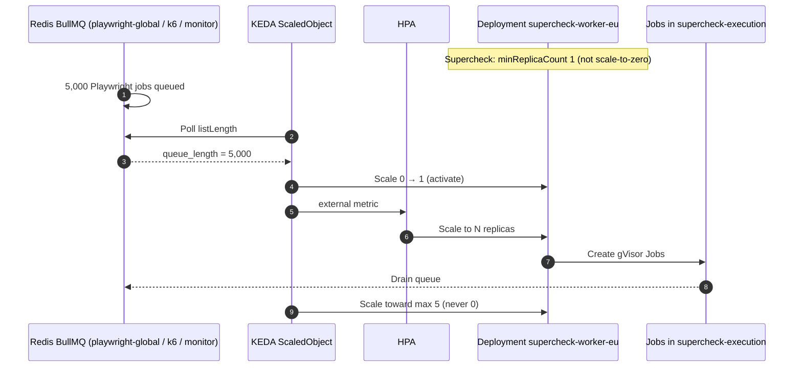

# Episode 33 — KEDA: Event-Driven Autoscaling

| | |
| :--- | :--- |
| **YouTube title** | KEDA: Event-Driven Autoscaling |
| **Film order** | 33 of 33 · Phase 4 · Week 33 |
| **Duration** | 10 minutes |
| **Lab repo** | `supercheck-io/supercheck` |
| **Supercheck files** | `base/keda-scaledobject.yaml · queues playwright-global, k6, monitor` |
| **Next** | Curriculum complete |

## Overview

CPU HPA ignores BullMQ depth. Supercheck workers use KEDA ScaledObjects (`minReplicaCount: 1`, `maxReplicaCount: 5`). Do not create a second HPA. Scale-to-zero is a KEDA feature Supercheck **does not** use in production (always keep one consumer).

Film only Supercheck names: `supercheck-app`, `supercheck-worker-eu`, `supercheck-execution`, Traefik, BullMQ, PlanetScale/Postgres, Redis Sentinel. No toy `demo-api`.


## Episode 33: KEDA: Event-Driven Autoscaling

### 1. The Production Problem
*"Our worker pods consume background tasks from a Redis / RabbitMQ queue. 200,000 jobs arrived in the queue. Because queue consumption is I/O-bound, worker CPU utilization stayed at 12%. The standard Kubernetes Horizontal Pod Autoscaler (HPA) never scaled up, and processing fell 5 hours behind schedule."*

### 2. Deep Technical Breakdown
Why Kubernetes HPA alone is insufficient for modern event-driven architectures:
1. **The Metrics-Server Limit:** Default Kubernetes HPA only knows about CPU and Memory metrics exposed by the metrics-server. It has zero knowledge of queue depth, Kafka consumer lag, or database connection queues.
2. **KEDA (Kubernetes Event-Driven Autoscaling) Architecture:**
   - **KEDA Operator:** Watches `ScaledObject` Custom Resources and configures an HPA object dynamically.
   - **KEDA Metrics Server:** Acts as an External Metrics API adapter. It polls external event sources (Redis, RabbitMQ, Kafka, AWS SQS) and serves custom metrics directly to the Kubernetes HPA.
3. **Scale-to-Zero:** Standard HPA cannot scale a deployment down to 0 replicas (minimum is 1). KEDA can scale deployments to **0 replicas** when queues are empty, slashing cloud computing costs by 80% for batch workloads.

### 3. Architecture: KEDA Event-Driven Scaling Sequence



### 4. Kubernetes Autoscaling Engines Comparison Matrix

| Feature | Standard K8s HPA | Custom Prometheus Adapter | KEDA |
| :--- | :---: | :---: | :---: |
| **Scale on CPU / Memory** | Yes | Yes | Yes |
| **Scale to Zero (0 replicas)** | **No** (Min 1) | **No** (Min 1) | **Yes (0 replicas enabled)** |
| **Native Scalers Out of the Box** | None (CPU/RAM only) | Requires custom Prometheus metrics | **60+ Scalers (Redis, SQS, Kafka, Cron)** |
| **Configuration Complexity** | Very Low | High (Complex Prometheus rules) | **Minimal (Single ScaledObject manifest)** |
| **Cloud Cost Optimization** | Moderate | Moderate | Scale-to-zero *can* save money; Supercheck keeps min 1 |

### 5. Production KEDA `ScaledObject` (from `keda-scaledobject.yaml`)

```yaml
apiVersion: keda.sh/v1alpha1
kind: ScaledObject
metadata:
  name: scaler-worker-eu
  namespace: supercheck-workers
spec:
  scaleTargetRef:
    name: supercheck-worker-eu
  minReplicaCount: 1
  maxReplicaCount: 5
  pollingInterval: 15
  cooldownPeriod: 300
  fallback:
    failureThreshold: 3
    replicas: 1
  triggers:
    - type: redis
      metadata:
        listName: bull:playwright-global:wait
        listLength: "10"
        enableTLS: "false"
      authenticationRef:
        name: keda-redis-auth
```

### 6. 10-Minute Video Script Outline
* **1. The Hook (0:00–0:45):** Show a Redis queue with 150,000 messages accumulating. Show the worker deployment sitting at 1 replica with 8% CPU usage. Standard HPA refuses to scale. *"Your queue is overflowing, but Kubernetes thinks everything is fine because CPU is low. Here is how to scale on real events with KEDA."*
* **2. The Stakes & Blast Radius (0:45–1:45):** Why CPU/RAM are lagging indicators for autoscaling. The business cost of delayed background job processing.
* **3. Architecture & Mental Model (1:45–3:30):** KEDA Operator + External Metrics. Supercheck keeps `minReplicaCount: 1` so a region never has zero consumers; scale-to-zero is a KEDA capability we **reject** for Playwright/k6 queues.
* **4. Hands-On Implementation (3:30–8:30):**
  - Step 1: Open `keda-scaledobject.yaml` — EU/US/APAC ScaledObjects in `supercheck-workers`.
  - Step 2: `kubectl get hpa -n supercheck-workers` (KEDA-owned). Prove there is no second hand-written HPA.
  - Step 3: Queue names `bull:playwright-global:wait`, `bull:k6-*:wait`, `bull:monitor-*:wait`. Fallback replicas: 1 if Redis metrics die.
* **6. Outro & Call to Action (10:00–10:30):** Rule of thumb: *"Scale supercheck-app on request latency; scale supercheck-worker on BullMQ depth."* Channel wrap: 33 core episodes on the Supercheck stack.

---

---

## Creator prep (from original kit)

### Episode 33 Preparation: KEDA: Event-Driven Autoscaling

#### 1. High-Yield Learning Links (Watch & Read Before Filming)
* **YouTube**: *That DevOps Guy (Viktor Farcic)* — "How to Autoscale Kubernetes Pods with KEDA" ([YouTube Search: Viktor Farcic KEDA Autoscaling](https://www.youtube.com/results?search_query=Viktor+Farcic+KEDA+Autoscaling))
* **YouTube**: *TechWorld with Nana* — "Kubernetes KEDA Explained: Autoscaling Made Easy" ([YouTube Search: TechWorld with Nana KEDA Autoscaling](https://www.youtube.com/results?search_query=TechWorld+with+Nana+KEDA+Autoscaling))
* **Official Docs**: [KEDA Core Concepts & Scalers](https://keda.sh/docs/latest/concepts/)

#### 2. Intuitive Mental Model
* **The Airport Taxi Stand Queue**:
  * Kubernetes standard HPA is like checking if taxi drivers are sweating (CPU utilization).
  * If 2,000 arriving passengers are queued at the airport terminal curb, but the single taxi driver on duty is sitting calmly listening to the radio, CPU is at 10%! Standard HPA refuses to dispatch more taxis, and passengers wait 6 hours.
  * **KEDA** looks at BullMQ list length. Supercheck still keeps **one taxi on the stand** (`minReplicaCount: 1`) so the first job is not delayed by a cold start, then scales to 5 per region.

#### 3. Pre-Flight (live ScaledObjects on Supercheck K3s)

```bash
kubectl get scaledobject -n supercheck-workers
kubectl describe scaledobject scaler-worker-us -n supercheck-workers
# Production: minReplicaCount 1, max 5, Redis listLength on BullMQ queues
# Do not helm install KEDA on a laptop cluster; do not create a second HPA
```

#### 4. YouTube Retention & Growth Kit
* **Clickable Titles**:
  1. *Kubernetes Autoscaling Is Broken: Fix It With KEDA*
  2. *KEDA vs HPA: Scale Workers on Queue Depth, Not CPU*
  3. *Why CPU Autoscaling Fails for Queue Workers*
* **Thumbnail Concept**: Left: HPA watching 12% CPU, queue 200k. Right: KEDA ScaledObject `scaler-worker-eu` 1→5 on `bull:playwright-global:wait`. Bold: **"QUEUE DEPTH"**
* **30-Second Hook**: *"Two hundred thousand Playwright jobs in Redis, one worker at 12% CPU, HPA asleep. Supercheck does not install KEDA on a laptop and scale to zero — we already run ScaledObjects in `supercheck-workers` with min 1, max 5, and a fallback replica if Redis metrics die."*
* **Beginner Gotcha**: Do NOT create a manual Kubernetes HPA manifest alongside a KEDA `ScaledObject` for the same deployment! KEDA generates and manages its own HPA object under the hood. If you create both, they will fight over the replica count in an endless reconciliation loop!
